# Rendering decoupling: benchmark overview

Updated **2026-10-07**. This consolidates the saved native and web benchmark milestones from September 29 through October 6. No new benchmarks were run for this document. Graphs show the numbers; the final section assesses the **current** implementation rather than repeating superseded milestone verdicts.

## Threading models at a glance

The models differ in where game simulation hands rendering work to another thread:

| Model | How it works |
|---|---|
| **Vanilla / PoC direct** | Simulation and rendering run sequentially on the engine's main thread. Vanilla is the unmodified control; PoC direct includes shared PoC changes with experimental threading off. |
| **Inline** | Uses the snapshot or command-capture machinery but executes it on the same thread. This measures the cost of restructuring without parallelism. |
| **Component threading** | On native, simulation stays on main and components publish owned, immutable rendering data to a rendering worker. That worker consumes the snapshot while simulation advances the next frame, without reading live component state. There is **one shared worker**, not a thread per component. |
| **Graphics-layer threading — Solution 1** | Simulation, culling, batching and geometry stay together. Graphics calls and their upload data are recorded into owned packets; a worker executes the backend calls. |
| **Render-layer threading — Solution 2** | Simulation extracts a shared immutable `RenderFrame` and captures render-script commands. A rendering worker performs culling, batching, geometry generation and graphics submission for the supported components. |

**On web, component threading reverses the native thread placement:** simulation and Lua run in a pthread worker; browser main owns WebGL and consumes the previous frame. In the latest broad-component variant, most preparation also runs on the worker, while sprite geometry generation moves to browser main to share the work more evenly. Two reusable frame slots bound memory and prevent simulation from running arbitrarily far ahead. The earlier **serialized** compatibility mode instead waits during rendering handoffs and does not provide this overlap.

### What “ready” mode means

**Ready is a web scheduling option for component threading, not another rendering architecture.** Ordinary completion scheduling can restart simulation when the worker finishes, but drawing waits for a browser animation callback (`requestAnimationFrame`, or rAF).

During normal visible rendering, ready mode gives rendering one opportunity per browser animation callback. If the frame is not ready when that callback runs, the opportunity remains available: when the worker finishes, browser main can consume the frame immediately using it, rather than waiting for the next callback. Used opportunities cannot be reused or accumulated. Simulation and rendering still overlap, with the same two slots.

**Ready + 32 ms budget** adds a timing estimate: use that opportunity only if elapsed time since the browser callback plus the previous render-consumption duration fits 32 ms; otherwise wait for the next callback. This is not a guaranteed display deadline or a 32 ms frame cap. All threading and scheduling experiments remain opt-in.

**The component-threading approach has demonstrated useful, workload-dependent gains. It is ready for further opt-in project evaluation, but the evidence does not yet support a production release or a universal default.** The clearest recent result is on the physical Pixel 4a: 30k moving sprites improve from **22.37 to 35.27 updates/s (+57.7%)**, with update p99 falling from **49.25 to 33.33 ms**, at **8.86 MiB** extra live allocation. The real space-game replay on that phone remains essentially unchanged.

## Reading the graphs

| Metric / control | Meaning |
|---|---|
| **Updates/s (UPS), higher is better** | Simulation-update intervals divided by wall time, including scheduling and waits. This is achieved engine throughput, **not measured displayed FPS, GPU completion or isolated CPU execution speed**. |
| **Update p99, lower is better** | Approximately 99% of update intervals are at or below this duration; the slowest 1% exceed it. A 20 ms p99 is not the maximum and is not input-to-display latency. Most later runs use 0.05 ms histogram bins. Web charts average per-run percentiles, not a pooled percentile. |
| **Live allocation, MiB** | Sampled WASM allocator usage, including allocated frame storage and worker stack. Excludes some runtime, JavaScript/browser and GPU storage. Charts generally show the mean of per-run sampled peaks. |
| **WASM capacity, MiB** | Current linear-memory size, including unused space. A live-memory reduction need not shrink this capacity. Do not add it to live allocation. |
| **RSS, MiB** | Native resident process memory. Browser process sums are noisier and may double-count shared pages. RSS and WASM allocator numbers are different scopes and are not compared directly. |
| **Vanilla** | Separate unmodified engine source at the pre-PoC branch point. Web vanilla controls use the same pthread-capable build flags; the ordinary non-pthread shipping bundle has not been benchmarked. |
| **PoC direct / Direct** | The modified engine with experimental threading disabled. Shared refactoring, instrumentation and inactive checks remain. This isolates a runtime policy; it does not isolate the total cost versus vanilla. Earlier reports sometimes call this “original” or “existing.” |

Dots on new bar charts are individual runs; bars are means unless explicitly marked as native medians. Heatmaps print absolute values; color shows the ratio of those displayed summaries to the panel's baseline. Older native reports also publish **paired** ratios, which need not equal ratios of independent medians. Compare modes **within a collection**, not absolute rates across dates: engine revisions, project capacities, drawing buffers, instrumentation and browser pacing changed.

## Latest physical-device results

Pixel **4a** (the connected device's verified model), Android 13, Chrome 154, Adreno 618. These are the latest quiet synthetic measurements: **60 runs**, three rotated repetitions per workload/mode, 10 seconds warmup and 30 seconds measurement. The same Release engine and content are used within each workload. Threaded variants use a 2 MiB worker stack and sprite geometry on browser main.

“Threaded” uses completion-driven simulation dispatch. “Ready” also allows a ready frame to render using an unused browser-tick credit. “Ready + 32 ms budget” restricts that opportunity using elapsed tick age and the previous render duration. All remain opt-in; the budget defaults off.

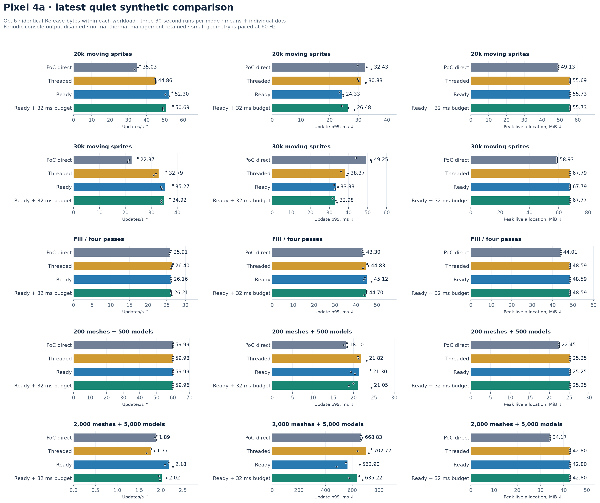

- **20k / 30k sprites:** ready scheduling improves throughput **49.3% / 57.7%** over PoC direct and reduces p99 **25.0% / 32.3%**. Live allocation increases **6.60 / 8.86 MiB**, about **13.4% / 15.0%**.
- **Fill-heavy:** approximately 26 updates/s in every mode. Threading adds about **4.58 MiB** without a useful throughput gain.
- **Light geometry:** every mode reaches about 60 updates/s, but ready p99 rises **18.10 → 21.30 ms**. Reaching the cap does not establish equal CPU headroom.
- **Oversized geometry:** about **1.77–2.18 updates/s**; far below useful gameplay rates. It is a stress test, not evidence that ordinary 3D games will behave this way.
- **The new readiness budget is functional but not an overall improvement over unbudgeted ready.** It retains sprite gains, adds no frame capacity, and loses some throughput in other comparisons. Keep it disabled by default.

WASM capacity stays **66.50 MiB** at 20k and **79.81 MiB** at 30k in every mode, despite the extra live allocations. Fill grows **55.38 → 66.50 MiB** with threading; oversized geometry grows **46.12 → 55.38 MiB**. These domains overlap.

[Latest report, all run points and temperature history](benchmarks/pixel-web-pacing-2026-10-06/REPORT.md) · [Milestone assessment and capacity checks](WEB_PIXEL_PACING_RESULTS.md)

### Why the earlier Pixel result looked worse

The first collection comprised **63 synthetic runs plus 12 game replays**. It also covered 10k sprites, simulation-heavy and balanced workloads, which were not repeated in the latest quiet collection:

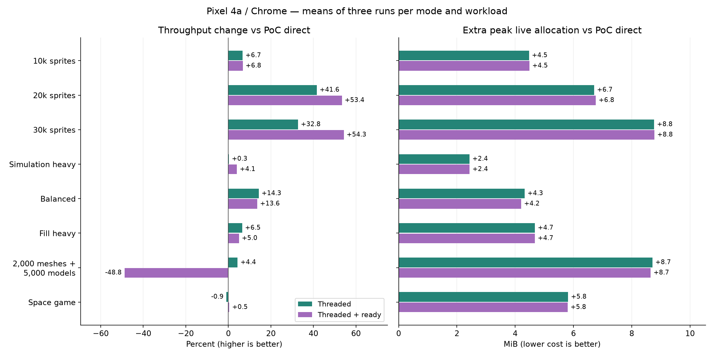

**Historical reporting-on measurements:** 10k sprites improved **56.11 → 59.93 UPS** with ready; simulation-heavy **18.35 → 19.10**; balanced **14.33 → 16.27**. These remain useful coverage, but periodic benchmark console output was enabled.

The follow-up found that worker stdout synchronously proxies to browser main. In a matched 30k diagnostic, turning periodic output off changed p99 **47.55 → 35.45 ms**, while throughput moved only **35.15 → 35.75 UPS**. Consequently, the old sprite/fill p99 regressions cannot be attributed solely to scheduling. The old geometry ready-policy collapse (**1.44 direct → 0.74 UPS ready**) did not repeat in the quiet collection; this does not prove every underlying driver/browser cause is fixed. Earlier geometry percentiles above the histogram limit remain **>1,000 ms**, not invented exact values.

This is a **benchmark correction**, not asynchronous application logging. Games that log frequently still need evaluation. The quiet and historical absolute rates must not be treated as a controlled before/after engine optimization.

[Historical Pixel results and limitations](PIXEL_4A_WEB_BENCHMARK_RESULTS.md)

## What each scenario tests

| Scenario | Small explanation |
|---|---|
| Initial native count / visibility / movement / constants / pass sweeps | Vary sprite population, visible fraction, moving fraction, material-constant groups and draw-pass count to identify where cost grows. |
| Native crowd 10k / 20k / 30k | Moving, animated sprites with grouped constants; stresses simulation plus CPU rendering work. Distinct from Bunnymark. |
| Web Bunnymark 10k / 20k / 30k | Fixed starting population of animated bouncing sprites. Tests increasingly expensive sprite preparation. Most later runs use a 720 × 720 drawing buffer. |
| Static sprites 50k | Many small stationary sprites, one pass; stresses component traversal, culling, batching and vertices. |
| Simulation heavy | 1,000 sprites plus one million deterministic Lua arithmetic iterations per update. Intentionally synthetic CPU work. |
| Balanced web | 10k moving sprites plus 100k Lua iterations; tests whether game work and rendering overlap usefully. |
| Native mixed crowd / balanced | 20k or 5k sprites with GUI boxes, changing text and particles; balanced adds more simulation work. |
| Fill-heavy / pixel scaling | Large overlapping sprites and multiple passes; tests a case where CPU threading may not help. Pixel scaling changes projected area while keeping population/passes fixed. GPU saturation is not independently established in every collection. |
| Capped 60 / 120 Hz | Requested update caps; focuses on p99 and pacing rather than maximum throughput. |
| GUI / particle / preparation heavy | 512 boxes + 512 texts; 16 emitters; or a combined scene with 500 sprites and scripted work. Tests the broader native render-layer boundary. |
| Geometry 100 / 200 / 1000 groups | Respectively 200/400/2,000 meshes and 500/1,000/5,000 models. Each group includes local/world mesh, static model, CPU/GPU skinning and two instanced animated models. Tiny triangles and one-joint animation stress component/draw overhead, not realistic high-poly assets. |
| Offline Underwatermelon | Deterministic fruit-game replay with physics, merging, scoring, GUI/particles and audio; approved optional streaming exclusions. Native uses a short replay; later web tests use 15,000 ticks, including 14,400 measured updates. |
| Space game | Anonymous external real-project replay, equivalent inputs/checkpoints and cleanup across modes. Published evidence contains aggregate measurements only. |
| Churn / GC / stack / lifecycle | Replace resources, rebuild GUI, pause/resume and unload; or isolate garbage collection and stack reservation. These investigate memory and correctness, not steady rendering speed. |

## Native: comparing all three threading boundaries

| Implementation | Where the work moves |
|---|---|
| Component threading | Immutable component snapshots feed one rendering worker. In the native comparison, sprites are prepared by the consumer; GUI/particle geometry is prepared on the game side with barriers. |
| Graphics-layer threading, Solution 1 | Game-side rendering produces owned graphics-command packets; a worker executes backend calls. Culling, batching, geometry and render Lua remain on the game side. Some resource/query operations still synchronize. |
| Render-layer threading, Solution 2 | Game side extracts immutable `RenderFrame` inputs and owned render-script commands. Consumer performs sprite/GUI/particle rendering preparation and graphics submission. |
| Inline controls | The corresponding snapshot/packet/frame path executes without a worker, separating restructuring/copying from parallelism. |

Apple M1 Pro, macOS/Metal, optimized native builds. The October 2 comparison includes a genuine vanilla control, **408 synthetic timing trials, 84 replay trials and eight memory runs**.

**This collection has a reported possible window-occlusion confound.** Treat the numbers below as descriptive architecture evidence, not a controlled production gate. The mixed-balanced case switched pacing regimes and is deliberately not pooled in this graph. RSS also varies with allocator/driver retention; a lower cell is not automatically a stable saving.

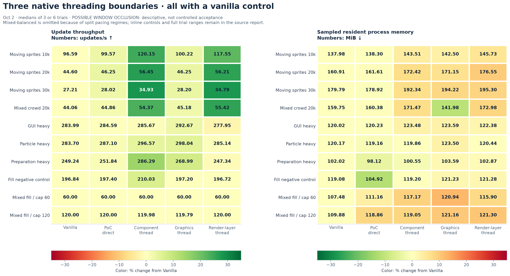

The recorded paired sprite gains versus vanilla were about **24–28% for component threading**, **22–28% for render-layer threading**, and **3–4% for graphics threading**. On the selected preparation-heavy case, render-layer threading was **13.8% slower than component threading**. That does not establish an architectural winner under controlled conditions, but it gives no measured reason to replace the component approach with the current render-layer implementation.

The preceding graphics comparison, using its own fresh direct/inline controls, measured **+22.2% component vs +1.0% graphics** on mixed 20k sprites. Graphics-threaded versus its own inline path was only **+1.8%** there: much of the larger balanced-scene improvement was already present in graphics inline.

At 60 Hz in the full architecture comparison, p99 was **17.48 ms direct, 18.43 component, 17.58 graphics, 17.55 render-layer**. At 120 Hz: **8.75, 9.25, 8.85, 9.20 ms**. The provisional ≤5% regression rule was not consistently met; the occlusion caveat also applies.

[Full architecture report, inline controls and trial ranges](RENDERING_POC_SUMMARY.md) · [Earlier graphics comparison](/Users/jhonny/dev/defold-projects/experiment-decoupled-rendering/results/graphics-comparison-20261002-v1/comparison.md)

### Earlier native optimization and timer experiments

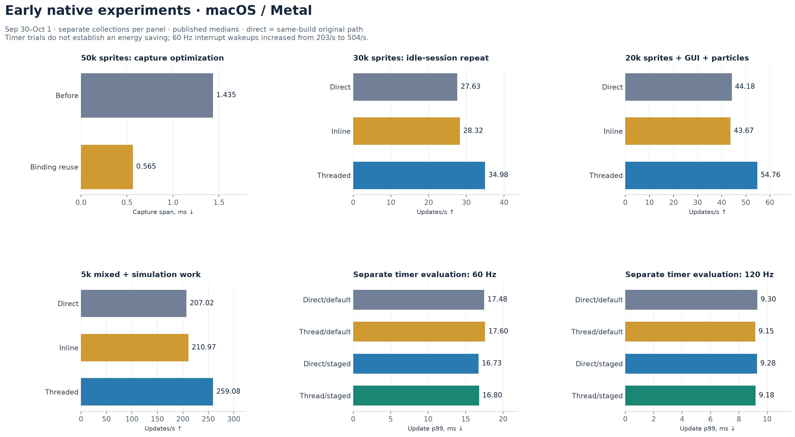

Binding reuse reduced 50k-sprite capture time by **61%**, with **8.3%** higher inline throughput. In the later idle-session sweep, paired component-threading gains at 10k/20k/30k were **18.0% / 20.7% / 25.6%**. Mixed GUI/particle workloads retained gains of about **24–25%**. This supported useful parallelism beyond code rearrangement alone.

The initial six-repeat decision matrix had failed its crowd ≥10% throughput and ≤5% capped-p99 gates. Follow-up workload scaling moved below the desktop pacing plateau; it did not erase the original result. Pixel scaling from 32 to 128 pixels reduced all modes from about **120 to 44.5–44.6 UPS**, with essentially no threading benefit.

The staged native timer improved 60 Hz p99 in its own collection, but the default timer also passed the relative gate on that occasion. Threaded interrupt wakeups rose from about **203/s to 504/s** at 60 Hz. CPU usage and wakeups do not establish energy savings. Timer and QoS changes remain opt-in and are not part of the latest web result.

### Native replay and resource churn

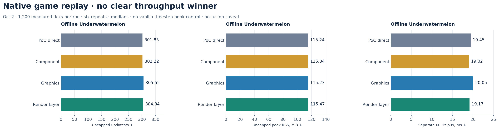

The short offline replay showed no compelling throughput separation. All compared modes matched declared gameplay checkpoints; that is not equivalent to pixel equality for randomized particles. An earlier replay switched from roughly 120 UPS to 269–288 UPS late in collection and remains throughput-inconclusive.

The full architecture collection ran **10-minute churn** for vanilla, direct and the three workers; inline controls ran one minute. Cleanup retired active frame/resource references. Second-half RSS changes were roughly **−1.98 to +2.00 MiB** across the long runs. Earlier active/paused sprite churn ran five minutes. These are useful bounded-lifetime checks, not exhaustive leak or hours-long device-budget certification.

## Desktop web: why the results changed as the implementation evolved

### Original Bunnymark and scheduling

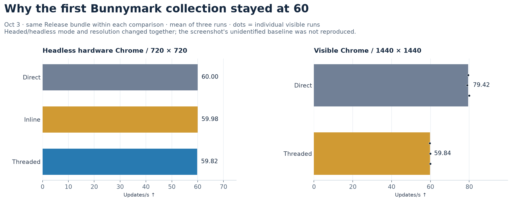

The first hardware-accelerated **headless** test stayed near 60 UPS at all three populations. The visible 30k rerun used a **1440 × 1440** buffer instead of 720 × 720 and measured **79.42 direct vs 59.84 threaded**. Both modes within that rerun used the same Release bundle, so debug/release did not explain their difference. The user's separate ~30 vs ~40 screenshot comparison had an unidentified baseline and was never a matched reproduction.

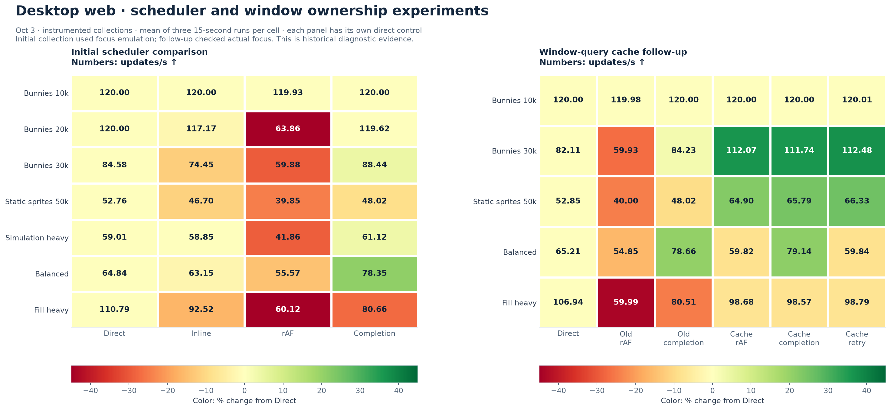

Completion dispatch recovered worker idle time, but the next experiment exposed a more important serialization point: a synchronous window-open query waited on browser main. Caching main-owned window state restored overlap. At 30k, cached rAF gave **112.07 vs 82.11 UPS direct**; balanced work preferred cached completion, **79.14 vs 65.21**. Fill-heavy still lost about **8%**. The immediate retry alternative rarely dispatched useful extra work.

These initial stage-instrumented experiments are historical diagnostics. The first collector used focus emulation; later collections checked real foreground focus. CPU frame age, submission p99 and update p99 are different measurements. Some policies gained throughput while increasing frame age; none measured physical input latency.

### Broad components, model/mesh ownership and preparation overlap

The broad compatibility path initially used exclusive main/worker handoffs. Owned component frames then allowed simulation, and subsequently preparation, to overlap previous-frame drawing. The early broad path kept culling, batching and geometry on the game worker; browser main replayed uploads and draws.

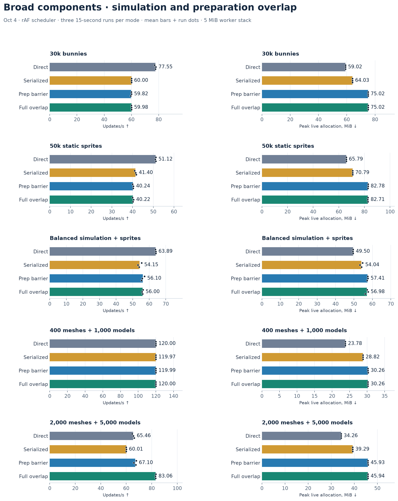

In 60 short runs, full preparation overlap improved the 7,000-component geometry case **67.10 → 83.06 UPS versus the preparation barrier (+23.8%)**, with almost identical memory. It did not help the sprite/balanced cases under that rAF policy. Heavy geometry used **45.94 vs 34.26 MiB direct**, with **6.44 MiB** retained frame capacity and a 5 MiB worker stack explaining most of the difference.

The longer candidate evaluation then ran three approximately two-minute trials per mode/case:

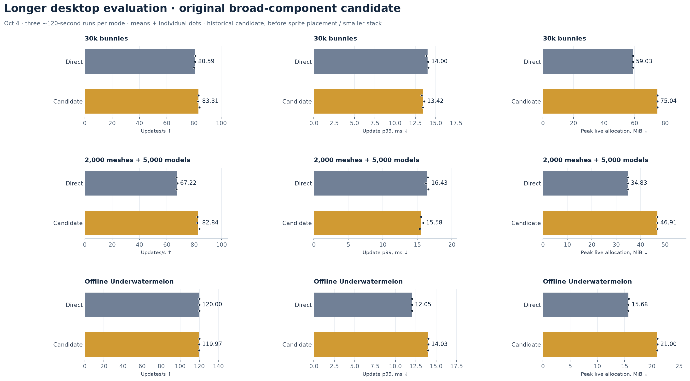

That historical candidate passed the heavy geometry throughput target (**+23.2%**) but failed the provisional **≤20% extra live-memory** budget and **≤5% gameplay-p99 regression** gate. Underwatermelon's p99 worsened **16.5%** while all modes remained near 120 UPS. Later memory and placement changes address parts of this result; they do not retroactively turn the old gate into a pass.

### Sprite work placement and smaller-stack diagnostics

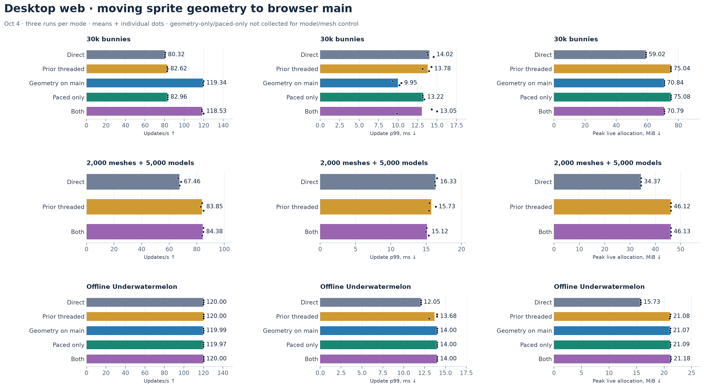

Moving sprite **geometry generation** to browser main balanced work across the two owners. At 30k, throughput rose **82.62 → 119.34 UPS** versus prior broad threading and live memory fell **75.04 → 70.84 MiB**. Culling and batch selection still remained on the worker. The separately tested paced scheduler added no reliable benefit, and Underwatermelon's pacing issue remained.

In the subsequent smaller-stack evaluation, 30k reached **118.87 vs 79.57 UPS direct**, and heavy geometry **83.69 vs 67.03**. Underwatermelon remained about 120 UPS, but p99 was **11.72 ms direct vs 14.02 ms threaded with 2 MiB stack**. Separate traces showed about **7.7 ms/update** of publication wait; they did not find expensive simulation or graphics-owner calls in that measured window. Browser cadence/backpressure remained important.

[Preparation overlap](WEB_PREPARATION_OVERLAP_RESULTS.md) · [Long candidate](WEB_PRODUCTION_CANDIDATE.md) · [Placement](WEB_SPRITE_PLACEMENT_RESULTS.md) · [Worker diagnostics](WEB_WORKER_DIAGNOSTICS_RESULTS.md)

## Memory: improvements achieved and costs that remain

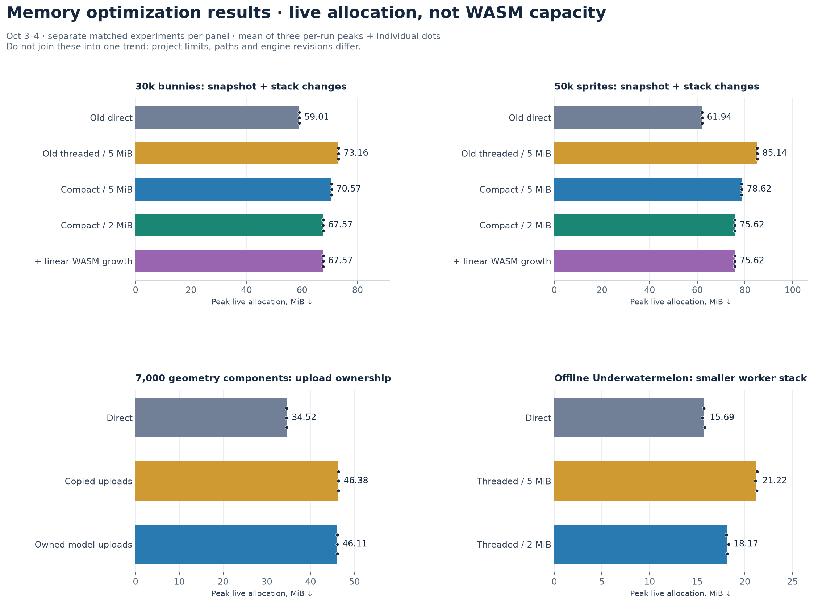

The experiments establish distinct savings:

| Change | Measured result | Limit |
|---|---|---|
| Compact/reserved sprite snapshots | At the unchanged 5 MiB stack: **−2.59 MiB at 30k**, **−6.52 MiB at 50k**. | Still retains two immutable slots. |
| Opt-in 5 → 2 MiB worker stack | About **3 MiB less live reservation**, also confirmed in broad components and gameplay. | Observed watermarks do not certify arbitrary Lua/native-extension call depth. Default remains 5 MiB. |
| Compact snapshots + 2 MiB stack | Total saving **5.59 MiB / 9.52 MiB** versus old threading at 30k / 50k. | Different collections/project capacities must not be combined into one memory trend. |
| Owned model upload buffers | **−0.27 MiB**, avoids **504,000 copied bytes/frame** in the geometry scene. | +0.6% measured throughput difference is too small for a strong speedup claim. |
| Optional 4 MiB linear WASM growth | 30k capacity **95.81 → 76.00 MiB** versus the old configuration; 50k **115.00 → 108.27 MiB** mean. | Mainly less spare capacity, not fewer live bytes. Extended-play growth stalls unproven. |
| Readiness budget | No measured increase in frame/queue capacity. | Does not remove snapshot/stack overhead. |

The earlier fixed-population geometry growth signal was investigated: after explicit diagnostic GC, two-minute growth was only **96 bytes direct / 144 bytes threaded**; without snapshot serialization, one-minute diagnostics ended **40 bytes** above baseline. Reclaimable Lua garbage and probe overhead explained that signal in that workload. This is not proof that all long-lived application/resource paths are leak-free.

[Sprite memory report](benchmarks/web-memory-2026-10-03/REPORT.md) · [Model ownership and GC attribution](WEB_OWNED_MODEL_MEMORY_RESULTS.md) · [Detailed capacity graphs](benchmarks/web-memory-2026-10-03/memory-capacity.png)

## Real external project: space game

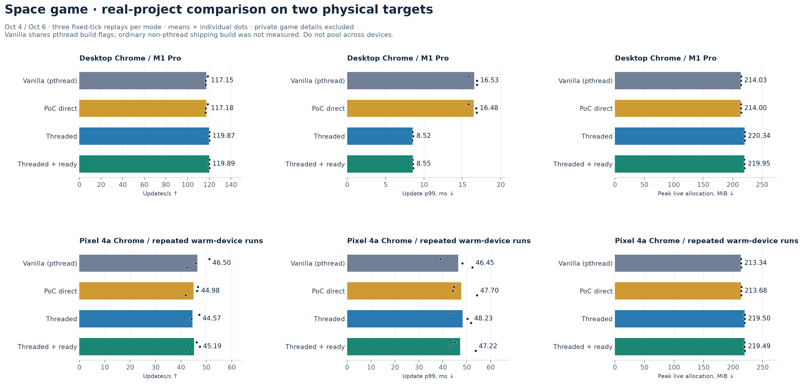

On desktop, threading gave **117.18 → 119.87 UPS** near the display ceiling, with p99 **16.48 → 8.52 ms** and **+6.34 MiB** live allocation. Ready scheduling reduced measured producer wait **1.78 → 0.20 ms/update** and CPU frame age **12.71 → 6.20 ms**, with little additional throughput/p99 change. Those spans do not measure display latency.

On the Pixel, the repeated real-game comparison was effectively flat: **44.98 direct, 44.57 threaded, 45.19 ready UPS**. Vanilla averaged **46.50**, but its cool first run was **51.12**, then **45.85 / 42.53**. Warm-device variation prevents interpreting small differences as a clear refactoring/threading effect. Threading added approximately **5.8 MiB** live allocation. All twelve desktop and all twelve phone replays matched checkpoints and cleanup.

The latest quiet milestone also completed one compatibility replay per selected mode: **51.66 direct / 52.44 ready / 51.96 budgeted UPS**. Those three runs establish continued compatibility, **not a replacement repeated performance verdict**.

Dwarfcopter supplied compatibility evidence only: it built, but custom render-target creation remained a threaded blocker and its direct renderer migration needed work. No accepted performance comparison exists for it.

[Desktop space-game report](SPACE_GAME_WEB_REPLAY_RESULTS.md) · [Repeated Pixel replay](benchmarks/pixel-4a-web-2026-10-06/replay/REPORT.md)

## Evidence inventory

This index covers the completed benchmark milestones and identifies validation-only, diagnostic and superseded collections. It is not a sum of independent samples: later reports reuse earlier controls/evidence. Failed startup attempts, sanitizer runs and instrumented pilots are not silently pooled into acceptance performance. Early native and original Bunnymark archives are local links; later web reports live in this repository.

| Period / collection | Extent and interpretation | Source |
|---|---|---|
| Sep 29 initial baseline | `-O0` diagnostic build; excluded as optimized performance evidence. | [Preserved diagnostic note](/Users/jhonny/dev/defold-projects/experiment-decoupled-rendering/results/baseline-20260929/README.md) |
| Sep 30 optimized baseline | 51 runs; count/visibility/simulation/movement/pass sweeps. Many ~120 UPS plateaus; battery/interactive desktop. 50k median **71.81 UPS**. | [Baseline](/Users/jhonny/dev/defold-projects/experiment-decoupled-rendering/results/baseline-20260930-o2/baseline-report.md) |
| Sep 30 inline/thread validation | Single-run checks; stable capacities/cleanup, not speedup evidence. Earlier discontinuous-timing collection superseded. | [Inline](/Users/jhonny/dev/defold-projects/experiment-decoupled-rendering/results/inline-validation-20260930/README.md), [threaded](/Users/jhonny/dev/defold-projects/experiment-decoupled-rendering/results/threaded-validation-20260930-final/validation-report.md) |
| Sep 30 sprite completion | 144 matched performance trials; active/paused five-minute churn; sanitizers. Selected paired gains: **12.7% static 50k, 21.1% fully moving, 19.0% 256 constant groups**. | [Completion](/Users/jhonny/dev/defold-projects/experiment-decoupled-rendering/results/completion-report-20260930.md) |
| Sep 30 capture / decision matrix / pixel scaling | Six old/new capture pairs; 180 evaluation + 18 pixel-scaling trials. Initial throughput/p99 gates failed. | [Evaluation](/Users/jhonny/dev/defold-projects/experiment-decoupled-rendering/results/evaluation-overview-20260930.md) |
| Oct 1 idle-session diagnosis | 54 untraced throughput + 27 traced runs; earlier interactive/interrupted sweeps separate. | [Findings](/Users/jhonny/dev/defold-projects/experiment-decoupled-rendering/results/diagnostics-analysis-idle-20261001/findings.md) |
| Oct 1 mixed components | Sprite/GUI/particle throughput, caps, 60-second churn and traces; v3 is the final comparison. | [Mixed findings](/Users/jhonny/dev/defold-projects/experiment-decoupled-rendering/results/mixed-analysis-20261001-v3/findings.md) |
| Oct 1 pacing / QoS / sampler | 72 final untraced trials; isolation, Mach timer, QoS and staged-wait traces are separate diagnostics. | [Pacing findings and linked pilots](/Users/jhonny/dev/defold-projects/experiment-decoupled-rendering/results/pacing-analysis-20261001-v1/findings.md) |
| Oct 2 initial offline replay | 36 trials; matching checkpoints; uncapped rate shift makes throughput inconclusive; energy unavailable. | [Replay notes](/Users/jhonny/dev/defold-projects/experiment-decoupled-rendering/results/underwatermelon-comparison-20261002-v1/evaluation-notes.md) |
| Oct 2 graphics packets | 180 synthetic + 60 replay trials, five churn runs. | [Graphics comparison](/Users/jhonny/dev/defold-projects/experiment-decoupled-rendering/results/graphics-comparison-20261002-v1/comparison.md) |
| Oct 2 three boundaries + vanilla | 408 synthetic + 84 replay trials, eight memory runs; possible occlusion. Partial v1 excluded; final v2 retained. | [Architecture report](RENDERING_POC_SUMMARY.md) |
| Oct 3 original web Bunnymark | 27 headless runs, then six visible 30k runs; conditions differ. | [Initial](/Users/jhonny/Downloads/sprite_bunnymark/benchmarks/web-2026-10-03/PERFORMANCE_COMPARISON.md), [visible](/Users/jhonny/dev/defold/tmp/web-visible-30k-2026-10-03/COMPARISON.md) |
| Oct 3 web scheduling | 84 instrumented runs + instrumentation-off controls. | [Scheduling](benchmarks/web-threading-2026-10-03/REPORT.md) |
| Oct 3 window cache / retry | 90 instrumented runs + controls; actual focus checks. | [Cache](benchmarks/web-threading-improvements-2026-10-03/REPORT.md) |
| Oct 3 snapshot memory | 36 runs; old/new layouts, stack and growth-policy controls. | [Memory](benchmarks/web-memory-2026-10-03/REPORT.md) |
| Oct 3–4 broad 2D/3D coverage | Correctness fixtures, pixels, animation, buffers, proxies, pause, shutdown; not a standalone performance comparison. | [Component coverage](WEB_COMPONENT_POC.md) |
| Oct 4 preparation overlap | 60 accepted runs; final alignment/font fixes; earlier attempts excluded. | [Overlap](WEB_PREPARATION_OVERLAP_RESULTS.md) |
| Oct 4 sustained candidate | 18 foreground runs; three workloads, two modes, ~two minutes each. | [Candidate](WEB_PRODUCTION_CANDIDATE.md) |
| Oct 4 model ownership | Nine timing runs + six separate GC diagnostics. | [Ownership](WEB_OWNED_MODEL_MEMORY_RESULTS.md) |
| Oct 4 sprite placement / pacing | 39 runs; geometry-only, pacing-only and combined policies. | [Placement](WEB_SPRITE_PLACEMENT_RESULTS.md) |
| Oct 4 worker/stack diagnosis | 27 acceptance runs + separate traced attribution; advanced-project smoke checks. | [Diagnostics](WEB_WORKER_DIAGNOSTICS_RESULTS.md) |
| Oct 4 space game | 12 replays including vanilla; anonymous published aggregates. | [Game](SPACE_GAME_WEB_REPLAY_RESULTS.md) |
| Oct 6 Pixel first complete comparison | 75 accepted runs; 12 game + 63 synthetic. Older incomplete setup excluded; periodic reporting affects interpretation. | [Pixel](PIXEL_4A_WEB_BENCHMARK_RESULTS.md) |
| Oct 6 Pixel quiet / readiness budget | 60 synthetic acceptance + three compatibility replays + 18 diagnostic runs. Current synthetic decision dataset. | [Quiet Pixel](WEB_PIXEL_PACING_RESULTS.md) |

New figures are generated from a [numeric-only extract](benchmarks/overview-2026-10-07/chart-data.json) with source attribution, plus [calculated chart aggregates](benchmarks/overview-2026-10-07/chart-aggregates.json). Recreate them with `python3 engine/docs/benchmarks/overview-2026-10-07/plot.py` using matplotlib and numpy. The extract preserves 648 source rows across 20 datasets; rows include published summaries and must not be mistaken for 648 independent trials. External game code, replay state/inputs, identities, logs, bundle hashes and screenshots are intentionally excluded.

## Verdict: readiness and remaining work

**The architectural viability question has a positive answer for selected workloads. Production readiness does not yet.** Component threading has repeated sprite-throughput gains on desktop and a physical lower-powered phone, useful geometry microbenchmark gains on desktop, deterministic real-game replay evidence, and explainable memory costs. The results also identify cases where it adds cost without benefit. That supports an opt-in implementation with measured project-specific qualification.

**The component path is the best-supported direction in this work.** Graphics-layer decoupling alone moved too little CPU work to show comparable gains in the native comparison. The current render-layer PoC has not demonstrated an advantage over component threading. Its native comparison needs a controlled repeat before a firm architectural performance ranking. Neither alternative has the broad web performance coverage accumulated by the component implementation.

| Readiness area | Current evidence / remaining decision |
|---|---|
| Component coverage | Broad web fixtures cover sprites, GUI/text/particles, labels, tilemaps, cameras, physics/audio, factories/proxies, meshes/models, CPU/GPU skinning and instancing. Preparation overlap is implemented. This does **not** mean every feature or extension path is production-supported. The separate native render-layer PoC has narrower coverage. |
| Throughput | Proven useful in selected sprite workloads; mixed results elsewhere. A representative animated model/mesh game and a sprite-heavy real game below the mobile display cap are still needed. The space-game phone replay is not a throughput win. |
| Pacing and physical latency | Latest quiet sprite p99 improves; light geometry and some gameplay comparisons still regress. No physical input-to-display measurement exists. CPU frame-age counters cannot substitute for it. |
| Memory | Snapshot compaction, upload ownership and smaller-stack options are measured. Several MiB of retained overhead remain. Validate project budgets and long repeated resource/scene lifecycles; small observed stack watermarks do not justify changing the global stack default. |
| Energy and thermals | Pixel temperature/throttling history is recorded. **Energy/battery efficiency is unmeasured**; native power collection could not authenticate the sampler and CPU/wakeup data are not watts. Add sustained thermal and energy comparisons on target devices. |
| Compatibility and lifecycle | Focused ownership/pixel tests, native ASan/TSan, animation, resource replacement, pause/resume, unload and context-loss **shutdown** pass within their scopes. Still need broader long-running lifecycle coverage, context restoration/reboot, custom render-target/resource paths and extension/DOM ownership contracts. Dwarfcopter remains a concrete compatibility blocker. |
| Platform and baseline breadth | Native performance is mainly macOS/Metal; web performance is Chrome on M1 Pro and Pixel 4a. Other supported browsers/backends/devices and ordinary non-pthread web shipping controls remain unmeasured. |
| Productization | Keep threading, scheduler, stack, growth and timer experiments opt-in. Select supported policies, validate pthread deployment with COOP/COEP, define explicit admission/fallback behavior and extension/resource ownership, then enforce correctness and regression budgets in CI. The 32 ms readiness budget has no demonstrated default-policy advantage. |

**Next release gate:** qualify one supported opt-in component configuration with a quiet, repeated real-project comparison against both PoC direct and ordinary shipping web builds; measure physical latency, energy and sustained memory/lifecycle behavior on the phone and another target browser/device. Resolve the concrete custom-render-target and extension/lifecycle gaps required by that supported scope. Until those pass, retain the PoC as an experimental option rather than enabling it generally.
