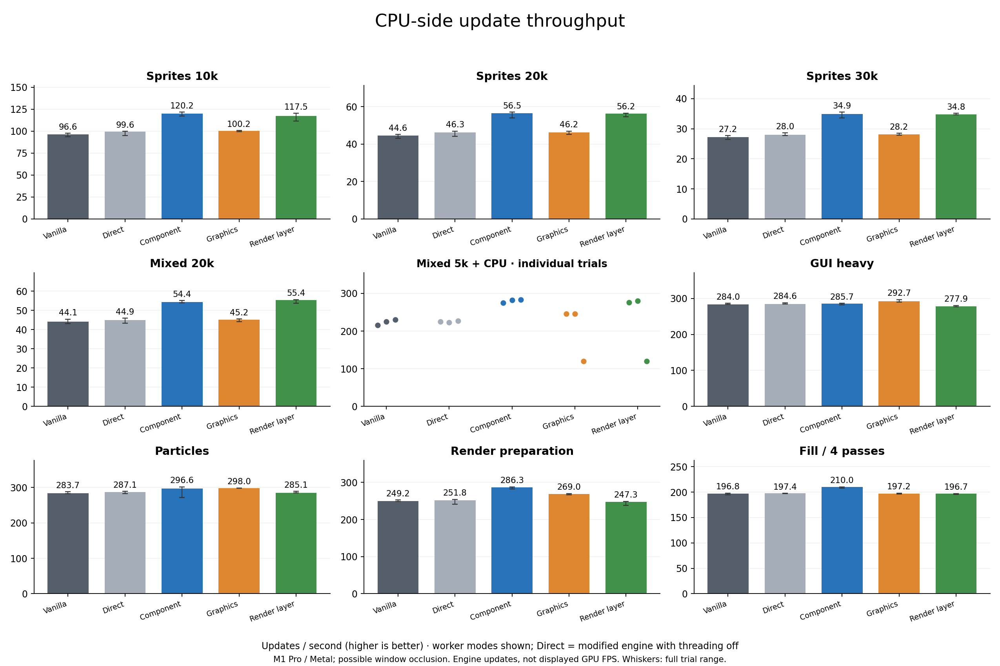
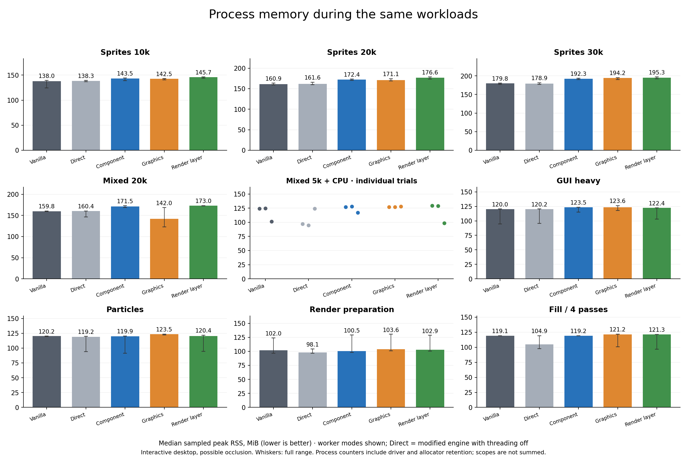
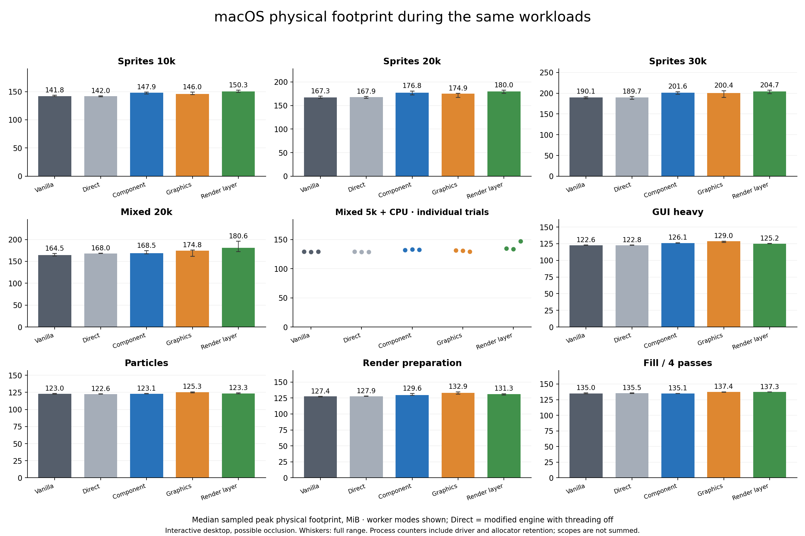
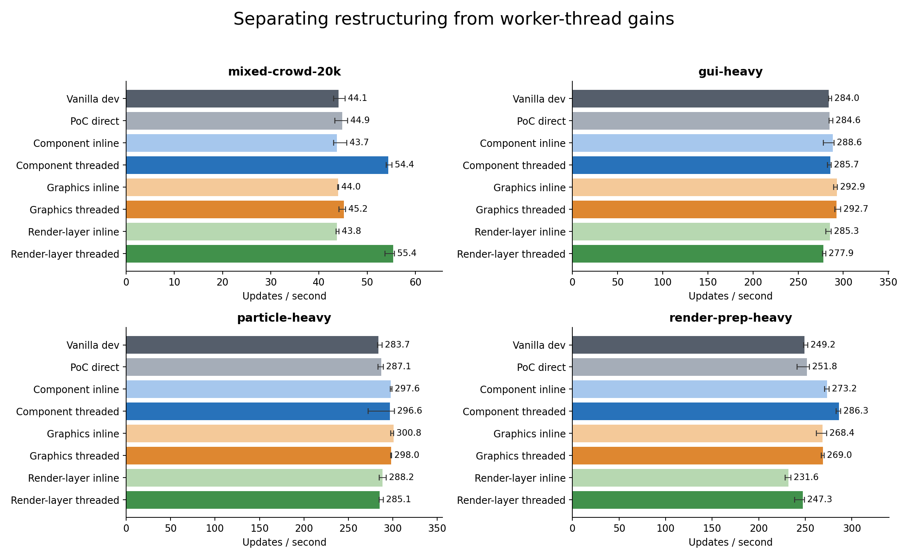
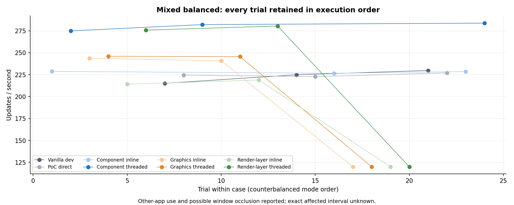
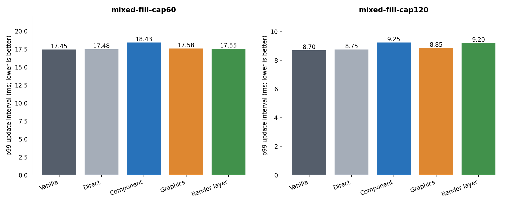
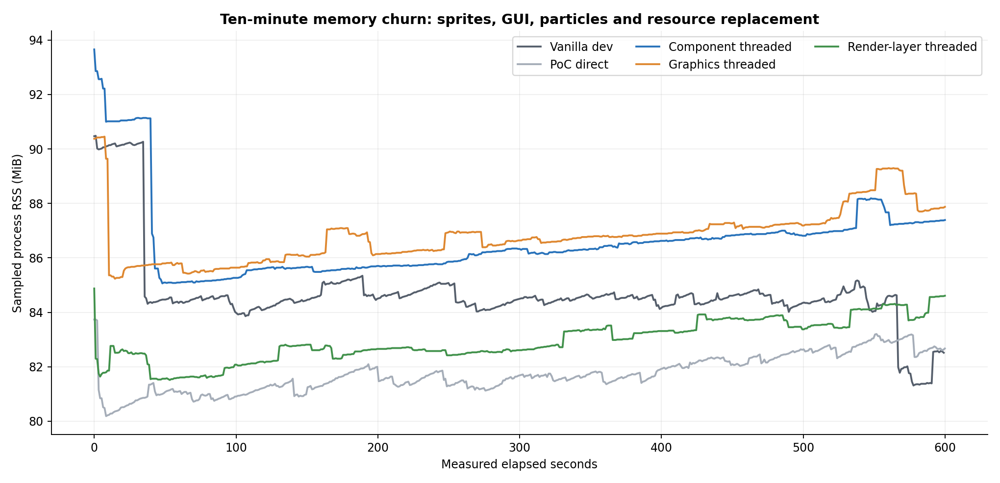

# Rendering decoupling: implementation and benchmark summary

For the consolidated history through October 6, including desktop web and Pixel measurements, see the [benchmark overview and current readiness verdict](RENDERING_POC_BENCHMARK_OVERVIEW.md). This document preserves the October 2 native comparison.

Collected on 2026-10-02; Apple M1 Pro, 16 GiB RAM, macOS 26.5.2, arm64/Metal. All threading, timer and QoS treatments remain opt-in.

The render-layer PoC is implemented for the admitted sprite, GUI and particle workloads. It adds a shared immutable frame, render-owner geometry generation for GUI/particles, owned per-pass constants, and persistent graphics-owner servicing. This is an experimental native implementation, not a production rollout or support for every Defold component.

The preselected render-preparation test shows **-13.8% throughput versus component threading**, with a paired 95% bootstrap ratio interval of **0.843–0.875**. Its provisional ≥10% gate is **NOT MET numerically; controlled conclusion INCONCLUSIVE because of possible window occlusion**. The numeric comparison is descriptive: the user reported using other apps and possibly covering the benchmark window during collection. The affected interval is not known. Retained slow trials and mode-dependent compositor pacing can distort the comparisons; bootstrap intervals do not correct that confound. A controlled repeat is needed before making an architectural performance decision.

Raw evidence: [collection and saved inputs](/Users/jhonny/dev/defold-projects/experiment-decoupled-rendering/results/renderframe-comparison-20261002-v2), [all trial data](/Users/jhonny/dev/defold-projects/experiment-decoupled-rendering/results/renderframe-comparison-20261002-v2/trials.csv), [summary CSV](/Users/jhonny/dev/defold-projects/experiment-decoupled-rendering/results/renderframe-comparison-20261002-v2/summary.csv), [paired comparisons](/Users/jhonny/dev/defold-projects/experiment-decoupled-rendering/results/renderframe-comparison-20261002-v2/comparisons.csv), [complete audit and results](/Users/jhonny/dev/defold-projects/experiment-decoupled-rendering/results/renderframe-comparison-20261002-v2/comparison.json).

## What the implementations do

| Condition | Implementation | What it tests |
|---|---|---|
| **Vanilla dev** (runner 7) | Unmodified pre-PoC dev source, commit `5f5706cb09a646358da203c7c59b95269c54910f`. Normal simulation and rendering on the engine thread. | Genuine baseline, built separately with the same compiler/optimization configuration. |
| **PoC direct** (0) | Modified PoC engine using the original rendering flow on the engine thread, with experimental rendering workers and frame capture disabled. | Combined effect of shared code changes and diagnostics versus unmodified vanilla. |
| **Component inline / threaded** (1 / 2, earlier Solution 3) | Snapshot sprites. Consume sprite inputs through culling, sorting, batching, geometry and graphics. GUI/particle geometry is prepared on main after draining the previous consumer, then replayed. | Inline isolates restructuring/copying; threaded measures overlap. One shared worker, not one thread per component. |
| **Graphics inline / threaded** (3 / 4, Solution 1) | Keep render Lua, culling, batching and geometry on main. Record owned dmGraphics packets, including copied upload/constant bytes, and execute backend calls inline or on a worker. | Moving graphics execution alone. Creates/queries/readbacks may still synchronously wait; this is not the complete future asynchronous logical-handle frontend. |
| **Render-layer inline / threaded** (5 / 6, Solution 2) | Main extracts immutable inputs into a generic `RenderFrame`; Lua records owned pass commands. The consumer builds the render list, generates sprite/GUI/particle geometry, and submits graphics. Resource and lifecycle graphics work executes on the persistent owner. | Moving more render preparation off main, compared both with component threading and with the same new path inline. |

**PoC direct is not an unmodified engine build.** It still uses the refactored sprite renderer state and shared sprite/particle geometry helpers, exposes additional memory/capacity diagnostics collected by the benchmark, and checks whether experimental capture or resource barriers are active (normally returning immediately). Metal command-buffer completion/reuse mutex protection also remains active. It does not create immutable render snapshots or start an experimental rendering worker; normal engine background threads remain. Detailed frame tracing, timer changes and QoS changes were disabled for these runs. The vanilla-versus-direct comparison measures these changes together; it does not isolate their individual costs.

The component and render-layer designs overlap by design. Sprites already used immutable worker inputs in the earlier PoC; the new mode is not an independent algorithmic reinvention for sprites. Its major additions are unified ownership, GUI/particle extraction instead of prepared geometry, per-pass state, and owner-side lifecycle/resource requests.

Select the new mode at startup:

```ini
[render]
poc_pipeline = renderframe
poc_threaded = 1
```

Use `poc_threaded = 0` for its inline control. Named pipelines also accept `legacy`, `component`, and `graphics`; `legacy` requires threading off. Existing `render.sprite_snapshot=0/1/2` and `render.graphics_packets=0/1/2` aliases remain. Explicit named and legacy selectors cannot be combined. Runner condition numbers are not engine configuration values.

## Implemented coverage and boundaries

| Feature | Render-layer PoC status |
|---|---|
| Sprites | Owned transforms, animation/texture bindings, constants and attributes; worker culling/batching/geometry. Focused geometry tests include slice9 and trimmed sprites. |
| GUI boxes and ordinary text | Owned box inputs, transforms, colors, clipping/stencil order, text and layout parameters. Geometry, glyph rendering, upload and renderer text caches are consumed on the owner. Game-side text-metric queries drain the consumer before shared font access; layout-cache misses also drain. These barriers can reduce overlap. |
| Standalone particles | Simulation and random advancement remain on main; evaluated particle inputs and constants are copied, geometry is generated on the consumer. |
| GUI particles | Added after the unchanged Underwatermelon replay exposed this coverage requirement. Capture applies GUI transforms on main, then owns evaluated particle inputs, colors, textures and constants for owner-side geometry. |
| Render Lua | Stays on main. Captured matrices, viewports, predicates/frusta and per-draw constants survive later Lua mutation/GC. Distinct-view correctness fixture supported. |
| Physics, sound, preloaded factories | Stay on main under the gameplay admission option; exercised by the offline replay. Not parallel simulation. |
| Resource lifetime | Retained dependencies and generation checks; conservative CPU/GPU drains protect in-place replacement. Create/upload/delete requests execute on the owner. Resource-job requests own their copied payloads and deliver completion on main. |
| Extensions | Private extension-style owner lifecycle/request fixture tested. Legacy pre/post-render hooks are rejected in the new mode; there is no general third-party extension migration API. |
| Not included | Labels, tilemaps, models/meshes, arbitrary collection streaming, GUI pie/custom nodes, rich text/custom text styles, general camera-component integration, custom render targets, compute, other native/web backends, device-loss recovery. |

There are two reusable CPU slots, at most one published incomplete frame, no frame dropping, and explicit admission failure. Complete frame capacity and conservative allocation-growth coexistence are bounded to 32 MiB per slot / 64 MiB total. Auxiliary request payloads have an 8 MiB retained bound (with separately bounded growth) and 256 outstanding requests. These are ownership budgets, **not total process memory limits**. Dynamic renderer scratch, GPU storage, caches, resources and thread stacks are additional scopes.

The new path captures after simulation/transforms and before destructive PostUpdate, matching the original render phase. The earlier component path retains its prior after-PostUpdate extraction timing; deletion-boundary differences are a documented comparison limitation. Gameplay checkpoint equality alone does not prove identical pixels at every such boundary.

## What each test measures

| Test | Workload / purpose |
|---|---|
| Sprite crowd 10k / 20k / 30k | Animated, moving sprites, 16 constant groups, fixed simulation work. Tests CPU render preparation at increasing load. |
| Mixed crowd 20k | Sprite-heavy scene plus 64 GUI boxes, 64 text nodes and 8 particle emitters. Historical throughput comparison. |
| Mixed balanced 5k | Fewer sprites and more scripted simulation work, with the same GUI/particles. Tests whether render work overlaps useful game work. |
| Mixed fill, capped 60 / 120 | Large sprites, four draws/passes and GUI/particles; requested engine update caps. Tests pacing and p99, not maximum throughput. |
| GUI heavy | 512 boxes and 512 text nodes, clipped/interleaved, with staggered text updates. Exercises GUI traversal, layout/cache and geometry costs. Some nodes extend outside the clipped view. |
| Particle heavy | 16 standalone emitters. Exercises evaluated-input copying and particle geometry generation. Emitter counts are fixed; per-trial active particle counts are not exported by this harness. |
| Render preparation heavy | 500 sprites, 512 boxes, 512 texts, 16 emitters and fixed scripted work. Preselected ≥10% comparison against component threading. |
| Fill negative control | Four large-sprite passes plus GUI/particles, uncapped. GPU/compositor pressure can limit the benefit of CPU threading. |
| Memory churn | 2,000 moving/animated sprites, GUI node rebuilding, particles, repeated texture/atlas replacement and scratch release. Worker modes also exercise pause/resource servicing. Ten minutes for vanilla/direct/three workers; 60 seconds for inline controls. |
| Offline Underwatermelon | Identical 1,320 replay ticks, 1,200 measured ticks and 836 ordered events, fruit physics/merging/scoring/GUI/sound. Optional streamed music loader remains excluded. Six runs at uncapped and 60 Hz for all seven PoC conditions. |
| Owned-data tests | Mutate/delete source sprite/particle data after capture; verify retained geometry, arena bounds, partial-failure cleanup and per-pass constant ownership. |
| Native pixel fixtures | Original and both render-layer modes match byte for byte for sprite/GUI ordering, two views/constants, and resize plus new-glyph rendering. Gameplay particle pixels are not claimed deterministic. |
| Owner lifecycle / sanitizers | Copied frameless requests, resource-job producer, exactly-once producer completion, paused servicing, initialization/frame/finalize, explicit hook rejection; focused tests plus ASan/TSan native stress/replay. |

**Update throughput** is measured update intervals divided by elapsed wall time. It is CPU-side engine throughput including waits/backpressure, not pure CPU instruction throughput, GPU FPS, displayed frame rate or input latency. A higher rate means the engine advances the same per-update workload faster.

**p99** is the update interval at or below which 99% of samples fall; the slowest 1% exceed it. Lower is better. Here it is the upper edge of a 0.05 ms histogram bin. p50 is the median; p95 covers 95%. A p99 of 20 ms means roughly 99% of update intervals were no longer than 20 ms, subject to that bin resolution. It is not a maximum, “1% low FPS”, or input-to-display latency.

**CPU %** is total process CPU time divided by wall time, expressed relative to one core: 150% means about 1.5 cores occupied on average. It is not power consumption. **RSS** is sampled resident process memory; **physical footprint** is macOS process accounting with a different scope. A sampled peak can miss shorter allocation spikes. MiB = 1,048,576 bytes.

## Throughput and memory graphs

Bars are medians of independent process trials. Cases flagged for an uncapped range over 20% show individual trials instead, without pooling across the unexplained regimes. Throughput and memory whiskers show the full observed range, including slow trials. “Direct” is the modified binary’s no-threading control; “Vanilla” is the separate unmodified build.







Physical footprint provides complementary macOS accounting; RSS can fall when pages leave the resident set without a corresponding reduction in the application’s total memory footprint. These scopes overlap and are not added.



## Paired comparisons



Ratios pair matching repetition blocks, rather than dividing two unrelated medians. Positive throughput percentages are faster. Medians of paired ratios need not multiply transitively or equal ratios of the displayed bar medians. The “worker vs own inline” comparison is the relevant estimate of adding the thread after restructuring.

| Workload | Component vs vanilla | Graphics vs vanilla | Render layer vs vanilla | Render layer vs component | Render-layer worker vs inline |
|---|---:|---:|---:|---:|---:|
| crowd-10000 | +24.3% | +4.0% | +22.5% | -1.7% | +24.2% |
| crowd-20000 | +26.2% | +3.9% | +25.1% | -0.4% | +24.5% |
| crowd-30000 | +28.1% | +3.5% | +28.3% | -0.3% | +23.3% |
| mixed-crowd-20k | +25.2% | +3.3% | +22.0% | +1.9% | +25.4% |
| mixed-balanced-5k | not pooled: unstable | not pooled | not pooled | not pooled | not pooled |
| gui-heavy | +0.6% | +2.3% | -2.2% | -2.7% | -2.9% |
| particle-heavy | +4.5% | +5.0% | +0.3% | -4.0% | -1.1% |
| render-prep-heavy | +14.6% | +7.5% | -1.2% | -13.8% | +6.5% |
| fill-negative | +6.7% | +0.0% | +0.1% | -6.2% | -0.8% |

### Restructuring versus threading on the preparation workload

| Solution | Inline vs PoC direct | Worker vs own inline | Worker vs vanilla |
|---|---:|---:|---:|
| Component | +8.8% | +5.0% | +14.6% |
| Graphics | +7.3% | +0.5% | +7.5% |
| Render layer | -7.7% | +6.5% | -1.2% |

The complete CSV retains arithmetic summaries even for flagged conditions for audit, but those pooled values are not interpreted as a common performance regime. It includes every inline control, direct-vs-vanilla contrast, paired RSS difference and 95% bootstrap interval. Bootstrap intervals resample repetition blocks (10,000 resamples, fixed seed); they do not eliminate time drift, correlated desktop activity or small-sample uncertainty. Three-repeat historical mixed and exploratory GUI/particle/fill cases are descriptive; reported desktop activity further limits causal interpretation across the collection.

## Capped pacing



| Case | Mode | Mean rate (median trial) | p99 ms | p99 change vs PoC direct | ≤5% numeric threshold |
|---|---|---:|---:|---:|---|
| mixed-fill-cap60 | Vanilla dev | 60.00 | 17.45 | — | reference |
| mixed-fill-cap60 | PoC direct | 60.00 | 17.48 | — | reference |
| mixed-fill-cap60 | Component threaded | 60.00 | 18.43 | +5.1% | NOT MET |
| mixed-fill-cap60 | Graphics threaded | 60.00 | 17.58 | +0.4% | within threshold |
| mixed-fill-cap60 | Render-layer threaded | 60.00 | 17.55 | +0.6% | within threshold |
| mixed-fill-cap120 | Vanilla dev | 120.00 | 8.70 | — | reference |
| mixed-fill-cap120 | PoC direct | 120.00 | 8.75 | — | reference |
| mixed-fill-cap120 | Component threaded | 119.98 | 9.25 | +6.2% | NOT MET |
| mixed-fill-cap120 | Graphics threaded | 119.79 | 8.85 | +1.1% | within threshold |
| mixed-fill-cap120 | Render-layer threaded | 120.00 | 9.20 | +5.2% | NOT MET |

The p99 column reports a numeric threshold only, not a controlled decision pass. Possible occlusion prevents that stronger conclusion. Average cap misses and unstable runs are listed below; a nominal p99 pass does not override those problems.

## Memory over time



| Mode | Measured seconds | RSS start MiB | RSS peak MiB | RSS end MiB | Change in second half MiB | After cleanup MiB | Resource cycles |
|---|---:|---:|---:|---:|---:|---:|---:|
| Vanilla dev | 600 | 90.47 | 90.48 | 82.52 | -1.98 | 83.09 | 3017 |
| PoC direct | 600 | 83.73 | 83.73 | 82.67 | +0.98 | 83.19 | 3016 |
| Component inline | 60 | 90.28 | 90.83 | 86.62 | +0.52 | 87.03 | 347 |
| Component threaded | 600 | 93.66 | 93.66 | 87.39 | +1.09 | 88.14 | 3028 |
| Graphics inline | 60 | 91.83 | 91.89 | 85.69 | +0.19 | 86.27 | 347 |
| Graphics threaded | 600 | 90.38 | 90.45 | 87.88 | +1.23 | 88.30 | 3029 |
| Render-layer inline | 60 | 90.67 | 90.69 | 86.08 | -4.50 | 86.69 | 346 |
| Render-layer threaded | 600 | 84.88 | 84.88 | 84.61 | +2.00 | 85.14 | 3026 |

Cleanup checks require live scene/frame data to retire; allocator/cache-retained RSS need not return to startup. Frame capacity, request capacity, resource references, backend allocation counters and RSS overlap and must not be summed. Existing sprite-only scratch counters are not complete per-consumer accounting for the new mode; zero in those old counters does not mean no GUI/particle scratch. The raw report retains measured frame/request capacities and growth peaks. These soaks check bounded churn; they are not an exhaustive leak or device-budget certification. Worker soaks additionally toggle pause to exercise owner servicing, so this is a lifecycle stress comparison rather than identical steady rendering activity. Process memory includes retained benchmark sample tables; PoC runs retain extra private counter fields that vanilla cannot export. RSS growth alone therefore cannot be attributed to a renderer leak, and sample-table overhead is not subtracted.

## Gameplay replay

| Mode | Uncapped updates/s | Uncapped peak RSS MiB | 60 Hz p99 ms |
|---|---:|---:|---:|
| PoC direct | 301.83 | 115.24 | 19.45 |
| Component inline | 303.36 | 115.23 | 19.50 |
| Component threaded | 302.22 | 115.34 | 19.02 |
| Graphics inline | 303.32 | 115.11 | 18.65 |
| Graphics threaded | 305.52 | 115.23 | 20.05 |
| Render-layer inline | 298.11 | 115.41 | 19.75 |
| Render-layer threaded | 304.84 | 115.47 | 19.17 |

[Replay report, checkpoints and individual trials](/Users/jhonny/dev/defold-projects/experiment-decoupled-rendering/results/renderframe-comparison-20261002-v2/gameplay/comparison.md). The same declared gameplay checkpoint signature is required across all modes. Vanilla is omitted from this fixed-step replay because it does not contain the PoC timestep hook; its synthetic throughput and memory measurements remain genuine vanilla results. The 1,200-tick measurement can be only a few seconds uncapped, so this replay is corroborating evidence, not the proposed long-duration final application gate.

Energy is **unavailable or incomplete**, not zero. Recorded reasons: sudo: a password is required. No energy-efficiency decision follows from these CPU/RSS results.

## Correctness evidence and exclusions

- Normal focused CMake suites pass: graphics (63 tests), render (84), render-script (61), particles (69), gamesys (561), extension admission (1). Test counts differ slightly under ASan because of conditional tests.
- ASan and TSan focused builds pass. Native mixed resource stress and the unchanged gameplay replay pass their sanitizer checks. Native ASan used `detect_leaks=0`; this is not a LeakSanitizer claim.
- Native deterministic pixel fixtures match across direct/render-layer-inline/render-layer-threaded. Resize runs intentionally return a timing-invalid result and are excluded from performance data.
- Gameplay pixels differ in randomized particle locations; inspection and copied-input/geometry tests support the particle path, but no exact gameplay-particle image-equality claim is made.
- The first gameplay admission attempt failed because GUI particles were unsupported. Support was implemented and revalidated. Earlier inline barrier reentry and missing test include/enum issues were fixed before freezing this binary. Diagnostic pixel attempts without the required explicit diagnostic replay flag were rejected/timed out; they are not timing evidence.
- A partial first performance collection was stopped after a shutdown-admission edge case was found in the private request API. It remains saved as `renderframe-comparison-20261002-v1` and is excluded. Shutdown now closes admission before invoking accepted completions; a regression test covers callback reentry on both policies. This report uses the restarted frozen collection.
- All performance trials are retained. There is no trimming of slow trials to improve the result. An audit error prevents publication of this report.

## Collection protocol and reproducibility

408 synthetic timing trials, 84 replay trials, eight memory runs and eight separate preflights. Trial order rotates within repetition blocks. Each trial starts a fresh process. Synthetic framebuffer is 2560 × 1440 physical pixels (1280 × 720 logical window). Windows are visible without taking focus; hiding/minimizing is not equivalent. AC power is sampled and display-idle sleep is inhibited during trials.

Historical timing workloads retain their previous durations: sprite sweep 6 × (3 s warm-up + 15 s measured); mixed throughput 3 × (5 + 20 s); capped mixed pacing 6 × (5 + 30 s). Exploratory GUI/particle/fill cases use 3 × (5 + 20 s), uncapped. The preselected render-preparation decision case uses 6 × (10 + 60 s), uncapped. Primary memory runs use 10 s warm-up + 600 s measured; inline controls use 60 s. This is a focused comparison, not the plan's full 60/120/uncapped cross-product or separate ten-minute steady-memory matrix. Default timer policy and QoS remain unchanged, with no artificial worker delay and no performance tracing.

The baseline is the unmodified dev **branch point**, not a claim to benchmark today's latest unrelated dev changes. It was archived from `5f5706cb09a646358da203c7c59b95269c54910f` and built with an isolated SDK/build directory. Both builds use the same Apple clang and CMake `RelWithDebInfo` / `-O2`, with release engine entry points. The archived baseline inherited the enclosing checkout's display version SHA; source provenance and the binary hash below identify it, not that display string.

- PoC binary SHA-256: `d98727c2e8b422aafe8a410a0f4eac18599b7b406fe1863d40ebdbe675985795`
- Vanilla binary SHA-256: `4a7a2828354687f5c2d663ce475e2b918d57497c101adb451d767a3b1df10174`
- Compiled synthetic content SHA-256: `74776a1dce130ca73edde5379a5258b1ead88a2cb003640f720d45a6befa631e`
- Frozen source diffs/files, runner copies, commands, power samples, process samples and raw JSON are retained in each collection phase.
- Memory trials explicitly allow a 900-second process timeout for the ten-minute measurement.

Reproduce with `tools/run_renderframe_comparison.py` in the benchmark project, passing the PoC binary, vanilla binary, engine source and a new output directory. Generate this report with `tools/analyze_renderframe_comparison.py RESULT_DIRECTORY --docs /Users/jhonny/dev/defold/engine/docs` using Python with matplotlib/numpy. SVG versions of the main charts are beside the PNGs. The collection also contains a portable report/figure copy and `analysis-source/` with the final scripts, pinned plotting dependencies, hashes and reproduction instructions.

## Measurement-quality notes

The saved [environment event](/Users/jhonny/dev/defold-projects/experiment-decoupled-rendering/results/renderframe-comparison-20261002-v2/environment-events.json) records an uncapped mixed-balanced scene changing from about 240 to 120 updates/s, and the user response: “Used other apps, possibly covering it”. This is consistent with possible compositor/window pacing, but does not establish the cause. The exact start/end and affected trials are unknown. All data remain visible; a narrow trial range alone does not prove a condition was unaffected. RSS also varies with allocator/driver retention and operating-system memory pressure, so a small median difference inside a wide trial range is not evidence of stable memory savings.

- User reported other app use and possible window occlusion during collection. Exact affected interval is unknown; retained timing results are descriptive and cannot establish a controlled decision gate.
- mixed-balanced-5k, Graphics inline: uncapped rate range exceeds 20%; descriptive only
- mixed-balanced-5k, Graphics threaded: uncapped rate range exceeds 20%; descriptive only
- mixed-balanced-5k, Render-layer inline: uncapped rate range exceeds 20%; descriptive only
- mixed-balanced-5k, Render-layer threaded: uncapped rate range exceeds 20%; descriptive only
- gameplay: Energy comparison is incomplete; missing energy is not zero
- gameplay: Backend query did not verify the requested adapter in every trial

## Decision boundary

The measured render-layer implementation does not establish a reason to replace component threading for performance: it is 13.8% slower on the preselected preparation workload. Keep it opt-in while investigating extraction and synchronization costs. The sprite results show that both preparation-worker paths can outperform vanilla, but do not establish a separate render-layer advantage.

The result evaluates the current bounded Metal PoCs. Use the paired tables to decide whether moving additional preparation outweighs extraction, copying, synchronization and memory costs for your target workload. A pass on one preparation-heavy case does not justify enabling threading by default. A miss means this implementation has not established the proposed benefit; it does not prove the architecture can never help.

A concrete optimization candidate is the conservative font boundary: game-side text-metric queries always drain the render owner, and layout-cache misses also drain it. Immutable CPU font metrics or a separately owned layout cache could preserve more overlap. This is a source-level hypothesis, not a measured attribution of the performance gap; profile and test it independently.

The next evaluation should record window occlusion/focus and display configuration per trial, then repeat the preselected preparation case and a longer identical gameplay replay with the desktop left unchanged. Collect actual energy and input-to-display latency before broad adoption. Do this before treating an observed median gain as a reason to migrate more components.

Remaining production work includes broader component/backend support, complete scratch/resource accounting, general extension and streaming contracts, longer representative application replays, end-to-end latency and measured energy, and validation on target device memory budgets.
