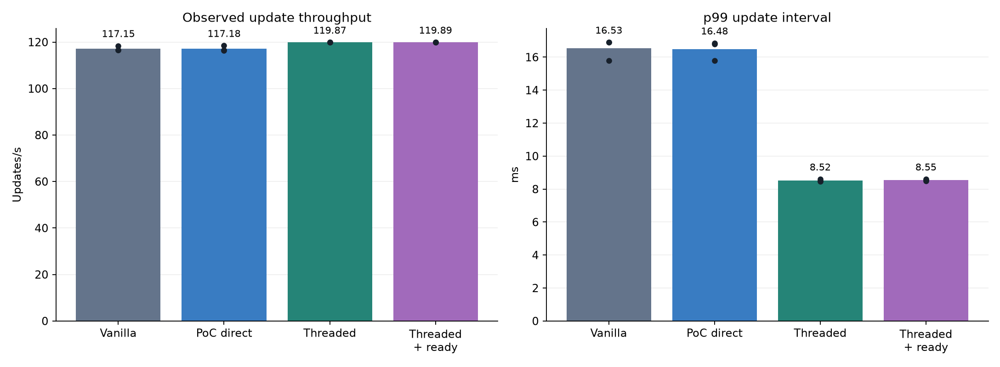
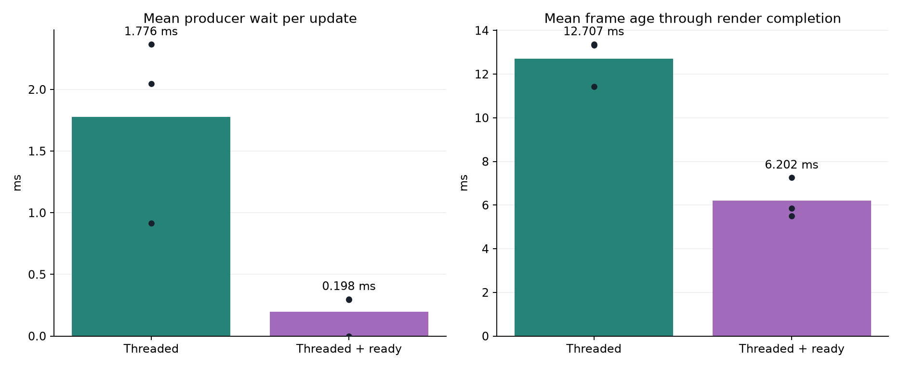
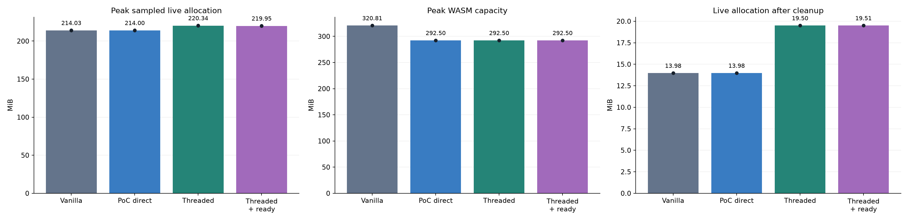

# Space game: vanilla, component threading and ready-frame scheduling

The four-part local milestone is complete: a deterministic real-game replay,
a verified vanilla control, performance/memory measurements, and one bounded
scheduling experiment. All twelve foreground Chrome runs matched the same 25
gameplay checkpoints and passed scene cleanup. The original game project was
not modified. Both threading and the new scheduler remain opt-in.

On this Apple M1 Pro, component threading improved average update throughput by
**2.3%**, reduced the p99 update interval by **48.3%**, and added **6.34 MiB** of
sampled peak live allocation compared with PoC direct. Throughput is close to the
120 Hz display ceiling, so this result primarily demonstrates better pacing.
It does not establish the gain on a slower device.

| Mode | Updates/s | Mean p99 update interval | Sampled peak live allocation | WASM capacity |
| --- | ---: | ---: | ---: | ---: |
| Vanilla | 117.15 | 16.53 ms | 214.03 MiB | 320.81 MiB |
| PoC direct | 117.18 | 16.48 ms | 214.00 MiB | 292.50 MiB |
| Component threaded | 119.87 | 8.52 ms | 220.34 MiB | 292.50 MiB |
| Component threaded + ready callback | 119.89 | 8.55 ms | 219.95 MiB | 292.50 MiB |

Vanilla is unmodified engine source at `5f5706cb09a646358da203c7c59b95269c54910f`,
with the same app-side replay probe and game extensions linked. PoC direct runs
the modified engine with threading disabled. All modes use the identical game
archive and optimized pthread-capable web build configuration. The two threaded
modes use deferred sprite geometry on browser main and a 2 MiB simulation-worker
stack. The private application adapter and source details are excluded from publication.
The ordinary shipping non-pthread web bundle was not measured; this vanilla
control shares the platform flags to isolate the threading comparison.

## Scheduling experiment

`render.poc_web_schedule=4` lets a worker-completion callback consume a ready
frame if the current browser tick has unused render credit. It wakes simulation
before consumption, preserves overlap, keeps the same two slots, and does not
accumulate credits. It changes no default behavior.

Across three repeats, mean producer-wait time fell from **1.78 to 0.20 ms/update**
and mean frame age through render completion fell from **12.71 to 6.20 ms**.
Throughput and p99 were essentially unchanged relative to existing threading.
The mechanism is useful enough to retain as an experiment; these counters do not
measure GPU completion, browser composition or physical input-to-photon latency.

## Memory assessment

Peak live allocation increased by about **3.0%**, or **6.34 MiB**. This is an
asset-heavy game; the absolute cost matters as well as the percentage. After
unloading the game, live allocation fell to about **14.0 MiB** in direct modes
and **19.5 MiB** in threaded modes. Approximately 3.49 MiB of reusable frame
capacity and the 2 MiB worker stack explain most of that difference. The retained
reference count was zero after unload.

WASM capacity is the current size of linear memory, including unused allocator
space. Its lower value in the PoC builds should not be read as lower live memory
use. It reflects allocation history and capacity growth. The full report plots
live allocation against gameplay progression and shows all three fresh-process
repeats. The workload and retained benchmark records change during the replay;
these runs do not certify leak-free repeated reloads in one long-lived process.

## Assessment and remaining proof

This strengthens the case for an opt-in web implementation: a substantial real
game keeps equivalent gameplay, gains smoother update pacing, and has a measured,
explainable memory cost. Vanilla and PoC direct are essentially equal here, which
also helps isolate the threading benefit from shared refactoring.

Before a production/default decision, the outstanding evidence remains:

- The same frozen replay on a slower physical device and additional target browsers, with an ordinary non-pthread shipping bundle as another control.
- Repeated load/unload and resource mutation in a long-lived process, including custom render targets.
- Native-extension ownership, including DOM callbacks, plus input/display latency and energy where relevant.

Dwarfcopter's custom render-target blocker is unchanged. No conclusion about that
project or unsupported extension paths is inferred from this replay.

[Full anonymous report and graphs](benchmarks/space-game-web-replay-2026-10-04/REPORT.md)
include per-run measurements, metric definitions, engine configuration and a
validation summary. Game code, replay inputs/state, project identifiers, dependencies,
logs, screenshots and raw archives remain in Git-ignored local storage and are
excluded from publication. The public report cannot reproduce the private replay
without separately authorized access to the project and adapter.
