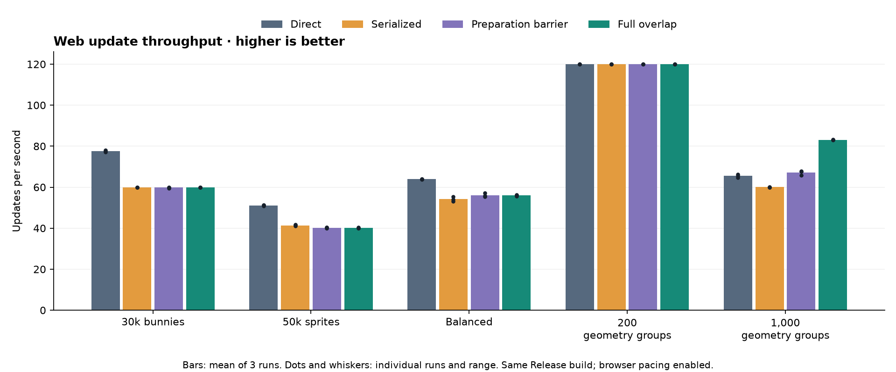
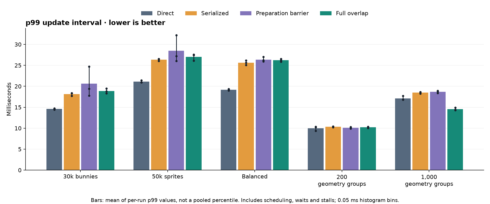
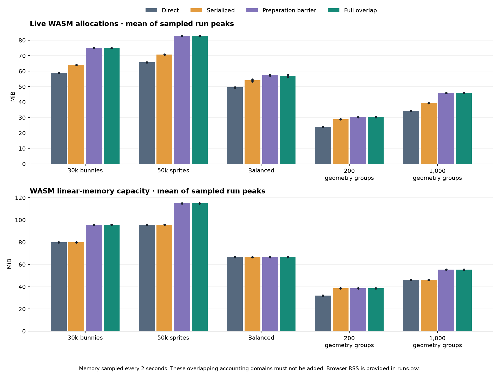

# Web component preparation overlap

Implementation validated October 3–4, 2026; hardware benchmark collection October 4.

The owned-frame web path can now prepare frame N+1 while browser main consumes
frame N. This includes component rendering, culling, batching, CPU skinning,
geometry generation and render-script execution. Simulation already overlapped.
These stages remain on the game worker; browser main performs the owned uploads
and draw calls. Resource mutation and publication still synchronize when needed.

The change makes upload recording thread-local, captures 2D pose/font texture data
alongside vertex/index uploads, and keeps preparation's viewport and buffer-size
metadata independent of backend state. Text uses producer-owned atlas dimensions.
Captured payloads retain four-byte alignment for WebGL typed-array uploads.
Two bounded reusable slots own the frame
data. See [configuration and limits](WEB_COMPONENT_POC.md#overlapping-modelmesh-and-mixed-component-frames-2026-10-03)
and [correctness evidence](validation/web-preparation-overlap-full-2026-10-03/README.md).

## Results and assessment

**Full preparation overlap helps this model/mesh-heavy microbenchmark, but these
results do not support making it the general web default.** All 60 final runs
passed the collector's validation checks; values below are means of three runs.

| Workload | Direct UPS | Serialized UPS | Barrier UPS | Overlap UPS | Overlap vs barrier | Overlap vs direct |
| --- | ---: | ---: | ---: | ---: | ---: | ---: |
| 30k bunnies | 77.55 | 60.00 | 59.82 | 59.98 | +0.3% | -22.7% |
| 50k sprites | 51.12 | 41.40 | 40.24 | 40.22 | -0.1% | -21.3% |
| Balanced | 63.89 | 54.15 | 56.10 | 56.00 | -0.2% | -12.4% |
| 200 geometry groups | 120.00 | 119.97 | 119.99 | 120.00 | +0.0% | -0.0% |
| 1,000 geometry groups | 65.46 | 60.01 | 67.10 | 83.06 | +23.8% | +26.9% |



At 1,000 geometry groups, full overlap delivered **83.06 updates/s**, versus
**67.10** with the preparation barrier (**+23.8%**) and **65.46** direct (**+26.9%**).
Full-overlap runs ranged from 82.92 to 83.22; direct ranged from 64.65 to 66.16.
The counter recorded **3,481 complete preparation spans during active consumption**
between measurement samples across the three heavy runs. The barrier control
recorded zero. No artificial consumer delay was used in these measurements.

The sprite-heavy and balanced workloads gained essentially nothing from removing
the preparation barrier and remained **12–23% slower than direct**. The light
geometry workload stayed at roughly 120 updates/s in every mode, so it cannot
establish available CPU headroom. Its 4,957 complete preparation overlaps also
show why overlap by itself is not proof of a speedup. No complete preparation
spans were counted in the sprite cases; the diagnostic does not count partial spans.

This pattern is consistent with a longer main-thread consumption stage hiding
more preparation work in the heavy geometry case. It does not establish an exact
breakdown of saved CPU time: detailed stage traces were disabled for these timings.
The small triangles make this primarily a component/batch/draw-overhead result,
not evidence that arbitrary model-heavy games will improve by 27%.



Heavy geometry's mean per-run p99 improved from **17.12 ms direct to 14.53 ms**.
Full overlap ranged from **14.30 to 14.90 ms**, compared with **16.80 to 17.70 ms**
direct. Both throughput and p99 improved in this workload across the three runs.
The 15-second windows still need longer project-specific testing for rare stalls.
Sprite-case p99 was worse than direct.



Heavy geometry used **45.94 MiB** of sampled peak live allocations with full overlap,
versus **34.26 MiB** direct: **+11.68 MiB, approximately +34%**. Its two owned slots
retained **6.44 MiB**, and the worker stack reserved **5 MiB**, explaining most of
that difference. WASM capacity increased from **46.12 to 55.38 MiB**. Enabling
preparation overlap adds no extra frame slot: the barrier control retains the same
6.44 MiB and uses almost identical live allocations (45.93 MiB).

For 30k bunnies, full overlap retained 11.01 MiB of frame storage and used 75.02 MiB
of live allocations versus 59.02 MiB direct, without a throughput gain. This is
another reason to keep threading opt-in and measure the intended project.

The next evaluation should use a representative model/mesh game on the target
browsers/devices, checking both throughput and p99. If optimizing further, profile
copying and scheduling in the losing sprite cases, and investigate generating
geometry directly into owned frame storage to reduce duplicate buffers and copies.
No scheduler or stack-size change is justified as a new default by this dataset.

[Detailed tables](benchmarks/web-preparation-overlap-2026-10-04/tables.md),
[per-run CSV](benchmarks/web-preparation-overlap-2026-10-04/runs.csv),
[raw measurements and environment](benchmarks/web-preparation-overlap-2026-10-04/raw-results.tar.gz),
and [build hashes/source evidence](validation/web-preparation-overlap-full-2026-10-03/README.md)
are retained with this report. The frozen local benchmark bundle is
`tmp/web-preparation-benchmark-aligned-bundle`.

## Comparison modes

All four modes use **the same modified Release engine and content archive**.
Direct is a same-build control, not a fresh vanilla Defold binary. This comparison
isolates execution policy; it cannot measure the total overhead of all PoC changes
relative to vanilla.

| Mode | Execution |
| --- | --- |
| Direct | Simulation, preparation and drawing on browser main; `poc_pipeline=legacy`. |
| Serialized | Simulation on a pthread, with exclusive main-thread rendering handoffs; no simulation/render overlap. |
| Preparation barrier | Owned frames; simulation overlaps drawing, but preparation drains the previous consumer. Uses the new upload implementation too. |
| Full overlap | Owned frames; simulation and preparation may overlap the previous consumer. |

All threaded modes use the default rAF scheduler (`poc_web_schedule=0`), the
main-owned window snapshot and a 5 MiB worker stack. Timer/scheduler experiments
and native threading modes are outside this comparison. Stack painting, detailed
CPU traces and artificial draw delays are disabled.

## Workloads and measurements

| Workload | Content |
| --- | --- |
| 30k bunnies | The existing moving-sprite Bunnymark workload, 30,000 sprites, 720 × 720 drawing buffer. |
| 50k sprites | 50,000 small static sprites, one pass; stresses submission, culling, batching and vertex preparation. |
| Balanced | 10,000 moving sprites plus 100,000 synthetic Lua loop iterations per update. |
| 200 geometry groups | 400 meshes and 1,000 models, including 800 looping animated models. |
| 1,000 geometry groups | 2,000 meshes and 5,000 models, including 4,000 looping animated models. |

Each geometry group contains a local-space mesh, a world-space mesh, a static
model, a CPU-skinned model, a GPU-skinned model and two instanced animated models.
They share tiny triangle assets and one-joint animations, tiled entirely inside
the viewport. This stresses component/batch/draw overhead, not realistic
high-poly skinning or fill rate. Mesh geometry is fixed during these timings;
buffer replacement and lifecycle changes are covered by correctness tests.
All non-bunny workloads use 1280 × 720 drawing buffers. The shared project allows
6,000 models and 3,000 meshes; its allocations differ from earlier sprite-only
benchmark projects and must not be compared as an identical memory baseline.

Measurements use Chrome 154.0.8037.95, Apple M1 Pro hardware WebGL through ANGLE
Metal, macOS 26.5.2, AC power and low-power mode off. Each combination has three
fresh-process runs with 5 seconds warmup and 15 seconds measurement. Mode order
rotates between repeats. The collector checks actual focus (focus emulation is
disabled), visibility, stable canvas dimensions, hardware GPU and AC power.
Idle/display sleep is inhibited while the collector runs, and the screen-saver
timeout is temporarily disabled and restored afterward. These are local,
single-machine measurements; the short headless pilot is excluded.
Earlier collections preceded the font-atlas metadata and upload-alignment fixes.
Those collections and failed startup-focus attempts are excluded; all reported
timings use the final build with both fixes. The accepted collection began after
disabling the screen saver; its real focus checks remained enabled. The geometry
workloads also passed a separate pixel check proving all rendering paths are visible.

**UPS** is game-update intervals per wall-clock second, including scheduling and
waiting. It is not isolated CPU execution speed, GPU completion rate, or measured
displayed frames. **p99** is the interval at or below which 99% of sampled update
intervals fall; roughly the slowest 1% are above it. The timing histogram uses
0.05 ms buckets. Tables average the three per-run p99 values rather than claiming
a pooled percentile. Browser/display pacing can hide available CPU headroom.

**Live allocations** are sampled WASM allocator bytes; **WASM capacity** is the
linear memory's reserved/grown byte length, which includes free space and runtime
overhead. **Owned frame capacity** is retained CPU storage for both frame slots,
already included in live allocations. Do not add these domains together. Memory
is sampled every two seconds, so peaks between samples can be missed. Browser
process RSS is included in the CSV as a noisier supplementary metric; precise
GPU memory and energy were not measured. Worker stack reservations come from
`Module.webStack`, not the legacy native-stack field in snapshot diagnostics.

## Reproduce

```sh
python3 scripts/web/benchmark/prepare.py NATIVE_BENCHMARK_PROJECT \
  SPRITE_BUNNYMARK_PROJECT tmp/NEW_BENCHMARK_PROJECT --memory-probe
python3 scripts/web/benchmark/add_geometry.py tmp/NEW_BENCHMARK_PROJECT
java -jar tmp/dynamo_home/share/java/bob.jar \
  --root tmp/NEW_BENCHMARK_PROJECT --platform wasm-web --variant release \
  --archive resolve build
EMSDK="$PWD/tmp/web-poc-emsdk" cmake -S . \
  -B engine/build/wasm-pthread-component-poc \
  -DDEFOLD_WEB_POC_CONTENT="$PWD/tmp/NEW_BENCHMARK_PROJECT/build/default"
EMSDK="$PWD/tmp/web-poc-emsdk" cmake --build \
  engine/build/wasm-pthread-component-poc --target dmengine_release -j8
cp scripts/web/benchmark/index.html \
  tmp/web-component-poc-build/engine/engine/build/wasm_pthread-web/index.html
python3 scripts/web/serve_component_poc.py \
  tmp/web-component-poc-build/engine/engine/build/wasm_pthread-web --port 8766
# In another shell, with NODE_PATH pointing at Playwright:
CASES=bunny30k,render50k,balanced,geometry200,geometry1000 \
  MODES=direct,serialized,barrier,overlap REPEATS=3 SECONDS=15 WARMUP=5 \
  METRICS=0 MEMORY_PROBE=1 caffeinate -diu -t 3600 \
  node scripts/web/benchmark/run.cjs NEW_RESULTS_DIRECTORY
MPLCONFIGDIR=/tmp/preparation-matplotlib python3 \
  scripts/web/benchmark/preparation_report.py NEW_RESULTS_DIRECTORY NEW_ARTIFACT_DIRECTORY
```

Use the previously configured isolated CMake build root; a new build directory
must also specify `DEFOLD_BUILD_HOME`. The local content project used for this
collection is `tmp/web-preparation-benchmark-project`.
