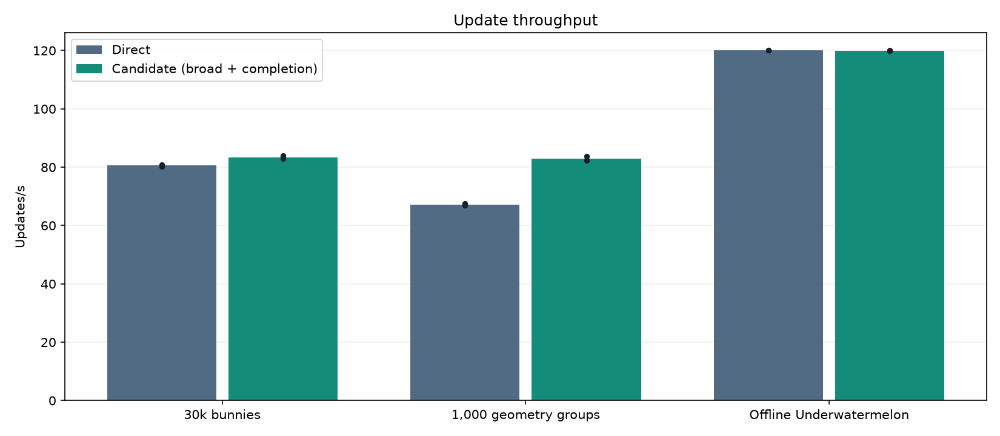
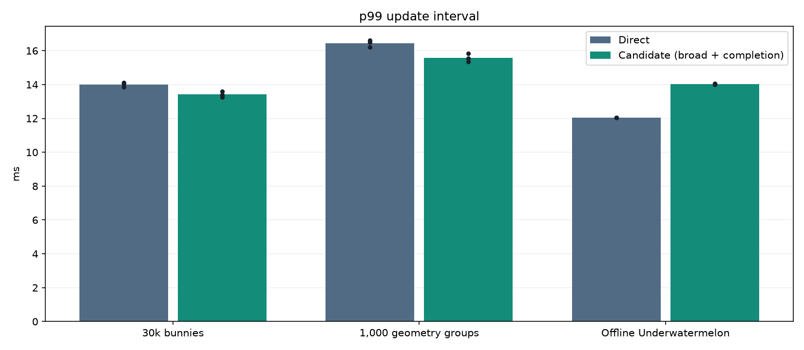
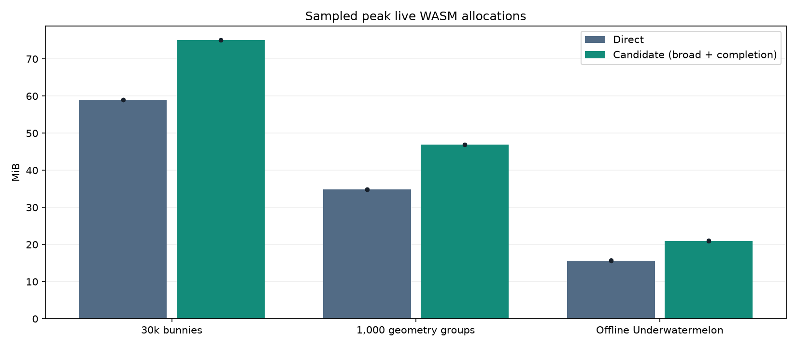
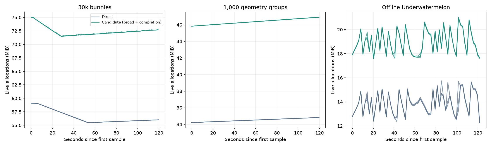

# Web production-candidate milestone

The desktop evaluation is complete. **This candidate does not meet the provisional
production gates.** It improves geometry throughput, but adds too much live memory
under the proposed budget and worsens the real-game replay's update p99.

| Workload | Direct → candidate updates/s | p99 change | Extra live memory |
| --- | ---: | ---: | ---: |
| 30k bunnies | 80.59 → 83.31 (+3.4%) | −4.2% | +27.1% |
| 2,000 meshes + 5,000 models | 67.22 → 82.84 (+23.2%) | −5.2% | +34.7% |
| Offline Underwatermelon | 120.00 → 119.97 (paced) | +16.5% | +33.9% |

Lower p99 is better. These are same-build direct controls, **not clean vanilla**.
All 18 foreground runs passed collection/correctness checks. All six gameplay
runs produced the same exact gameplay signature as both headless validation runs:
15,000 ticks, 9,387 input events, six merges, score 1,350, and verified cleanup.





There is also a repeatable allocation-growth signal in the fixed-population
geometry scene: early-to-late sample medians increase by up to 0.83 MiB in the
candidate and 0.47 MiB direct. The candidate's owned-frame capacity stays fixed at
6.434 MiB. This fails the provisional 0.5 MiB growth screen, but does not identify
a leak: Lua garbage, diagnostics, caches and native allocations still need attribution.
Bunnymark's early/late screen passes because allocations initially fall; its later
rebound shows why passing that screen is not proof of stable long-term memory.

A [follow-up memory diagnostic](WEB_OWNED_MODEL_MEMORY_RESULTS.md) now attributes
this geometry growth signal to reclaimable Lua garbage and probe overhead:
post-GC growth was only 96–144 bytes over two minutes. Its opt-in model-buffer
ownership change saves about 0.27 MiB; the larger allocation overhead and gameplay
p99 regression remain. The historical gate results below are unchanged.



The immediate engineering priorities are to attribute that growth, reduce the
retained-frame/stack memory cost, and test a dispatch policy that improves light
real-game pacing without discarding heavy-workload throughput. The sprite trace
below shows why dispatch changes alone cannot recover the specialized sprite
path's advantage. No smaller stack or automatic workload-dependent renderer is
enabled by this milestone.

The collection used visible Chrome 154.0.8037.95 on this Apple M1 Pro, hardware
WebGL, AC power, and real focus checks. Synthetic cases have 10 seconds warmup
and 120 seconds measurement. Gameplay uses 600 warmup and 14,400 measurement
ticks at a fixed simulation dt; its measured wall windows are approximately 120
seconds on this display. There are three fresh-process repeats per mode/case,
with order rotated. Detailed traces are disabled in acceptance runs. Memory is
sampled every two seconds. p99 is the mean of per-run update-interval percentiles,
not physical input latency or a pooled percentile. The graphs show individual
runs; three repeats do not establish rare-stall or hours-long soak behavior.

[Detailed report, WASM capacity and gates](benchmarks/web-production-candidate-2026-10-04/REPORT.md),
[per-run CSV](benchmarks/web-production-candidate-2026-10-04/runs.csv),
[raw acceptance measurements](benchmarks/web-production-candidate-2026-10-04/raw-results.tar.gz),
[diagnostic/replay-pilot evidence](benchmarks/web-production-candidate-2026-10-04/diagnostic-evidence.tar.gz),
and [build hashes](benchmarks/web-production-candidate-2026-10-04/builds.json) are preserved.
Local frozen bundles are `tmp/web-candidate-sustained-bundle` and
`tmp/web-candidate-gameplay-bundle`. The original screen-saver timeout was restored
to 1,200 seconds after collection, both servers stopped, and the CMake content
configuration restored. Fourteen focused [harness regression checks](benchmarks/web-production-candidate-2026-10-04/harness-tests.log) pass. Engine
code/defaults were not changed in this milestone; the existing validated binary
was repackaged with the new replay content.

This milestone evaluates a fixed candidate, rather than changing engine defaults.
The candidate is broad component threading with owned frames, preparation overlap,
completion dispatch, a 5 MiB worker stack and worker-side audio mixing. It remains
opt-in. The exact configuration and provisional gates are frozen in
[candidate.json](../../scripts/web/benchmark/candidate.json).

## What is implemented

- Matched-scheduler diagnostics compare the specialized sprite path and broad
  component path using the same Release engine and content. Both rAF and
  completion dispatch are measured, with stage spans and worker idle time.
- The browser runner accepts replay project manifests, validates the expected
  tick/event counts, exact gameplay checkpoint signatures and final cleanup,
  preserves game audio, and supports longer measurement timeouts.
- A disposable web adapter preserves the previously approved offline
  Underwatermelon project. Its longer scenario spreads twelve fruit drops and
  periodic movement over 15,000 fixed simulation ticks; it retains physics,
  merging, GUI and sound. The original downloaded project is untouched.
- Frozen bundle hashes, runner sources, thresholds, device identity, visibility,
  focus, power and failures accompany results. Resume rejects changed inputs.
- Automated assessment reports throughput, update p99, sampled live memory,
  WASM capacity and steady-state memory-growth signals separately. Missing
  production evidence remains explicitly unproven.
- The macOS awake wrapper temporarily disables the screen saver and restores
  the original setting on exit, including collector failure. A recovery file
  remains available if the process is forcibly killed.

## Candidate and acceptance limits

```ini
[render]
poc_pipeline = component
poc_threaded = 1
poc_web_components = 1
poc_web_overlap = 1
poc_web_prepare_overlap = 1
poc_web_schedule = 1
poc_web_stack_kb = 5120

[sound]
use_thread = 0
```

The provisional local gates require three runs of nominally at least 120 seconds
(duration compared at 0.01-second precision; raw timestamps retained), a 10%
throughput gain in the selected CPU-heavy geometry workload, at most a 5% p99
regression, and at most 20% extra live memory against the same-build direct
control. Other workloads must not lose more than 5% throughput. Fixed-population
cases flag sampled growth above 0.5 MiB between early/late sample medians; this
tolerance detects a growth signal and does not establish leak freedom. Gameplay
with a growing fruit population is not eligible for that steady-state gate.

The long gameplay replay is deliberately sparse enough to remain in active play.
It establishes compatibility and pacing under sustained gameplay, not a large
CPU-load speedup. Two-minute wall-clock synthetic samples and the fixed-tick
replay must not be mistaken for hours-long thermal or lifecycle soak tests.

## What the sprite diagnostic establishes

In the initial same-build diagnostic, 30k bunnies reached 80.79 updates/s direct,
114.03 on the specialized cached-rAF sprite path, 60.00 on broad-rAF, and 83.67
on broad completion dispatch. These are single diagnostic runs, not acceptance
results.

Broad completion dispatch reduced mean worker idle time from 5.28 ms to 0.06 ms.
It did not redistribute preparation: the worker still spent roughly 4.8 ms in
simulation and 7.0 ms preparing, while main consumed the prepared frame in
0.4 ms. The specialized sprite path instead spent about 0.7 ms extracting on the
worker and 8.5 ms consuming/preparing on main, allowing more useful overlap with
simulation. These are elapsed stage spans; they are not exclusive CPU time and
must not be summed into a claimed critical-path speedup.

The result reconciles the apparently conflicting sprite reports. Completion
dispatch addresses avoidable idle time, while a broader preparation-on-worker
implementation still has a different division of work. This milestone does not
silently select an alternative renderer based on benchmark scene or change the
default scheduler. Further sprite improvement in the broad path needs a measured
change to preparation placement/cost, not just another dispatch setting.

## Production boundary

The automated local assessment cannot approve a production rollout. Clean
vanilla web comparisons, a representative animated model/mesh game, a physical
lower-powered target, input-to-display latency, and energy/thermal evidence are
still separate requirements. Device emulation or CPU throttling does not satisfy
the physical-device requirement. Extension and lifecycle compatibility work
listed in [the web PoC documentation](WEB_COMPONENT_POC.md) also remains.

The current runner automates macOS Chrome; relaxing its former Apple M1 Pro
renderer-name check allows another hardware renderer, not automatic support for
every operating system/browser. Use separate device collections and retain the
hardware identity. Do not combine different machines into one average.

See the [runner and reproduction instructions](../../scripts/web/benchmark/README.md#production-candidate-evaluation).
