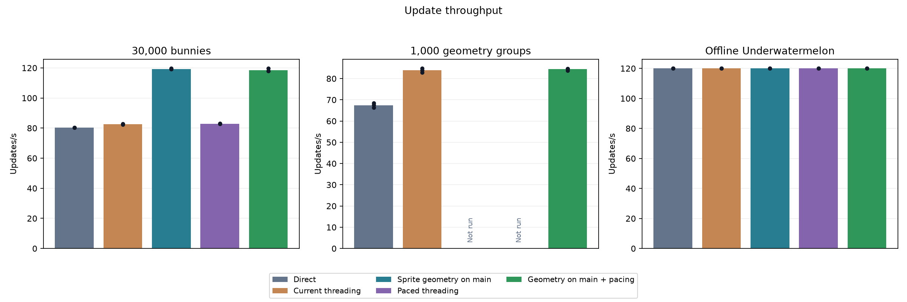
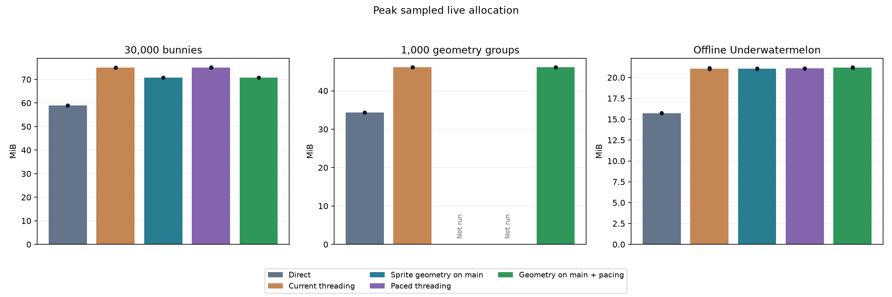

# Web sprite placement and pacing experiments

**Advance sprite geometry generation on browser main. Keep the existing completion scheduler for now.** The new placement substantially improves the heavy sprite case while reducing memory. The new paced scheduler did not fix gameplay p99 and produced more variable sprite p99 results.

[Full report and graphs](benchmarks/web-placement-pacing-2026-10-04/REPORT.md) · [Per-run CSV](benchmarks/web-placement-pacing-2026-10-04/runs.csv) · [Raw results](benchmarks/web-placement-pacing-2026-10-04/raw-results.tar.gz)

These are same-build Release comparisons on Apple M1 Pro, Chrome 154.0.8037.95, hardware WebGL through ANGLE/Metal, foreground and connected to AC power. Direct means this modified engine with threading disabled, not clean vanilla. Both new switches default off.

## Results

Means of three runs; p99 is the 99th-percentile interval between simulation updates, not displayed FPS or input latency. Memory is the mean of each run's peak sampled live WASM allocation.

| 30,000 bunnies | Updates/s | p99 ms | Allocated MiB | WASM capacity MiB |
| --- | ---: | ---: | ---: | ---: |
| Direct | 80.32 | 14.02 | 59.02 | 66.50 |
| Existing component threading | 82.62 | 13.78 | 75.04 | 95.81 |
| Sprite geometry on main | **119.34** | **9.95** | **70.84** | **79.81** |
| Paced scheduling only | 82.96 | 13.22 | 75.08 | 95.81 |
| Both changes | 118.53 | 13.05 | 70.79 | 79.81 |

Geometry on main delivers **44.4% more updates/s than existing threading**, 5.6% less live allocation, and 16.7% less WASM capacity. Relative to direct, throughput rises 48.6%, with approximately 20% more live allocation. The result approaches the observed 120 Hz browser cadence, so it does not establish the uncapped throughput ceiling.

The separate trace explains the change: mean worker preparation drops from **7.05 to 3.34 ms**, while main consumption rises from **0.39 to 5.81 ms**. The worker and main thread can now overlap useful work more evenly. Compact sprite snapshots replace captured generated sprite upload payloads; this reduces memory despite retaining two immutable snapshot slots. These are wall-time spans, not CPU utilization or energy measurements.

Pacing adds no useful throughput here. Combined-mode p99 ranged from 9.85 to 15.00 ms, versus 9.30–10.40 ms for geometry-only. Its mean p99 was 31% higher than geometry-only; three runs establish no reliable pacing benefit.

The model/mesh control retained its improvement over direct: **67.46 updates/s direct, 83.85 existing threading, 84.38 combined**. The small difference between threaded variants is not a compelling gain. Allocation remains about 46.1 MiB versus 34.4 MiB direct. This control ran three modes; geometry-only and pacing-only were not separately collected for it.

Offline Underwatermelon remained at approximately **120 updates/s in all five modes**, with identical replay signatures. Direct p99 was 12.05 ms; existing threading averaged 13.68 ms, and all new variants averaged 14.00 ms. Threaded live allocation remains about 21.1 MiB versus 15.7 MiB direct. **The gameplay pacing and memory regressions remain unresolved.**





## What was implemented

The worker still simulates, extracts immutable sprite data, culls, sorts all components together, and selects batches. Each sprite batch records frame-owned indices at its original pass position. Browser main generates/uploads sprite geometry when consuming those batches. This preserves mixed component ordering, render-script pass state and the existing preparation paths for other components. It does not move all sprite preparation to main.

Deferred descriptor/index pools are reusable and budgeted. Resource barriers protect referenced resources, and sprite-world deletion drains published work before freeing consumer scratch. The two-slot lifecycle is unchanged. Allocator measurements are authoritative here: the existing sprite-specific renderer-scratch diagnostic counters are not refreshed by this experimental path.

Scheduler 3 grants at most one admission credit per visible browser animation callback. A worker busy at that point can consume the credit when it finishes. Credits do not accumulate; shutdown can wake the worker without one. This policy is independently selectable, but the measurements do not justify replacing scheduler 1.

The useful configuration from this evaluation is:

```ini
[render]
poc_pipeline = component
poc_threaded = 1
poc_web_components = 1
poc_web_overlap = 1
poc_web_prepare_overlap = 1
poc_web_deferred_sprites = 1
poc_web_schedule = 1
```

Use `poc_web_schedule=3` only to reproduce the pacing experiment. The separate model-owned-buffer option remained disabled, and every threaded comparison retained the same 5 MiB worker stack.

## Validation and remaining evidence

- **39 valid performance runs:** 15 Bunnymark, 9 model/mesh, 15 gameplay; three repetitions per selected condition. Synthetics measured 30 seconds after 10 seconds warmup. Gameplay used 600 warmup updates and 14,400 measured updates (approximately 120 seconds).
- One final-control startup failed in macOS Chrome activation before measurement. Its failed attempt is preserved; resuming the unchanged frozen configuration completed that run successfully. It is excluded from means.
- Six browser modes passed mixed-component pixel equality, dynamic geometry, resource replacement, collection lifecycle, pause/resume and clean exit checks. Deliberately stalled consumption verified preparation overlap. Paced and combined modes also stopped cleanly after forced WebGL context loss; this tests shutdown, not recovery.
- Native tests passed: **98 render, 563 gamesys, 2 scheduler admission tests**. Harness/report checks passed: **8 JavaScript and 17 Python tests**.
- Three separate 10-second traced runs support work attribution only. Internal input-to-submit mean improved slightly, but its diagnostic p99 increased from 21.35 to about 23.26 ms. This is not evidence of improved end-to-end input latency.

The next evidence should be a slower physical web target and a representative sprite-heavy game using geometry-on-main with scheduler 1. Investigate gameplay worker wake-up, handoff and synchronous main-thread waits to locate the p99 cost. Memory remains a separate gate, especially for model/mesh workloads. Clean vanilla, additional browsers, real input-to-display latency, energy, extension compatibility and context recovery still need validation before production.

Raw runs include bundle hashes, device/browser information, foreground checks and frozen runner sources. Validation logs, a source patch and build manifests are beside the report. Frozen runnable bundles remain under `tmp/web-placement-{fixture,synthetic,gameplay}`. Temporary servers were stopped and the original 1,200-second screen-saver timeout and CMake content configuration were restored.
