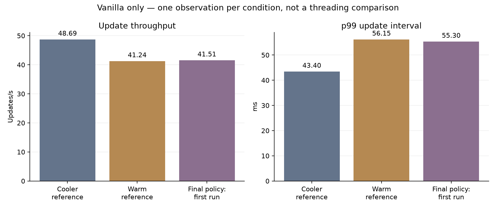
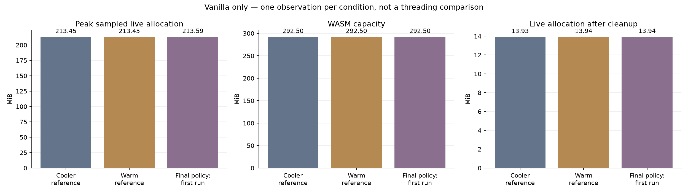
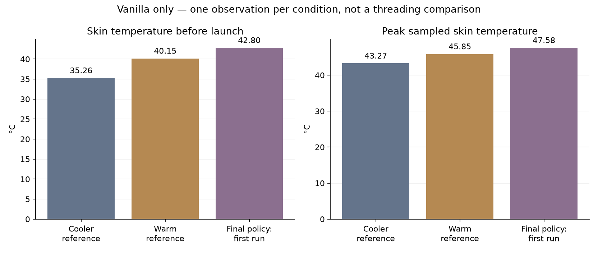

# Pixel 4a web benchmark status — incomplete

**Historical initial attempt. A fresh retry completed all 75 planned game/synthetic measurements; see the [completed comparison](../../PIXEL_4A_WEB_BENCHMARK_RESULTS.md).** The baseline observations below are excluded from the new averages.

**All four short correctness checks passed. The sustained performance comparison is incomplete, so there is no threading performance verdict.**

The connected device identifies as a **Pixel 4a**, running Android 13 and Chrome 151.0.7922.173 on the Adreno 618 GPU. These are web builds running in foreground Android Chrome, not native Android binaries.

## Completed validation

| Mode | Short replay | Matching checkpoints | Scene cleanup |
| --- | --- | --- | --- |
| Vanilla | 1,800 ticks | Passed (3 checkpoints) | Passed |
| PoC direct | 1,800 ticks | Passed (3 checkpoints) | Passed |
| Component threaded | 1,800 ticks | Passed (3 checkpoints) | Passed |
| Component threaded + ready callback | 1,800 ticks | Passed (3 checkpoints) | Passed |

The two threaded modes reported component-snapshot activation and a 2 MiB worker stack. The ready-callback mode passed its bounded-consumption check. These short checks validate this replay on the device; their timings are excluded from performance evidence. They do not certify every component, extension callback, or rendering effect.

## Why the long comparison is held

Play Store background activity was initially observed using about 90% of one CPU core. Those initial timing attempts were excluded, and the background activity was stopped. Later, even with high aggregate CPU-idle readings, the powered phone retained substantial heat. It reached full charge while the battery remained around 42°C, and Android continued reporting moderate thermal throttling during idle waits.

The final intended protocol is a sustained, plugged-in comparison: each run starts only at Android thermal status 0/1 (none/light), with at least 90% aggregate CPU idle. Moderate or higher status waits. Screen brightness is reduced only during waits and restored before launch; OS thermal protections remain active. Starting and in-run temperatures are recorded. This is not a cold-device or battery-only CPU-capacity test.

The second run exceeded the 15-minute readiness wait without reaching status 0/1. **Only 1 of the planned 12 long replay runs is accepted in the final-policy collection.** The seven-case synthetic suite is prepared but has not been measured on the phone. Continuing requires suitable thermal conditions; completed data and frozen inputs are preserved for resumption.

## Baseline observations

The following are three individually validated vanilla observations from setup and the incomplete final collection. They use the same frozen engine/project bundle and fixed replay. They are **not repetitions under identical starting conditions**, and must not be averaged into a threading comparison or treated as proof that temperature alone caused the differences. The earlier background-activity attempts are excluded from these plots.

| Observation | Start skin °C | Updates/s | p99 ms | Peak live MiB | WASM MiB | Peak thermal status |
| --- | ---: | ---: | ---: | ---: | ---: | ---: |
| Cooler reference | 35.26 | 48.69 | 43.40 | 213.45 | 292.50 | 1 |
| Warm reference | 40.15 | 41.24 | 56.15 | 213.45 | 292.50 | 2 |
| Final policy: first run | 42.80 | 41.51 | 55.30 | 213.59 | 292.50 | 2 |

## Definitions and limits

- **Updates/s** counts completed update intervals per wall second; it is not isolated CPU time or confirmed displayed frames.
- **p99** is the update interval at or below which 99% of measured intervals fall. These are per-run histogram upper bounds; lower is better. It is not physical input latency.
- **Live allocation** is sampled allocated WASM memory, including engine, game and benchmark records. Short peaks may be missed. **WASM capacity** also includes free allocator space. These quantities overlap and must not be added.
- **After cleanup** is sampled after game unload and Lua collection; the benchmark driver remains alive. It is not expected to be zero.
- Process RSS, physical GPU memory and energy were not measured. Temperature is not an energy measurement.
- Vanilla uses unmodified engine source at `5f5706cb09a646358da203c7c59b95269c54910f` with the common app-side probes and optimized pthread-capable platform. The ordinary shipping non-pthread web bundle is not included.
- PoC direct uses the modified engine with threading disabled. Component threading moves simulation/preparation to a worker while browser main consumes snapshots; ready scheduling adds the opt-in completion callback policy.

Long replays use 600 warmup ticks plus 14,400 measured updates at a fixed 1/60-second simulation step and a 1280×720 drawing buffer. The Android replay bundles are byte-identical to the accepted Mac comparison. Repeated mode order rotates; each run starts a fresh Chrome process and checks real foreground focus, active audio and deterministic cleanup.

## Published data and privacy

[Numeric baseline observations](baseline-observations.csv) are also available as [JSON](baseline-observations.json). [Short correctness results](correctness.json) contain only anonymous validation outcomes. The external project is referred to as the space game. Its source, identifiers, dependencies, replay state, logs, screenshots, content hashes and raw evidence remain in Git-ignored local storage.

## Collection handoff

Temporary stay-awake, rotation and brightness settings were restored and verified. The benchmark server, host keep-awake process and benchmark ADB port mappings were removed. Play Store was reopened after the temporary background-activity stop. No device thermal protections were changed.

The Android transport/report checks and existing launch/replay/diagnostic checks passed (21 tests). Published links and anonymous fields were checked, and all three plots were visually reviewed. These checks validate the tooling and reporting, not the missing performance comparison.

Before resuming, confirm that the phone is away from laptop heat and can cool while idle. If its physical placement or power protocol changes, start a fresh comparable collection rather than mixing those measurements with the existing long baseline run.
