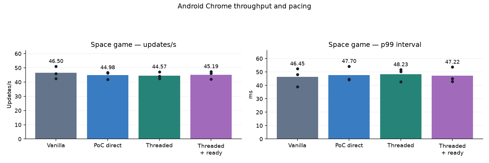
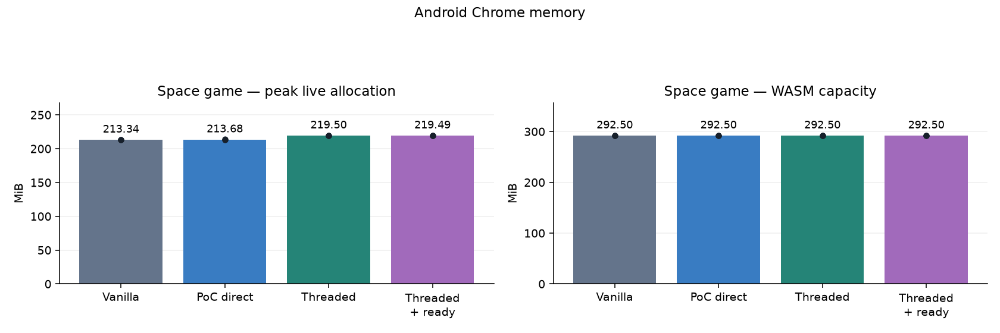
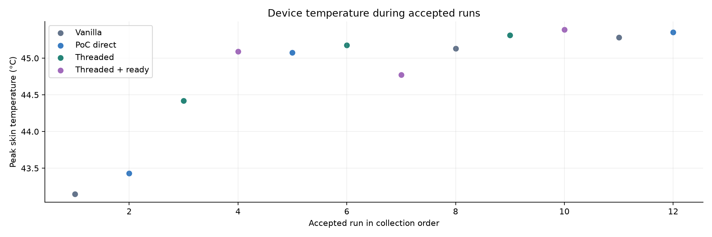
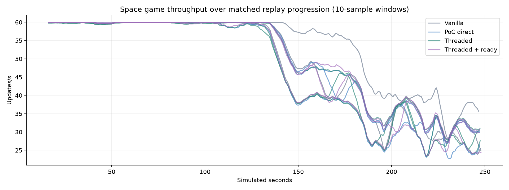

# Pixel 4a web rendering comparison — sustained plugged-in runs

Device: **Pixel 4a**, Android 13; Chrome 154.0.8037.126. GPU: ANGLE (Qualcomm, Adreno (TM) 618, OpenGL ES 3.2 V@0490.0 (GIT@85da404 I46ff5fc46f 1606801434) (Date:11/30/20)).

Bars show run means; dots show individual repetitions. Measurements were collected on the physical phone, without CPU emulation or manually imposed CPU throttling. Normal Android thermal throttling remained active.

| Workload | Mode | Repeats | Updates/s (range) | Mean p99 ms | Peak live MiB | WASM capacity MiB |
| --- | --- | ---: | ---: | ---: | ---: | ---: |
| Space game | Vanilla | 3 | 46.50 (42.53–51.12) | 46.45 | 213.34 | 292.50 |
| Space game | PoC direct | 3 | 44.98 (41.87–46.69) | 47.70 | 213.68 | 292.50 |
| Space game | Threaded | 3 | 44.57 (42.43–47.20) | 48.23 | 219.50 | 292.50 |
| Space game | Threaded + ready | 3 | 45.19 (42.05–47.40) | 47.22 | 219.49 | 292.50 |

## Changes relative to PoC direct

| Workload | Mode | Throughput | p99 interval | Live allocation |
| --- | --- | ---: | ---: | ---: |
| Space game | Threaded | -0.9% | +1.1% | +2.7% |
| Space game | Threaded + ready | +0.5% | -1.0% | +2.7% |

## Method and definitions

- **Vanilla:** unmodified engine source at `5f5706cb09a646358da203c7c59b95269c54910f`, sharing the optimized pthread-capable platform and common replay probes. This is not the ordinary shipping non-pthread bundle.
- **PoC direct:** modified engine with threading disabled.
- **Threaded:** simulation and preparation on a pthread; browser main consumes component snapshots and prepares deferred sprite geometry. Two slots and a 2 MiB worker stack.
- **Threaded + ready:** same component model with experimental scheduler 4, allowing completion callbacks to use an unused browser-tick render credit.
- **Updates/s:** completed update intervals per wall second. This includes browser scheduling and is not isolated CPU time or confirmed displayed FPS.
- **p99:** 99% of measured update intervals fall at or below this duration. Tables average per-run histogram p99 upper bounds; lower is better. This is not input-to-photon latency.
- **Live allocation:** sampled WASM allocator bytes, including engine, game, worker stack and instrumentation. Short peaks can be missed. **WASM capacity** also includes free allocator space and does not shrink when allocations are freed. Do not add these measures together.
- Process RSS, physical GPU memory, energy and physical input latency were not measured.

Each mode starts a fresh installed Chrome process. The phone stays on external power with Battery Saver off, fixed landscape orientation and screen sleep inhibited. Real focus/visibility checks remain active. Mode order rotates between repeats. No CPU tracing, stack painting or forced-GC diagnostic runs enter the comparison.

Before each run, Android must report thermal status 0 or 1 (none/light) and at least 90% aggregate CPU idle with Chrome stopped. This is a sustained plugged-in comparison: the powered device did not consistently return to a cold-start temperature, so there is no fixed Celsius cutoff. Starting temperature is recorded and can vary. Brightness is dimmed only while waiting, then restored before launch. Thermal samples are taken about every ten seconds; later thermal changes remain in the results. The OS thermal protections remain active. These warm, powered results do not isolate raw CPU capacity, and a status of 0 does not prove fixed CPU/GPU frequencies.

Maximum Android thermal status observed: **2**. Peak sampled skin temperature: **45.4°C**.

## Workloads and validity

Each line is one repeat, using differences between memory-probe ticks and wall times across ten sample intervals (approximately ten seconds). The workload changes over the replay, so declining throughput alone is not proof of thermal throttling.

The anonymous space game uses the same frozen project and engine bundles as the Mac comparison: 600 warmup ticks followed by 14,400 measured updates at a fixed simulation step. All accepted modes/repeats must match deterministic checkpoints and pass scene cleanup. Running WebAudio is checked during measurement. Project-specific gameplay, code, dependencies, identifiers and raw evidence remain private.

## Rejected setup attempts

Initial setup attempts and the earlier incomplete collection are excluded. A busy Play Store process was found during the initial setup; later the powered device failed its thermal readiness wait. Those attempts and separate vanilla reference observations remain outside these means. After the user requested a retry, the game comparison started again from scratch with the same frozen bundles and the unchanged status 0/1 and CPU-idle admission policy. The completed retry and synthetic collection retain all accepted runs, including later thermal throttling. Starting temperatures vary and external-power heat remains a limitation; this is not a battery-only comparison.

## Published evidence

[Anonymous numeric run data](runs.csv) is also available as [JSON](runs.json). No raw archives, game screenshots, replay state, project sources or content hashes are exported by this report. Reproducing the external-project replay requires separately authorized private inputs.
