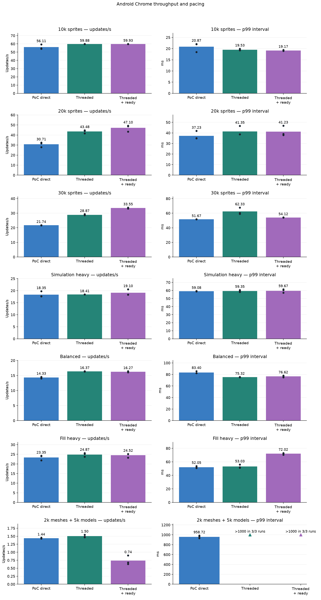
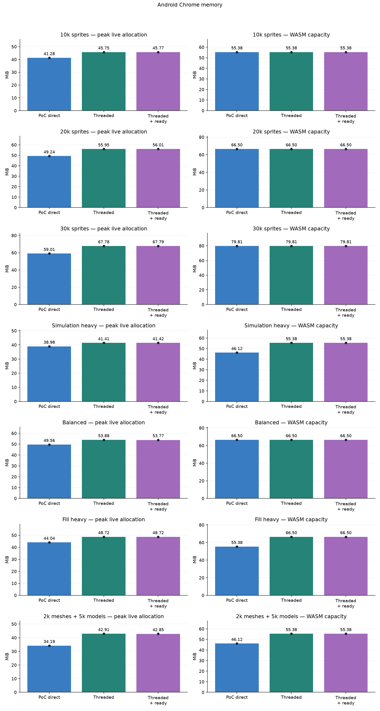
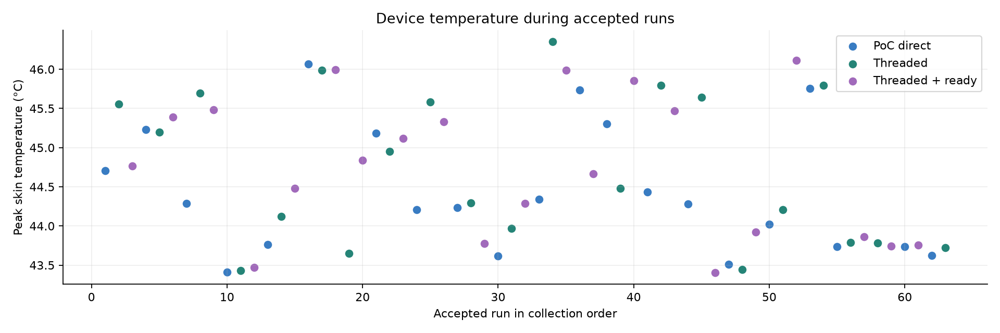

# Pixel 4a web rendering comparison — sustained plugged-in runs

**Measurement follow-up:** this historical collection includes periodic worker status/snapshot output. That output synchronously rendezvous with browser main and can inflate update tails. See the [quiet frame-pacing comparison](../../../WEB_PIXEL_PACING_RESULTS.md) before attributing the p99 differences solely to scheduling.

Device: **Pixel 4a**, Android 13; Chrome 154.0.8037.126. GPU: ANGLE (Qualcomm, Adreno (TM) 618, OpenGL ES 3.2 V@0490.0 (GIT@85da404 I46ff5fc46f 1606801434) (Date:11/30/20)).

Bars show run means; dots show individual repetitions. Measurements were collected on the physical phone, without CPU emulation or manually imposed CPU throttling. Normal Android thermal throttling remained active.

| Workload | Mode | Repeats | Updates/s (range) | Mean p99 ms | Peak live MiB | WASM capacity MiB |
| --- | --- | ---: | ---: | ---: | ---: | ---: |
| 10k sprites | PoC direct | 3 | 56.11 (54.13–59.39) | 20.87 | 41.28 | 55.38 |
| 10k sprites | Threaded | 3 | 59.88 (59.87–59.91) | 19.53 | 45.75 | 55.38 |
| 10k sprites | Threaded + ready | 3 | 59.93 (59.91–59.94) | 19.17 | 45.77 | 55.38 |
| 20k sprites | PoC direct | 3 | 30.71 (27.96–32.42) | 37.23 | 49.24 | 66.50 |
| 20k sprites | Threaded | 3 | 43.48 (41.61–44.73) | 41.35 | 55.95 | 66.50 |
| 20k sprites | Threaded + ready | 3 | 47.10 (43.38–49.25) | 41.23 | 56.01 | 66.50 |
| 30k sprites | PoC direct | 3 | 21.74 (21.67–21.79) | 51.67 | 59.01 | 79.81 |
| 30k sprites | Threaded | 3 | 28.87 (28.57–29.28) | 62.33 | 67.78 | 79.81 |
| 30k sprites | Threaded + ready | 3 | 33.55 (33.13–33.84) | 54.12 | 67.79 | 79.81 |
| Simulation heavy | PoC direct | 3 | 18.35 (17.66–19.73) | 59.08 | 38.98 | 46.12 |
| Simulation heavy | Threaded | 3 | 18.41 (18.38–18.43) | 59.35 | 41.41 | 55.38 |
| Simulation heavy | Threaded + ready | 3 | 19.10 (18.37–20.54) | 59.67 | 41.42 | 55.38 |
| Balanced | PoC direct | 3 | 14.33 (14.01–14.53) | 83.40 | 49.56 | 66.50 |
| Balanced | Threaded | 3 | 16.37 (16.31–16.44) | 75.32 | 53.88 | 66.50 |
| Balanced | Threaded + ready | 3 | 16.27 (16.04–16.41) | 76.62 | 53.77 | 66.50 |
| Fill heavy | PoC direct | 3 | 23.35 (21.81–24.20) | 52.05 | 44.04 | 55.38 |
| Fill heavy | Threaded | 3 | 24.87 (23.71–25.68) | 53.03 | 48.72 | 66.50 |
| Fill heavy | Threaded + ready | 3 | 24.52 (23.24–25.17) | 72.02 | 48.72 | 66.50 |
| 2,000 meshes + 5,000 models | PoC direct | 3 | 1.44 (1.43–1.45) | 958.72 | 34.19 | 46.12 |
| 2,000 meshes + 5,000 models | Threaded | 3 | 1.50 (1.47–1.54) | Unavailable; 3/3 runs >1000 ms | 42.91 | 55.38 |
| 2,000 meshes + 5,000 models | Threaded + ready | 3 | 0.74 (0.63–0.90) | Unavailable; 3/3 runs >1000 ms | 42.85 | 55.38 |

## Changes relative to PoC direct

| Workload | Mode | Throughput | p99 interval | Live allocation |
| --- | --- | ---: | ---: | ---: |
| 10k sprites | Threaded | +6.7% | -6.4% | +10.8% |
| 10k sprites | Threaded + ready | +6.8% | -8.1% | +10.9% |
| 20k sprites | Threaded | +41.6% | +11.1% | +13.6% |
| 20k sprites | Threaded + ready | +53.4% | +10.7% | +13.7% |
| 30k sprites | Threaded | +32.8% | +20.6% | +14.9% |
| 30k sprites | Threaded + ready | +54.3% | +4.7% | +14.9% |
| Simulation heavy | Threaded | +0.3% | +0.5% | +6.2% |
| Simulation heavy | Threaded + ready | +4.1% | +1.0% | +6.3% |
| Balanced | Threaded | +14.3% | -9.7% | +8.7% |
| Balanced | Threaded + ready | +13.6% | -8.1% | +8.5% |
| Fill heavy | Threaded | +6.5% | +1.9% | +10.6% |
| Fill heavy | Threaded + ready | +5.0% | +38.4% | +10.6% |
| 2,000 meshes + 5,000 models | Threaded | +4.4% | Unavailable | +25.5% |
| 2,000 meshes + 5,000 models | Threaded + ready | -48.8% | Unavailable | +25.3% |

## Method and definitions

- **PoC direct:** modified engine with threading disabled.
- **Threaded:** simulation and preparation on a pthread; browser main consumes component snapshots and prepares deferred sprite geometry. Two slots and a 2 MiB worker stack.
- **Threaded + ready:** same component model with experimental scheduler 4, allowing completion callbacks to use an unused browser-tick render credit.
- **Updates/s:** completed update intervals per wall second. This includes browser scheduling and is not isolated CPU time or confirmed displayed FPS.
- **p99:** 99% of measured update intervals fall at or below this duration. Tables average per-run histogram p99 upper bounds; lower is better. This is not input-to-photon latency.
- **Live allocation:** sampled WASM allocator bytes, including engine, game, worker stack and instrumentation. Short peaks can be missed. **WASM capacity** also includes free allocator space and does not shrink when allocations are freed. Do not add these measures together.
- Geometry stress runs may exceed the 1,000 ms histogram range. A missing p99 is exported as null with an explicit lower bound; triangles mark censored values, and no mean p99 or p99 percentage is computed for an affected group. Throughput and allocator measurements remain separate. With only a few dozen updates in a stress run, p99 is a sparse tail observation.
- Process RSS, physical GPU memory, energy and physical input latency were not measured.

Each mode starts a fresh installed Chrome process. The phone stays on external power with Battery Saver off, fixed landscape orientation and screen sleep inhibited. Real focus/visibility checks remain active. Mode order rotates between repeats. No CPU tracing, stack painting or forced-GC diagnostic runs enter the comparison.

Before each run, Android must report thermal status 0 or 1 (none/light) and at least 90% aggregate CPU idle with Chrome stopped. This is a sustained plugged-in comparison: the powered device did not consistently return to a cold-start temperature, so there is no fixed Celsius cutoff. Starting temperature is recorded and can vary. Brightness is dimmed only while waiting, then restored before launch. Thermal samples are taken about every ten seconds; later thermal changes remain in the results. The OS thermal protections remain active. These warm, powered results do not isolate raw CPU capacity, and a status of 0 does not prove fixed CPU/GPU frequencies.

Maximum Android thermal status observed: **2**. Peak sampled skin temperature: **46.4°C**.

## Workloads and validity

- **10k sprites:** moving sprite workload; actual drawing buffer 720×720.
- **20k sprites:** moving sprite workload; actual drawing buffer 720×720.
- **30k sprites:** moving sprite workload; actual drawing buffer 720×720.
- **Simulation heavy:** 1,000 objects with 1,000,000 synthetic simulation iterations per update.
- **Balanced:** 10,000 moving objects with 100,000 synthetic simulation iterations per update.
- **Fill heavy:** 10,000 sprites, 64-pixel size, four rendering passes; intended to expose fill/bandwidth limits.
- **Model/mesh:** 1,000 groups containing 2,000 meshes and 5,000 models, including CPU/GPU-skinned and instanced animated models, exercising geometry preparation and rendering.

Synthetic timings use 10 seconds of warmup and 30 seconds of measurement per run and are compared only within the same workload/build; their gameplay paths are not deterministic real-game replays. The synthetic group does not include a clean-vanilla control. Three repetitions on one phone are evidence for this device, not a universal production guarantee.

## Rejected setup attempts

Initial setup attempts and the earlier incomplete collection are excluded. A busy Play Store process was found during the initial setup; later the powered device failed its thermal readiness wait. Those attempts and separate vanilla reference observations remain outside these means. After the user requested a retry, the game comparison started again from scratch with the same frozen bundles and the unchanged status 0/1 and CPU-idle admission policy. The completed retry and synthetic collection retain all accepted runs, including later thermal throttling. Starting temperatures vary and external-power heat remains a limitation; this is not a battery-only comparison.

## Published evidence

[Anonymous numeric run data](runs.csv) is also available as [JSON](runs.json). No raw archives, game screenshots, replay state, project sources or content hashes are exported by this report. Reproducing the external-project replay requires separately authorized private inputs.

Geometry stress measurements use an explicitly separate collection that records histogram overflow. The earlier strict-policy geometry attempt is excluded; the six other synthetic workloads use the original frozen runner and unchanged validation. No engine binary was changed for the timing policy.
