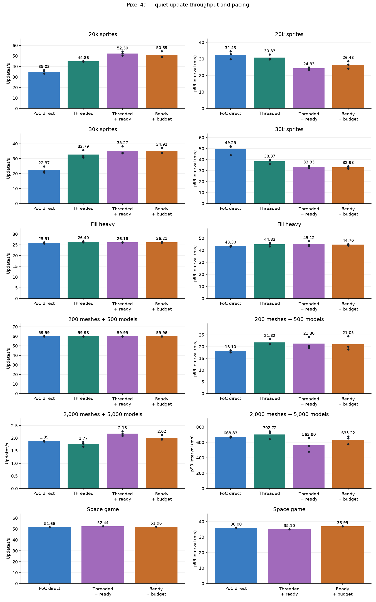
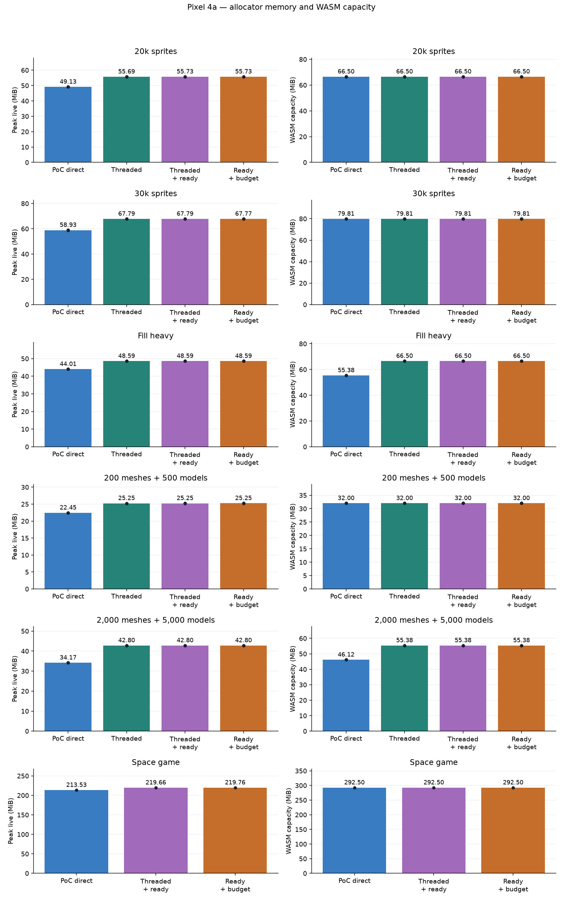
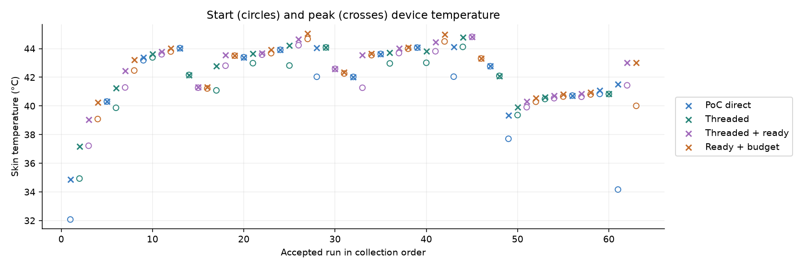

# Pixel web frame-pacing milestone

Device: Pixel 4a, Android 13; Chrome 154.0.8037.126. 63 accepted tracing-off runs.

Within each workload, the comparison uses identical Release PoC engine/content bundles for every mode. Direct disables threading; it is not a fresh vanilla engine comparison. Threaded uses completion dispatch with rAF consumption. Ready permits consumption on worker completion using an unused browser-tick credit. Budgeted ready additionally defers outside-rAF consumption when credit age plus the previous consumption duration exceeds 32 ms. The budget is an estimate, not a preemptive deadline or GPU timing. Threaded variants use overlapping component preparation, deferred sprite geometry on browser main and 2 MiB worker stacks. All threading and scheduling switches remain opt-in.

Periodic Bunnymark status output and synthetic snapshot-output sampling are disabled in this collection. The previous benchmark emitted those messages during measurement. Worker stdout synchronously proxies to browser main, so logging could wait behind rendering. The quiet control changes measurement overhead, not the gameplay work. Do not attribute that improvement to the readiness budget. Sparse browser allocator sampling and the bounded timing histogram remain enabled.

Bars are means; dots retain every accepted repetition. Modes rotate between repetitions. A space-game row with one run is a compatibility check, not a repeated performance verdict, and is excluded from the target gates. The phone remains connected to power with normal thermal management; runs begin at thermal status 0 or 1 and at least 90% aggregate CPU idle. Later throttling is retained. No energy or physical input-latency measurement is implied.

| Workload | Mode | Runs | Updates/s | p99 ms | Peak live MiB | WASM MiB |
|---|---|---:|---:|---:|---:|---:|
| 20k sprites | PoC direct | 3 | 35.03 | 32.43 | 49.13 | 66.50 |
| 20k sprites | Threaded | 3 | 44.86 | 30.83 | 55.69 | 66.50 |
| 20k sprites | Threaded + ready | 3 | 52.30 | 24.33 | 55.73 | 66.50 |
| 20k sprites | Ready + budget | 3 | 50.69 | 26.48 | 55.73 | 66.50 |
| 30k sprites | PoC direct | 3 | 22.37 | 49.25 | 58.93 | 79.81 |
| 30k sprites | Threaded | 3 | 32.79 | 38.37 | 67.79 | 79.81 |
| 30k sprites | Threaded + ready | 3 | 35.27 | 33.33 | 67.79 | 79.81 |
| 30k sprites | Ready + budget | 3 | 34.92 | 32.98 | 67.77 | 79.81 |
| Fill heavy | PoC direct | 3 | 25.91 | 43.30 | 44.01 | 55.38 |
| Fill heavy | Threaded | 3 | 26.40 | 44.83 | 48.59 | 66.50 |
| Fill heavy | Threaded + ready | 3 | 26.16 | 45.12 | 48.59 | 66.50 |
| Fill heavy | Ready + budget | 3 | 26.21 | 44.70 | 48.59 | 66.50 |
| 200 meshes + 500 models | PoC direct | 3 | 59.99 | 18.10 | 22.45 | 32.00 |
| 200 meshes + 500 models | Threaded | 3 | 59.98 | 21.82 | 25.25 | 32.00 |
| 200 meshes + 500 models | Threaded + ready | 3 | 59.99 | 21.30 | 25.25 | 32.00 |
| 200 meshes + 500 models | Ready + budget | 3 | 59.96 | 21.05 | 25.25 | 32.00 |
| 2,000 meshes + 5,000 models | PoC direct | 3 | 1.89 | 668.83 | 34.17 | 46.12 |
| 2,000 meshes + 5,000 models | Threaded | 3 | 1.77 | 702.72 | 42.80 | 55.38 |
| 2,000 meshes + 5,000 models | Threaded + ready | 3 | 2.18 | 563.90 | 42.80 | 55.38 |
| 2,000 meshes + 5,000 models | Ready + budget | 3 | 2.02 | 635.22 | 42.80 | 55.38 |
| Space game | PoC direct | 1 | 51.66 | 36.00 | 213.53 | 292.50 |
| Space game | Threaded + ready | 1 | 52.44 | 35.10 | 219.66 | 292.50 |
| Space game | Ready + budget | 1 | 51.96 | 36.95 | 219.76 | 292.50 |

## Acceptance checks

These are engineering targets on run means, not statistical confidence intervals. The sprite targets are at least 90% of unbudgeted-ready throughput and p99 no greater than 105% of direct. Other workloads also need review for regressions.

| Workload | Budgeted / ready throughput | ≥90% | Budgeted / direct p99 | Sprite p99 target |
|---|---:|---|---:|---|
| 20k sprites | 96.9% | pass | 81.7% | pass |
| 30k sprites | 99.0% | pass | 67.0% | pass |
| Fill heavy | 100.2% | pass | 103.2% | not a sprite gate |
| 200 meshes + 500 models | 100.0% | pass | 116.3% | not a sprite gate |
| 2,000 meshes + 5,000 models | 92.5% | pass | 95.0% | not a sprite gate |

Retained-capacity checks compare the largest final value of each accounting counter against unbudgeted ready in the same collection:

- 20k sprites: pass — no increased frame/queue capacity.
- 30k sprites: pass — no increased frame/queue capacity.
- Fill heavy: pass — no increased frame/queue capacity.
- 200 meshes + 500 models: pass — no increased frame/queue capacity.
- 2,000 meshes + 5,000 models: pass — no increased frame/queue capacity.

## What the numbers mean

- Updates/s counts simulation-update intervals, not confirmed displayed frames. p99 is the 99th percentile of wall-clock update intervals, rounded upward to a 0.05 ms histogram bin. It is not CPU utilization or physical input latency.
- Live allocation is sampled WASM allocator usage including the worker stack. WASM capacity includes unused space; the two columns overlap and must not be added. Neither includes all JavaScript/browser memory or GPU allocations. Android process RSS was not available.
- Geometry100 contains 200 meshes and 500 models. Geometry1000 contains 2,000 meshes and 5,000 models; its one-second histogram limit can censor p99. Few measured frames make that stress case unsuitable for precise tail comparisons.
- The queue retains two frame slots with at most one submitted frame outstanding. Capacity counters sampled after synthetic measurement are in [capacities.json](capacities.json); they are accounting categories, not an additive process-memory total.
- The generic space-game entry, when present, verifies deterministic replay checkpoints and cleanup. Raw project content, replay state, logs, adapters and bundle identities remain private and are not copied into this report.

## Diagnostic evidence

Traces are separate from acceptance runs. Their spans measure elapsed time, including waits; overlapping spans must not be summed as CPU usage. Tail columns refer to the longest 1% of worker-start intervals and do not imply the previous frame caused the entire delay. Quiet diagnostic controls are investigative single runs, not repeated performance verdicts.

Trace-set numbers follow the command-line input order; they do not identify private source paths.

| Trace set | Workload | Mode | Quiet | Mean worker ms | Tail simulation ms | Tail publish wait ms | Mean consumption ms |
|---|---|---|---|---:|---:|---:|---:|
| 1 | 20k sprites | Threaded | False | 21.32 | 21.24 | 2.79 | 13.93 |
| 1 | 20k sprites | Threaded + ready | False | 18.45 | 25.22 | 0.02 | 16.54 |
| 1 | 30k sprites | Threaded | False | 27.88 | 37.94 | 0.01 | 21.76 |
| 1 | 30k sprites | Threaded + ready | False | 26.74 | 37.23 | 0.02 | 21.94 |
| 1 | Fill heavy | Threaded | False | 35.80 | 27.07 | 9.58 | 34.58 |
| 1 | Fill heavy | Threaded + ready | False | 36.33 | 12.89 | 49.54 | 35.82 |
| 1 | 200 meshes + 500 models | Threaded | False | 16.23 | 1.78 | 16.25 | 4.32 |
| 1 | 200 meshes + 500 models | Threaded + ready | False | 16.01 | 2.03 | 14.29 | 4.51 |
| 2 | 2,000 meshes + 5,000 models | Threaded | False | 564.80 | 14.29 | 767.13 | 541.90 |
| 2 | 2,000 meshes + 5,000 models | Threaded + ready | False | 622.38 | 10.62 | 3792.30 | 618.85 |
| 3 | 30k sprites | Threaded | True | 27.43 | 14.75 | 12.69 | 22.07 |
| 4 | 30k sprites | Threaded | False | 27.89 | 37.41 | 0.01 | 20.81 |
| 5 | 30k sprites | Threaded | True | 27.38 | 17.77 | 9.50 | 21.93 |

[Per-run anonymous metrics](runs.json) · [Target calculations](gates.json) · [Diagnostic aggregates](diagnostics.json)
