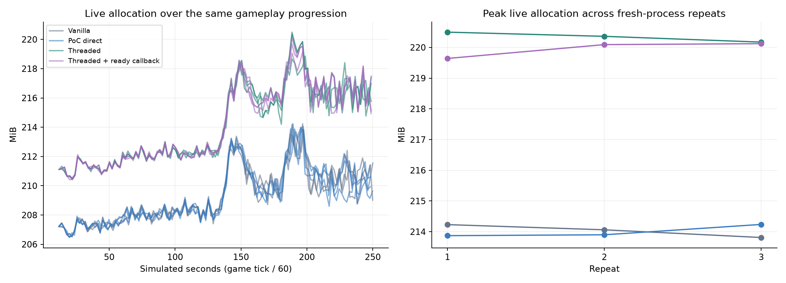

# Space game web replay comparison

Four optimized engine modes run the same deterministic gameplay replay. Bars are means of three runs; dots are individual runs. No slower device or CPU throttling is included.

| Mode | Implementation |
| --- | --- |
| Vanilla | Unmodified engine source at `5f5706cb09a646358da203c7c59b95269c54910f`, with the same benchmark and game extensions linked. Simulation/rendering run on browser main. |
| PoC direct | Current PoC engine, with threading disabled; includes shared PoC refactoring and inactive checks. |
| Threaded | Component snapshots; simulation, render Lua and preparation on a pthread; browser main consumes draws and generates deferred sprite geometry. Completion dispatch, two slots, 2 MiB worker stack. |
| Threaded + ready callback | Same component path, plus scheduler 4. A completion callback may consume using an unused browser-tick credit. Wake-before-consume preserves overlap; one visible consumption per credit, still two slots. |

| Mode | Updates/s (range) | Mean p99 ms | Peak live MiB | WASM MiB | After-cleanup live MiB |
| --- | ---: | ---: | ---: | ---: | ---: |
| Vanilla | 117.15 (116.46–118.42) | 16.53 | 214.03 | 320.81 | 13.98 |
| PoC direct | 117.18 (116.45–118.48) | 16.48 | 214.00 | 292.50 | 13.98 |
| Threaded | 119.87 (119.85–119.88) | 8.52 | 220.34 | 292.50 | 19.50 |
| Threaded + ready callback | 119.89 (119.87–119.90) | 8.55 | 219.95 | 292.50 | 19.51 |

Threading versus PoC direct: **+2.3% throughput**, -48.3% p99 interval, +3.0% sampled peak live allocation.

Threading versus vanilla: **+2.3% throughput**. The ready-callback experiment versus existing threading: **+0.0% throughput**, +0.4% p99 interval.

Frame age spans frame-slot reservation through completion of render consumption. It includes simulation/preparation/waiting and graphics submission, but not confirmed browser composition, GPU completion or display. This counter cannot establish input-to-photon latency.

| Mode | Late-minus-early live MiB | Ready-callback consumptions per run | Producer wait ms/update | Peak browser-process RSS MiB |
| --- | ---: | --- | ---: | ---: |
| Vanilla | +3.41 | 0, 0, 0 | 0.000 | 2533.3 |
| PoC direct | +3.30 | 0, 0, 0 | 0.000 | 2388.8 |
| Threaded | +4.67 | 0, 0, 0 | 1.776 | 2392.3 |
| Threaded + ready callback | +5.39 | 5692, 9035, 2467 | 0.198 | 2461.5 |

This asset-heavy workload includes a preloaded game archive; the absolute MiB cost of threading matters alongside its percentage. The post-unload frame pools remain allocated for reuse by the engine. Upload capacity is a subset of frame capacity, so those columns must not be added together.

| Mode | Frame capacity after unload MiB | Of which uploads MiB | Worker stack MiB | Retained references after unload (max) |
| --- | ---: | ---: | ---: | ---: |
| Threaded | 3.49 | 3.36 | 2.00 | 0 |
| Threaded + ready callback | 3.49 | 3.36 | 2.00 | 0 |

## Test and metrics

Each run has 600 warmup ticks and 14,400 measured updates with a fixed 1/60-second simulation step. This represents 250 simulated seconds overall, rather than 250 wall seconds. A private project adapter supplies the same deterministic workload and measurement probes in every mode. Audio processing remains enabled with output muted. Project-specific inputs, state schemas, code, dependencies and gameplay progression are intentionally not published.

- **Updates/s** counts completed game-update intervals per wall second. This is observed browser throughput, not isolated CPU execution time or guaranteed displayed frames. Browser refresh can cap the result.
- **p99** is the interval at or below which 99% of measured update intervals fall. Lower is better. Each run uses a 0.05 ms histogram upper bound; the table averages run p99 values, not pooled samples. It is not physical input-to-photon latency.
- **Live allocation** is the WASM allocator’s currently allocated bytes, including game, engine, worker stack, benchmark records and PoC instrumentation. Peak values use both two-second browser samples and roughly one-second game-side samples, plus measurement endpoints. Short peaks can still be missed.
- **WASM capacity** is the current size of WebAssembly linear memory, including allocator-free space. It can remain high after freeing live allocations.
- **After cleanup** is allocation after unloading the whole game and a full Lua collection plus two-second cooldown. Replay records and the root driver remain; the worker has not yet been destroyed. This is not expected to be zero.
- **Growth** compares medians of the last and first gameplay quarters. Changing workload, assets and retained benchmark records make this an observation, not proof of a leak. Cleanup samples are excluded. Fresh-process repeats do not establish repeated in-process reload stability.
- **RSS** sums Chrome process resident memory and includes browser, GPU process, runtime, audio and potentially shared pages. It is supplementary, not engine-only memory.

Producer-wait time is the change in the render-thread drain counter between measurement endpoints, divided by measured updates. It includes publication/resource drains and is not pure CPU work or an additive CPU-time total. Direct modes have no such queue; their zero is not a zero-cost rendering claim. Ready-callback counts include startup/cleanup and show whether the experimental path actually ran.

## Validation and scope

All 12 accepted runs completed with matching deterministic checkpoints, clean exit and scene cleanup. Checkpoints are compared every 600 ticks and on the final tick. This is a state-equivalence check, not a comparison of every rendered pixel. Private state contents and signatures are omitted.

Separate scheduler correctness tests verify matching frozen pixels, animated meshes/models, real input and sound completion, simulation/preparation overlap under a stalled consumer, pause/resume, context-loss shutdown and the consumption bound. Native admission tests and runner/replay contract tests are preserved in the validation evidence.

The space game is an external project. Its implementation, native dependencies, source revision and replay adapter remain private. This workload does not certify every component or native extension. The adapter and common probes add overhead to every mode. The PoC also retains endpoint snapshot counter tables that vanilla lacks; their allocation is included. Periodic samples use the same allocator/Lua probes in every mode.

Chrome 154.0.8037.95; {'platform': 'darwin', 'arch': 'arm64', 'os': '25.5.0', 'device': 'MacBookPro'}. Canvas 1280×720. Foreground, focus emulation disabled, hardware Apple M1 Pro GPU, AC power, temporary screensaver inhibition. Variant order rotates between repeats; each starts a fresh Chrome process. CPU tracing and stack painting are disabled. Both builds use the same optimized pthread-capable web platform/toolchain, main stack, assertions and archive. Only threaded modes start the simulation worker.

Vanilla source verification compared 5,408 engine/build files to the baseline commit with no differences or missing files. Its generated engine-info SHA can name the enclosing PoC repository because the baseline is a source archive, not a standalone Git checkout; private source verification and frozen-bundle checks establish provenance. Do not use that generated string as the baseline revision.

The vanilla control deliberately shares the pthread-capable platform flags with the PoC to isolate execution mode. An ordinary shipping non-pthread web bundle is a separate production comparison and was not measured here.

No energy, physical input-latency, weaker-device, browser-portability or long-running resource-reload claim is made. Native-extension event/DOM ownership and custom render-target lifecycle support remain separate production gates.

## Published evidence and privacy

- [Individual run metrics](runs.csv), [machine-readable assessment](assessment.json), and [mode means](means.json).
- [Validation summary](DEVELOPMENT_NOTES.md) and [engine build configuration](build-provenance.json).
- The graphs above contain only anonymous benchmark measurements.

Only aggregate measurements, anonymous per-run metrics, engine configuration and generic validation findings are published. Private game source, adapters, build recipes, project identifiers, content hashes, raw checkpoints, logs, screenshots and archived source/evidence bundles are excluded. Original evidence is kept locally under Git-ignored `tmp/private-external-benchmarks/`; it must not be force-added or included in a release archive.

The published data supports the numerical comparisons, but cannot independently reproduce or audit the private gameplay replay. Reproduction requires authorized access to the private project and adapter. Do not regenerate this directory with a raw-evidence report exporter.
