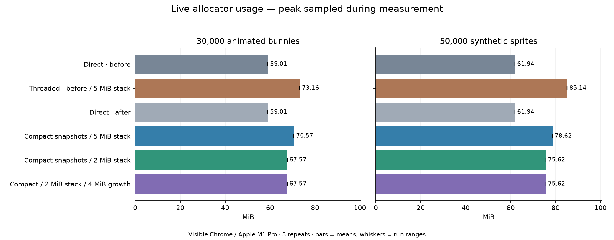
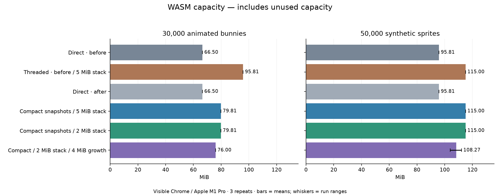
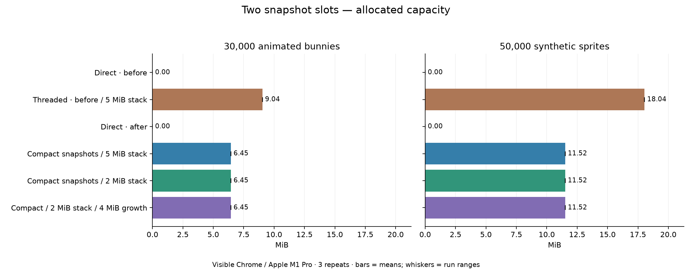
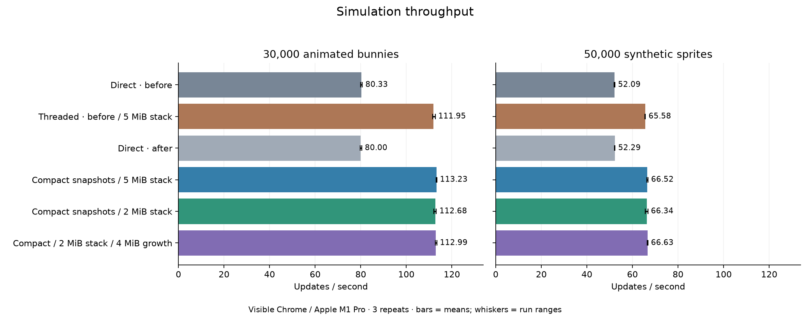
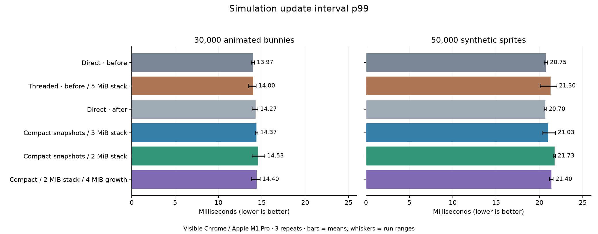

# Web component threading: memory optimization

Measured 2026-10-03. 36 valid Release runs; 5 s warmup + 15 s measurement, 3 repeats per configuration/workload. Large CPU traces and stack watermarking are off. Sparse allocator/snapshot samples and a bounded timing histogram are on in every configuration.

## Assessment

**The snapshot changes reduce real allocator usage while preserving the threaded throughput gain.** The optional 2 MiB worker stack saves another 3 MiB. Keep the default stack at 5 MiB until individual projects/extensions have been validated, and keep linear WASM growth opt-in.

| Workload | Direct live MiB (before) | Threaded before MiB | Compact + 2 MiB stack MiB | Live saving | Threading-overhead reduction |
| --- | ---: | ---: | ---: | ---: | ---: |
| bunny30k | 59.01 | 73.16 | 67.57 | 5.59 MiB (7.6%) | 39.5% |
| render50k | 61.94 | 85.14 | 75.62 | 9.52 MiB (11.2%) | 41.0% |

**At the unchanged 5 MiB default stack**, compaction/reservation alone saves 2.59 MiB at 30k and 6.52 MiB at 50k. Snapshot capacity falls from 9.04 to 6.45 MiB and from 18.04 to 11.52 MiB respectively. The 50k scene creates sprites incrementally, so its subsequent growth still has temporary copy costs and modest spare capacity.

With compact snapshots and the 2 MiB stack, throughput changes from **111.95 to 112.68 updates/s** at 30k and **65.58 to 66.34** at 50k. These small improvements are not the main result; the memory saving is consistent across repeats. Update p99 averages change from **14.00 to 14.53 ms** and **21.30 to 21.73 ms**, with overlapping run ranges. This is not evidence of a major throughput regression, but it does not prove zero latency cost.

The 4 MiB growth experiment lowers sampled WASM capacity from **95.81 to 76.00 MiB** at 30k and from **115.00 to 108.27 MiB on average** at 50k, compared with the old threaded configuration. Compared with compact + 2 MiB stack alone, its extra capacity saving is 3.81 MiB and 6.73 MiB respectively. It does **not** materially reduce live allocator usage; it reduces unused capacity. Its steady-state p99 is similar in this collection, but startup/extended-play growth stalls remain outside the measured interval.

The worker watermark touched 9,936 bytes in Bunnymark, 4,688 bytes in the 50k synthetic scene, 2,768 bytes in the sprite correctness fixture and 5,184 bytes in the broad-2D fixture. These are deepest observed writes during those particular worker lifetimes, not guaranteed worst-case stack requirements. Native geometry/lifetime tests and browser correctness tests pass; arbitrary native extensions and deep script/native call chains remain untested.

## Changes and controls

- **Before:** preserved pre-optimization sprite layout (128 bytes), doubling array growth, and the same new memory instrumentation used after optimization. Threaded uses the previously tested window cache plus completion dispatch.
- **Compact:** 96-byte sprite records; all three affine transform axes preserved; slice-9 values stored only when used; material tags shared per captured binding. Active sprite/bound storage is reserved before capture with 12.5% headroom on later growth. Two immutable slots remain.
- **2 MiB stack:** opt-in worker stack size, down from 5 MiB. The production/default setting remains 5 MiB. Correctness/stack watermark pilots are separate from this collection.
- **4 MiB growth:** opt-in CMake linear WASM growth experiment; default retains Emscripten’s geometric growth. This changes capacity policy, not live data size.
- **Direct before/after:** main-thread legacy rendering in each PoC binary. These are controls for the optimization, not independently built vanilla Defold engines.

All threaded configurations use `render.poc_pipeline=component`, `render.poc_threaded=1`, `render.poc_web_cache_window=1`, and `render.poc_web_schedule=1`. Smaller stack: `render.poc_web_stack_kb=2048`. Linear growth build: `DEFOLD_WEB_POC_MEMORY_GROWTH_LINEAR_STEP=4194304` with the web PoC build option enabled.

## Measurements

Cells show mean (minimum–maximum) across runs. Memory cells first take the maximum sampled value within each run. p99 is the update interval at or below which 99% of sampled intervals fall, rounded upward in a 0.05 ms histogram. It is not displayed FPS, render-submission p99, or input latency.

| Workload | Configuration | Updates/s | Update p99 ms | Live allocator MiB | WASM capacity MiB |
| --- | --- | ---: | ---: | ---: | ---: |
| bunny30k | Direct · before | 80.33 (80.02–80.66) | 13.97 (13.80–14.15) | 59.01 (59.01–59.01) | 66.50 (66.50–66.50) |
| bunny30k | Threaded · before / 5 MiB stack | 111.95 (111.57–112.68) | 14.00 (13.50–14.35) | 73.16 (73.16–73.16) | 95.81 (95.81–95.81) |
| bunny30k | Direct · after | 80.00 (79.69–80.43) | 14.27 (13.90–14.55) | 59.01 (59.00–59.01) | 66.50 (66.50–66.50) |
| bunny30k | Compact snapshots / 5 MiB stack | 113.23 (113.15–113.40) | 14.37 (14.25–14.55) | 70.57 (70.57–70.57) | 79.81 (79.81–79.81) |
| bunny30k | Compact snapshots / 2 MiB stack | 112.68 (112.13–113.17) | 14.53 (13.90–15.35) | 67.57 (67.57–67.57) | 79.81 (79.81–79.81) |
| bunny30k | Compact / 2 MiB stack / 4 MiB growth | 112.99 (112.69–113.38) | 14.40 (13.80–14.80) | 67.57 (67.57–67.57) | 76.00 (76.00–76.00) |
| render50k | Direct · before | 52.09 (51.98–52.30) | 20.75 (20.55–20.95) | 61.94 (61.94–61.94) | 95.81 (95.81–95.81) |
| render50k | Threaded · before / 5 MiB stack | 65.58 (65.47–65.70) | 21.30 (20.10–22.00) | 85.14 (85.14–85.14) | 115.00 (115.00–115.00) |
| render50k | Direct · after | 52.29 (52.20–52.37) | 20.70 (20.55–20.80) | 61.94 (61.94–61.94) | 95.81 (95.81–95.81) |
| render50k | Compact snapshots / 5 MiB stack | 66.52 (66.27–66.82) | 21.03 (20.40–21.85) | 78.62 (78.62–78.62) | 115.00 (115.00–115.00) |
| render50k | Compact snapshots / 2 MiB stack | 66.34 (65.70–66.74) | 21.73 (21.65–21.85) | 75.62 (75.62–75.62) | 115.00 (115.00–115.00) |
| render50k | Compact / 2 MiB stack / 4 MiB growth | 66.63 (66.49–66.76) | 21.40 (21.15–21.60) | 75.62 (75.62–75.62) | 108.27 (104.00–112.06) |

### Live allocation

### WASM capacity

### Snapshot storage

### Throughput

### Tail update intervals

## Accounting detail

| Workload | Configuration | Snapshot used MiB | Snapshot capacity MiB | Slot growth admission peaks MiB | Renderer CPU MiB | Logical GPU buffers MiB |
| --- | --- | ---: | ---: | ---: | ---: | ---: |
| bunny30k | Direct · before | 0.000 | 0.000 | 0.000 | 4.120 | 3.433 |
| bunny30k | Threaded · before / 5 MiB stack | 8.262 | 9.040 | 12.540 | 4.120 | 3.433 |
| bunny30k | Direct · after | 0.000 | 0.000 | 0.000 | 4.120 | 3.433 |
| bunny30k | Compact snapshots / 5 MiB stack | 6.431 | 6.449 | 6.449 | 4.120 | 3.433 |
| bunny30k | Compact snapshots / 2 MiB stack | 6.431 | 6.449 | 6.449 | 4.120 | 3.433 |
| bunny30k | Compact / 2 MiB stack / 4 MiB growth | 6.431 | 6.449 | 6.449 | 4.120 | 3.433 |
| render50k | Direct · before | 0.000 | 0.000 | 0.000 | 6.867 | 5.722 |
| render50k | Threaded · before / 5 MiB stack | 13.735 | 18.040 | 25.040 | 6.867 | 5.722 |
| render50k | Direct · after | 0.000 | 0.000 | 0.000 | 6.867 | 5.722 |
| render50k | Compact snapshots / 5 MiB stack | 10.684 | 11.516 | 20.076 | 6.867 | 5.722 |
| render50k | Compact snapshots / 2 MiB stack | 10.684 | 11.516 | 20.076 | 6.867 | 5.722 |
| render50k | Compact / 2 MiB stack / 4 MiB growth | 10.684 | 11.516 | 20.076 | 6.867 | 5.722 |

## Method and limitations

- Visible Chrome on Apple M1 Pro, AC power checked before/after every run, Low Power Mode off; temporary display/system sleep prevention. Variant order rotates between repeats. Fresh browser process/profile per run; no DevTools. All bundles use the identical compiled content archive, with hashes retained in the manifest.
- 30k uses animated Bunnymark at a 720×720 drawing buffer. 50k uses the existing synthetic sprite scene at 1280×720, including its incremental population ramp. Both retain the shared 60k object/sprite limits. Canvas size, focus and visibility are checked; sampled visibility is not an independent OS occlusion measurement.
- `mallinfo.uordblks` reports allocated allocator chunks including allocator overhead and the worker stack. It excludes static storage/main stack, JavaScript/browser allocations and GPU allocations. Free allocator space can be reused; WASM capacity may remain above live usage. Peaks are sampled every ~2 seconds during measurement, not exhaustive startup peaks.
- Snapshot used bytes include both slots at capture before retirement. Snapshot capacity includes capture maps; the sum of per-slot growth high-water values is a conservative admission estimate, not a measured simultaneous process peak. Snapshot storage, renderer CPU buffers and the worker stack are already in allocator totals; do not sum those columns again. Retained texture/resource descriptors refer to shared storage, not duplicate texture copies.
- Browser process RSS samples are preserved in `runs.csv` and raw JSON, but shared pages may be counted in more than one process. These sums are not unique resident memory and are not used to attribute engine savings. Logical GPU buffer sizes are not actual driver allocation measurements.
- Allocator scans acquire a lock; snapshot JSON and the fixed timing histogram also have overhead. Instrumentation is identical across configurations but not free. Three short steady-state repeats do not prove absence of growth stalls during extended play or safety for arbitrary native extensions.
- The 2 MiB stack was validated on separate sprite and broad-2D lifecycle fixtures. Watermarking measures deepest writes after worker entry, excludes main-thread initialization/finalization and JS stack, and can miss unwritten stack reservations. No default stack reduction or default WASM growth change is made.

## Evidence

- [Per-run measurements](runs.csv)
- [Raw JSON and manifest](raw-results.tar.gz)
- [Correctness and build evidence](validation.json)
- [Runner workflow](../../../../scripts/web/benchmark/README.md#memory-comparison)
