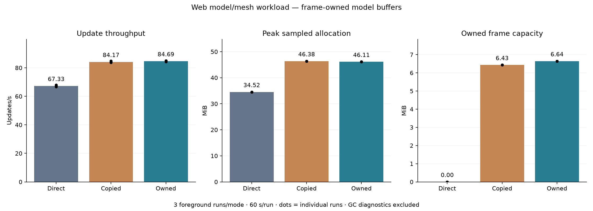
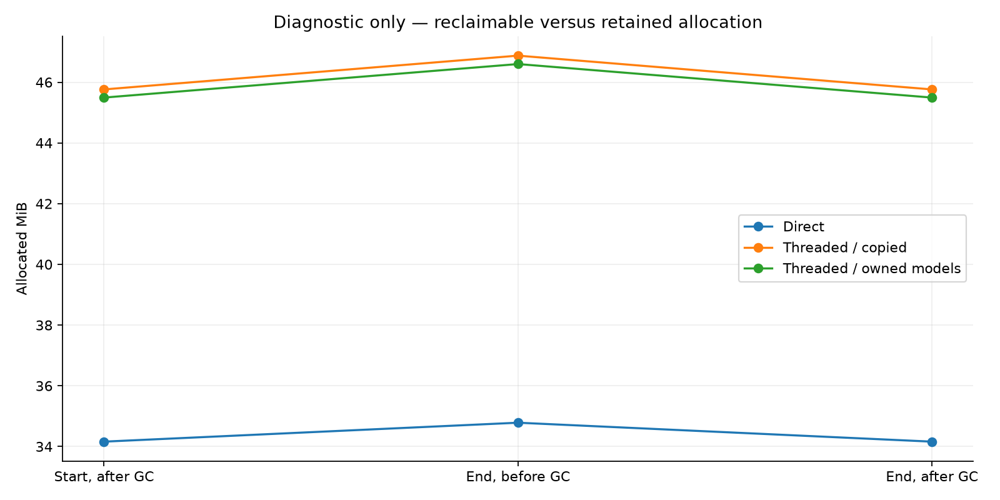

# Web frame-owned model buffers and memory attribution

This is a focused optimization experiment, not a production acceptance run. All modes use the same Release binary and content; direct is the modified engine with threading disabled, not clean vanilla. The worker stack remains 5 MiB.

The workload contains 1,000 groups: 2,000 meshes and 5,000 models, including CPU-skinned, GPU-skinned and instanced animation. Its tiny triangles stress component/preparation work, not realistic 3D assets.

## Performance collection

3 fresh-process foreground runs per mode, 10 seconds warmup and 60 seconds measurement. Mode order rotates. No forced GC, tracing or stack watermarking in these runs. Memory is sampled every two seconds.

| Mode | Updates/s | Update p99 ms | Allocated MiB | WASM MiB | Frame capacity MiB |
| --- | ---: | ---: | ---: | ---: | ---: |
| Direct | 67.328 (66.655–68.010) | 16.433 (16.300–16.550) | 34.523 (34.520–34.525) | 46.125 (46.125–46.125) | 0.000 (0.000–0.000) |
| Threaded / copied | 84.173 (83.715–84.747) | 15.417 (15.100–15.800) | 46.378 (46.376–46.379) | 55.375 (55.375–55.375) | 6.432 (6.432–6.432) |
| Threaded / owned models | 84.690 (84.343–85.072) | 15.267 (15.050–15.500) | 46.113 (46.110–46.115) | 55.375 (55.375–55.375) | 6.645 (6.645–6.645) |

Cells show mean (minimum–maximum). p99 is the update interval at or below which 99% of samples fall; it is not input-to-display latency. Allocated memory includes Lua garbage awaiting collection, allocator overhead and the worker stack. WASM capacity includes reusable/free space. Frame capacity is already included in allocation; do not add these columns.

Owned versus copied: throughput +0.61%; live allocation -0.265 MiB; frame capacity +0.212 MiB. The instrumented frame avoids copying 504,000 model upload bytes per frame.

## GC attribution diagnostics

These separate runs collect twice at each measurement boundary on the Lua owner. Collection is outside the timing window, but their timing results are deliberately excluded above. Render/game/GUI scripts share the engine Lua context. Disabling snapshot serialization keeps external allocator sampling and the fixed timing histogram enabled.

| Mode | Snapshot serialization | Seconds | Post-GC growth bytes | End reclaimed bytes | Lua post-GC growth bytes | Lua reclaimed bytes |
| --- | --- | ---: | ---: | ---: | ---: | ---: |
| Direct | on | 120.0 | 96 | 653,928 | 87 | 512,985 |
| Threaded / copied | on | 120.0 | 144 | 1,167,088 | 142 | 991,713 |
| Threaded / owned models | on | 120.0 | 144 | 1,158,272 | 142 | 985,144 |
| Direct | off | 60.0 | 40 | 277,312 | 42 | 199,774 |
| Threaded / copied | off | 60.0 | 40 | 335,296 | 42 | 242,920 |
| Threaded / owned models | off | 60.0 | 40 | 339,592 | 42 | 246,142 |

Short fixed-population diagnostics cannot establish leak freedom across hours, resource churn, other projects or extensions. GC may return memory to the allocator without shrinking WASM capacity. Browser/JS and GPU memory are outside the allocator metric.

[Per-run performance CSV](runs.csv), [GC CSV](gc.csv), [machine-readable assessment](assessment.json), [raw results, manifests and runner sources](raw-results.tar.gz).
