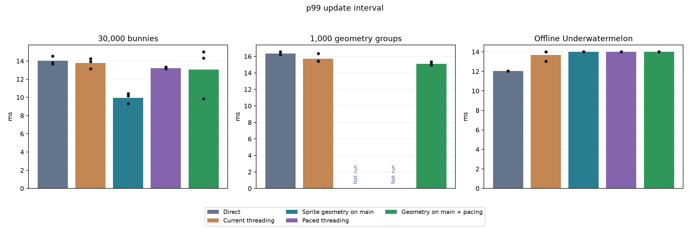
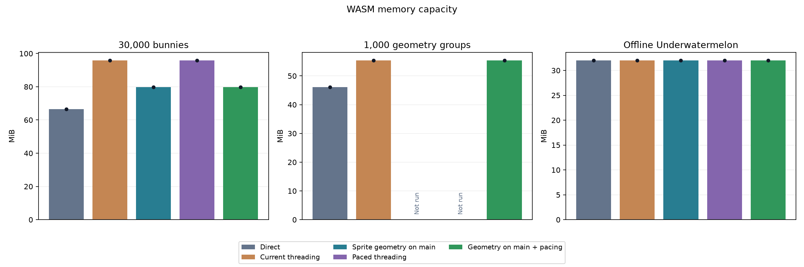
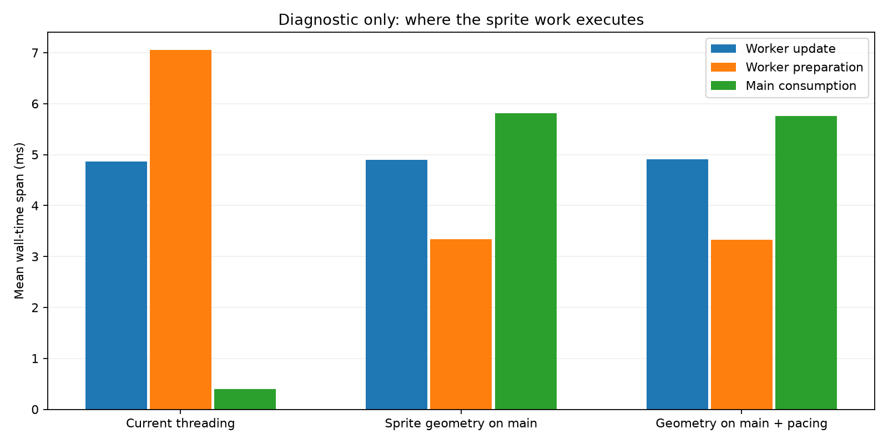

# Sprite placement and paced browser scheduling

These are opt-in experiments in the broad component snapshot path. Direct uses the same modified Release engine with threading disabled; it is not clean vanilla.

All collections use foreground Chrome, AC power, a temporarily disabled screen saver, no focus emulation, and no CPU tracing. Every run checks visibility, focus, build identity, errors and clean exit. Dots show individual runs; bars show means.

| Collection | Repeats per mode | Measurement |
| --- | ---: | --- |
| bunny30k | 3 | 30 s after 10 s warmup |
| geometry1000 | 3 | 30 s after 10 s warmup |
| gameplay_long | 3 | 600 warmup updates; 14,400 measured updates (~120 s) |

| Mode | Difference |
| --- | --- |
| Direct | Simulation and rendering run together on browser main. |
| Current threading | Simulation and component preparation on worker; captured draws execute on main; completion scheduler (1). |
| Sprite geometry on main | Sprite snapshots and batch indices cross the boundary. Main generates and uploads sprite vertices at each original draw position. Culling, sorting and batch selection stay on worker. |
| Paced threading | Scheduler 3 grants at most one update credit per visible rAF. A busy worker may use an unused credit on completion; credits do not accumulate. |
| Geometry on main + pacing | Both independent changes enabled. |

All modes keep the separate model-owned-buffer experiment disabled. Worker stack reservation remains 5 MiB.

| Workload / mode | Updates/s (range) | Mean p99 ms | Peak allocation MiB | WASM MiB |
| --- | ---: | ---: | ---: | ---: |
| bunny30k / Direct | 80.32 (80.22–80.43) | 14.02 | 59.02 | 66.50 |
| bunny30k / Current threading | 82.62 (82.37–82.93) | 13.78 | 75.04 | 95.81 |
| bunny30k / Sprite geometry on main | 119.34 (119.10–119.67) | 9.95 | 70.84 | 79.81 |
| bunny30k / Paced threading | 82.96 (82.91–83.02) | 13.22 | 75.08 | 95.81 |
| bunny30k / Geometry on main + pacing | 118.53 (117.90–119.66) | 13.05 | 70.79 | 79.81 |
| geometry1000 / Direct | 67.46 (66.40–68.48) | 16.33 | 34.37 | 46.12 |
| geometry1000 / Current threading | 83.85 (82.88–84.79) | 15.73 | 46.12 | 55.38 |
| geometry1000 / Geometry on main + pacing | 84.38 (83.77–84.71) | 15.12 | 46.13 | 55.38 |
| gameplay_long / Direct | 120.00 (119.99–120.00) | 12.05 | 15.73 | 32.00 |
| gameplay_long / Current threading | 120.00 (120.00–120.00) | 13.68 | 21.08 | 32.00 |
| gameplay_long / Sprite geometry on main | 119.99 (119.99–120.00) | 14.00 | 21.07 | 32.00 |
| gameplay_long / Paced threading | 119.97 (119.95–119.97) | 14.00 | 21.09 | 32.00 |
| gameplay_long / Geometry on main + pacing | 120.00 (120.00–120.00) | 14.00 | 21.18 | 32.00 |

| Workload / change versus current threading | Throughput | p99 | Allocations |
| --- | ---: | ---: | ---: |
| bunny30k / Sprite geometry on main | +44.4% | -27.8% | -5.6% |
| bunny30k / Paced threading | +0.4% | -4.1% | +0.0% |
| bunny30k / Geometry on main + pacing | +43.5% | -5.3% | -5.7% |
| geometry1000 / Geometry on main + pacing | +0.6% | -3.9% | +0.0% |
| gameplay_long / Sprite geometry on main | -0.0% | +2.3% | -0.0% |
| gameplay_long / Paced threading | -0.0% | +2.3% | +0.1% |
| gameplay_long / Geometry on main + pacing | +0.0% | +2.3% | +0.5% |

p99 is the 99th-percentile interval between simulation updates, reported as a histogram-bin upper bound. It measures update pacing, not physical input latency or displayed FPS. Higher throughput is better; lower p99 is better.

Allocation is the maximum sampled live WASM allocator usage per run. WASM capacity includes free space and cannot shrink. These domains overlap and must not be added. Browser/GPU memory and energy are not established by these plots. No forced GC runs are mixed into timing results.

Bunnymark exercises moving sprites; geometry groups exercise mesh/model preparation and act as a non-sprite control. The gameplay replay keeps fruit physics, merging, scoring, GUI and sound, excluding the optional streamed-music loader. All gameplay runs must have the same deterministic replay signature.

This is a single-device experiment, not production acceptance. Clean vanilla, slower physical devices, representative model-heavy projects, input latency, energy, extensions and context recovery remain separate evidence requirements. Raw runs, build hashes, environment and runner sources are preserved in raw-results.tar.gz.

Separate 10-second instrumented Bunnymark diagnostics, filtered to the measured window. These spans overlap; their sum is not CPU usage or energy consumption. They are excluded from performance comparison means.

| Mode | Update ms | Preparation ms | Consumption ms | Prepared-to-consume ms | Input-to-submit mean / p99 ms |
| --- | ---: | ---: | ---: | ---: | ---: |
| Current threading | 4.867 | 7.049 | 0.393 | 4.496 | 16.805 / 21.345 |
| Sprite geometry on main | 4.895 | 3.338 | 5.813 | 1.777 | 15.824 / 23.259 |
| Geometry on main + pacing | 4.909 | 3.328 | 5.756 | 1.869 | 15.863 / 23.279 |

Input-to-submit is an internal engine interval ending at graphics submission; it excludes GPU completion, display scanout and physical input delivery. It is not end-to-end input latency. Prepared-to-consume includes any publication wait and browser scheduling delay.
