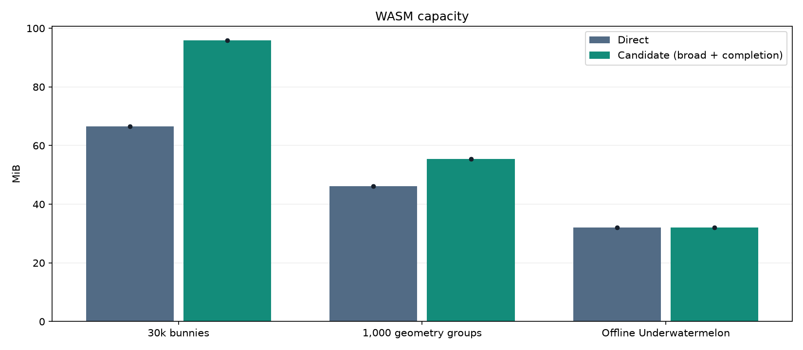

# Web production-candidate evaluation

**Status: not ready for production.** Gates are provisional and frozen before collection.

Direct is the same modified Release build with threading disabled, not clean vanilla. Each bar is the mean of run values; dots show individual runs.

Each line is one run; axes have separate memory scales. Gameplay samples can include final cleanup.

| Workload / mode | Updates/s | Mean p99 ms | Live MiB | WASM MiB | Largest sampled growth MiB |
| --- | ---: | ---: | ---: | ---: | ---: |
| bunny30k / direct | 80.59 | 14.00 | 59.03 | 66.50 | -2.53 |
| bunny30k / overlap_completion | 83.31 | 13.42 | 75.04 | 95.81 | -0.80 |
| geometry1000 / direct | 67.22 | 16.43 | 34.83 | 46.12 | 0.47 |
| geometry1000 / overlap_completion | 82.84 | 15.58 | 46.91 | 55.38 | 0.83 |
| gameplay_long / direct | 120.00 | 12.05 | 15.68 | 32.00 | 0.79 |
| gameplay_long / overlap_completion | 119.97 | 14.03 | 21.00 | 32.00 | 0.19 |

| Workload | UPS change | p99 change | Live memory change | Gate results |
| --- | ---: | ---: | ---: | --- |
| bunny30k | +3.4% | -4.2% | +27.1% | duration: pass, repeats: pass, throughput: pass, p99: pass, live_memory: FAIL, steady_state_memory: pass |
| gameplay_long | -0.0% | +16.5% | +33.9% | duration: pass, repeats: pass, throughput: pass, p99: FAIL, live_memory: FAIL, steady_state_memory: unproven |
| geometry1000 | +23.2% | -5.2% | +34.7% | duration: pass, repeats: pass, throughput: pass, p99: pass, live_memory: FAIL, steady_state_memory: FAIL |

Duration is compared at 0.01-second precision (fixed-tick runs here can finish a few milliseconds before nominal 120 seconds); exact durations remain in the CSV. Memory growth compares medians of the first and last quarters of samples. It is a screening signal, not proof of a leak or of leak freedom. Growing gameplay populations cannot pass a steady-state memory gate. p99 measures update intervals, not physical input latency. Memory domains overlap and must not be added.

External evidence still required: clean vanilla web comparison; representative animated model/mesh game replay; lower-powered target device; physical input-to-display latency; energy and sustained thermal behavior.

[Per-run measurements](runs.csv), [machine-readable gates](assessment.json), [raw evidence](raw-results.tar.gz).
