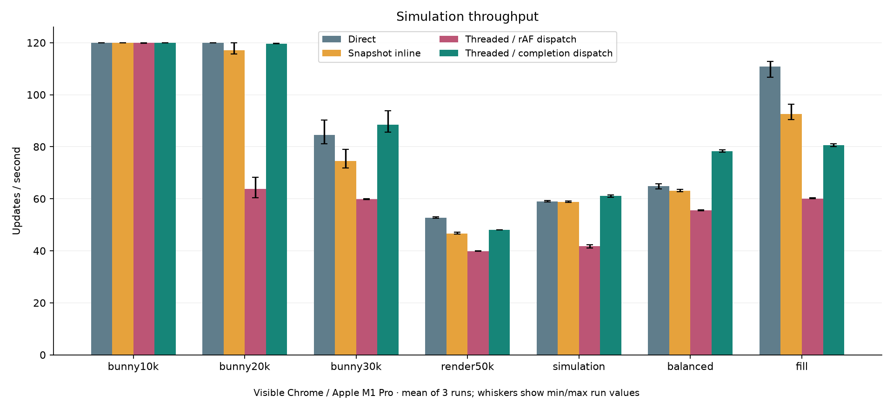
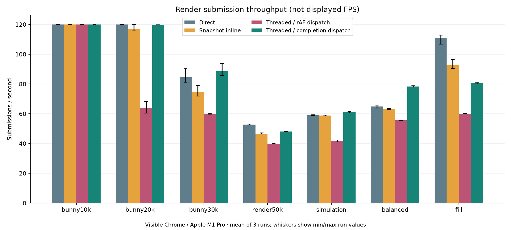
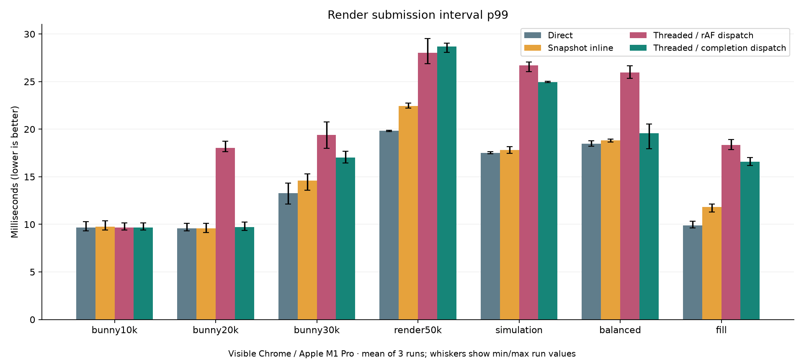
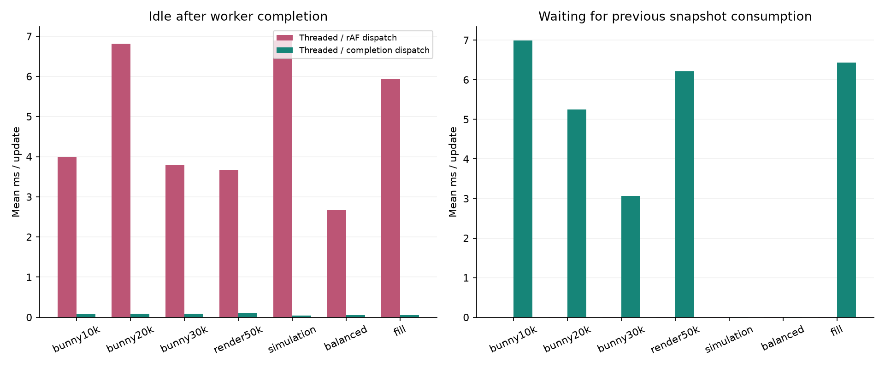
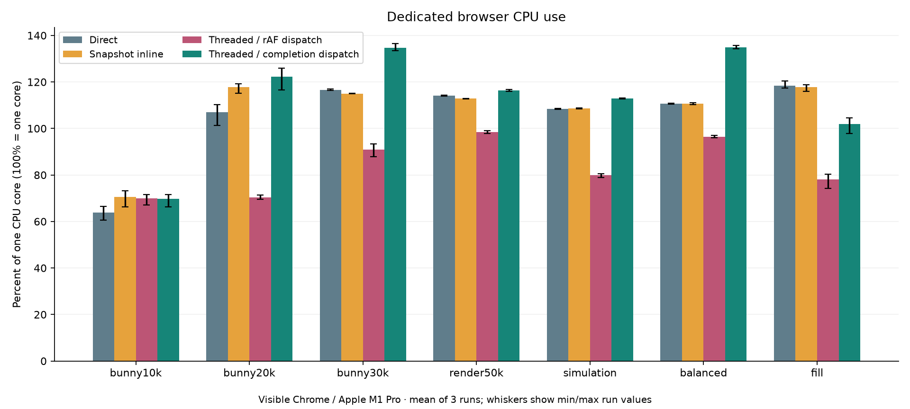
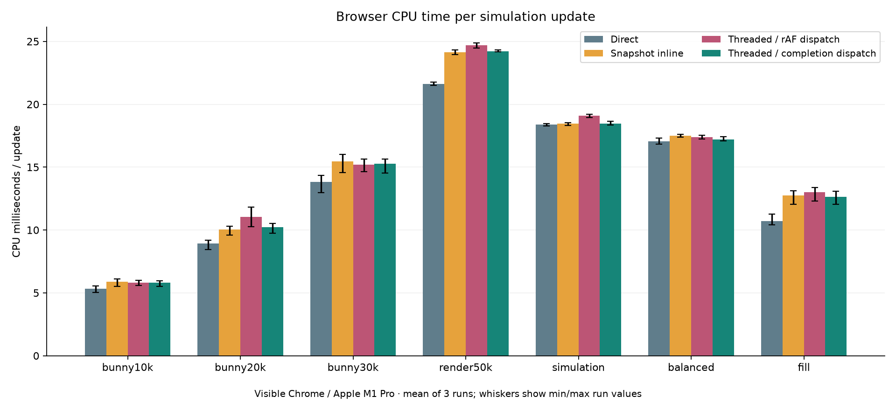
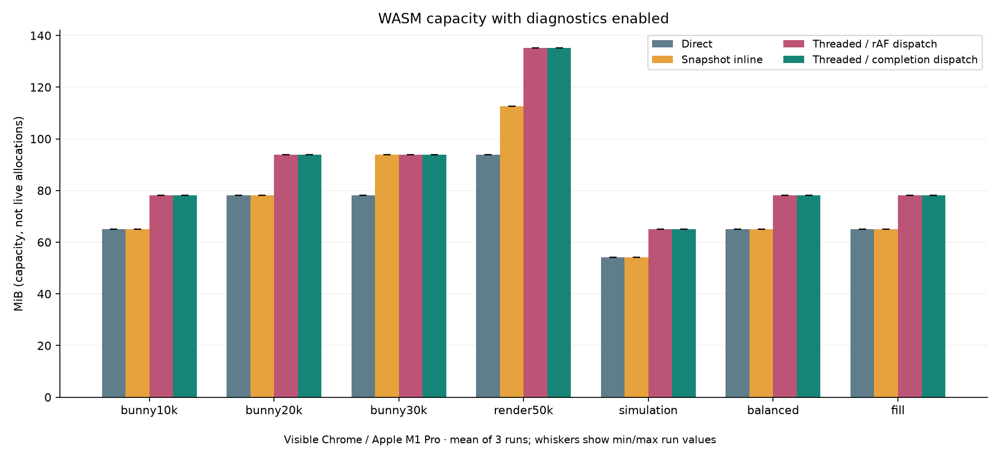
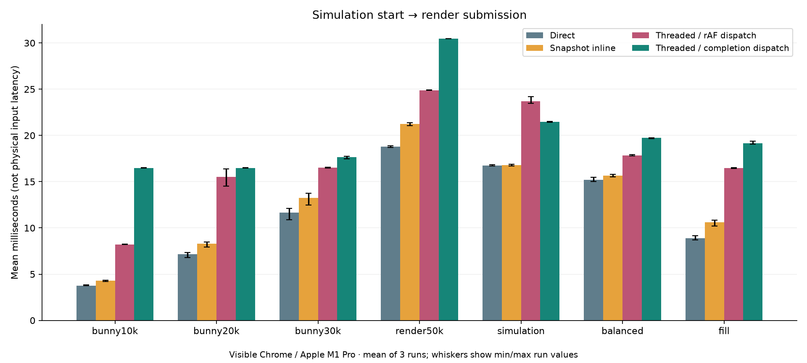
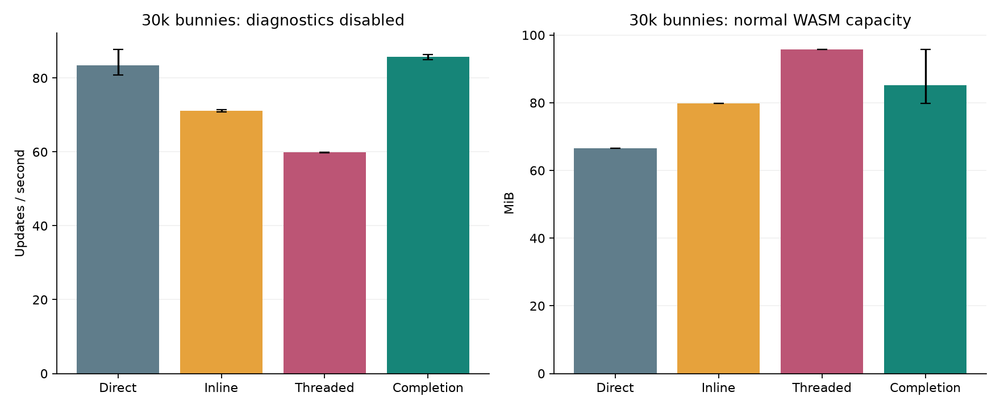

# Web component threading: scheduling experiment

Measured 2026-10-03. Same instrumented PoC Release engine in every mode; direct is its legacy rendering path, not a separate vanilla-engine build.

## Assessment

Component threading is worth continuing as an **opt-in option for suitable workloads on this tested desktop target**, but these measurements do not justify making it the default for web exports. The current animation-callback-only dispatcher leaves avoidable worker idle time. Completion dispatch removes much of that wait, but snapshot costs and additional frame age remain.

- The balanced workload gains **20.8%** over direct. At 30k bunnies the gain is **4.6%**. These are gains against the same PoC binary’s direct path, not against a separate vanilla build. The 30k gain is modest and the ranges of run means overlap; treat its magnitude as tentative rather than a precise speedup.
- Render-heavy 50k sprites change by **-9.0%**, and the fill-heavy case by **-27.2%**. The scheduler improvement does not make every workload faster.
- At 30k, worker idle time after completion falls from **3.79 ms** to **0.09 ms**. This directly measures a scheduler weakness; it is not an inference from average update rate alone.
- At 10k, mean simulation-start-to-submit age is **3.77 ms direct**, **8.21 ms current threaded**, and **16.48 ms completion dispatch**, despite similar throughput. Running ahead introduces a latency tradeoff.
- Balanced-workload CPU time per update is approximately **17.06 ms direct** and **17.21 ms completion dispatch**. Mean throughput rises, but submission-interval p99 changes from **18.45 ms** to **19.60 ms**: this is not a demonstrated tail-latency improvement.
- In the fill case, mean render span is **7.92 ms direct** versus **9.52 ms completion dispatch**, with only **0.84 ms** of simulation. There is insufficient simulation work to hide the longer render path. These elapsed spans include driver behavior; they do not isolate GPU time.

Recommendation: retain direct mode and keep the experiment opt-in. Next quantify/remove the remaining synchronous window-state query and test a dispatch policy that limits how far simulation runs ahead, then validate the promising balanced workload on a lower-powered web device, and add only the component snapshot coverage needed for one representative gameplay replay. Measure physical input latency and power before treating the throughput gain as a product-level win. The broad 2D compatibility path remains serialized and cannot substitute for that replay evaluation.

This result does not reproduce or invalidate the earlier screenshot comparison of an unidentified baseline at 30 updates/s versus threaded at 40. Engine identity, render harness and actual drawing-buffer dimensions differ; those exact screenshot conditions remain unverified.

## Results

| Workload | Direct updates/s | Inline | Current threaded | Completion dispatch | Completion vs direct |
| --- | ---: | ---: | ---: | ---: | ---: |
| bunny10k | 120.00 | 120.00 | 119.93 | 120.00 | +0.0% |
| bunny20k | 120.00 | 117.17 | 63.86 | 119.62 | -0.3% |
| bunny30k | 84.58 | 74.45 | 59.88 | 88.44 | +4.6% |
| render50k | 52.76 | 46.70 | 39.85 | 48.02 | -9.0% |
| simulation | 59.01 | 58.85 | 41.86 | 61.12 | +3.6% |
| balanced | 64.84 | 63.15 | 55.57 | 78.35 | +20.8% |
| fill | 110.79 | 92.52 | 60.12 | 80.66 | -27.2% |

### Simulation throughput

### Render submissions

### Tail frame intervals

### Scheduling and queue waits

### CPU usage

### CPU cost per update

### Memory with instrumentation

### Frame age

## CPU stages and scheduler evidence

Times below are per-frame elapsed CPU spans, not exclusive CPU time. Simulation and rendering overlap in threaded modes, so these columns must not be added together to predict throughput. Preparation includes command capture and housekeeping as well as sprite extraction. Queue wait is measured separately.

| Workload | Mode | Simulation ms | Preparation ms | Render ms | Queue wait ms | Dispatch idle ms | Worker total ms | Callback interval ms |
| --- | --- | ---: | ---: | ---: | ---: | ---: | ---: | ---: |
| bunny10k | Direct | 0.979 | 0.070 | 2.722 | 0.000 | 0.000 | 0.000 | 0.000 |
| bunny10k | Snapshot inline | 1.004 | 0.346 | 2.933 | 0.000 | 0.000 | 0.000 | 0.000 |
| bunny10k | Threaded / rAF dispatch | 0.908 | 0.310 | 2.969 | 0.001 | 3.991 | 4.304 | 8.333 |
| bunny10k | Threaded / completion dispatch | 0.881 | 0.311 | 2.988 | 6.989 | 0.071 | 8.229 | 8.333 |
| bunny20k | Direct | 2.275 | 0.122 | 4.742 | 0.000 | 0.000 | 0.000 | 0.000 |
| bunny20k | Snapshot inline | 2.336 | 0.562 | 5.386 | 0.000 | 0.000 | 0.000 | 0.000 |
| bunny20k | Threaded / rAF dispatch | 2.580 | 0.517 | 5.609 | 0.001 | 6.812 | 8.843 | 8.334 |
| bunny20k | Threaded / completion dispatch | 2.426 | 0.518 | 5.408 | 5.247 | 0.086 | 8.246 | 8.333 |
| bunny30k | Direct | 4.433 | 0.202 | 7.015 | 0.000 | 0.000 | 0.000 | 0.000 |
| bunny30k | Snapshot inline | 4.474 | 0.844 | 7.943 | 0.000 | 0.000 | 0.000 | 0.000 |
| bunny30k | Threaded / rAF dispatch | 3.975 | 0.728 | 7.997 | 0.002 | 3.787 | 12.856 | 8.357 |
| bunny30k | Threaded / completion dispatch | 4.162 | 0.865 | 8.270 | 3.065 | 0.085 | 11.202 | 8.335 |
| render50k | Direct | 6.069 | 0.346 | 12.364 | 0.000 | 0.000 | 0.000 | 0.000 |
| render50k | Snapshot inline | 6.032 | 1.268 | 13.948 | 0.000 | 0.000 | 0.000 | 0.000 |
| render50k | Threaded / rAF dispatch | 6.056 | 1.019 | 14.087 | 0.002 | 3.662 | 21.448 | 8.384 |
| render50k | Threaded / completion dispatch | 6.014 | 1.031 | 14.381 | 6.214 | 0.095 | 20.733 | 10.437 |
| simulation | Direct | 16.246 | 0.016 | 0.492 | 0.000 | 0.000 | 0.000 | 0.000 |
| simulation | Snapshot inline | 16.231 | 0.038 | 0.529 | 0.000 | 0.000 | 0.000 | 0.000 |
| simulation | Threaded / rAF dispatch | 16.269 | 0.039 | 0.511 | 0.002 | 6.891 | 16.927 | 8.334 |
| simulation | Threaded / completion dispatch | 16.198 | 0.040 | 0.486 | 0.005 | 0.041 | 16.293 | 8.333 |
| balanced | Direct | 12.584 | 0.068 | 2.567 | 0.000 | 0.000 | 0.000 | 0.000 |
| balanced | Snapshot inline | 12.437 | 0.255 | 2.945 | 0.000 | 0.000 | 0.000 | 0.000 |
| balanced | Threaded / rAF dispatch | 12.069 | 0.242 | 2.843 | 0.002 | 2.661 | 15.286 | 8.334 |
| balanced | Threaded / completion dispatch | 12.331 | 0.233 | 2.831 | 0.009 | 0.058 | 12.670 | 8.333 |
| fill | Direct | 0.884 | 0.063 | 7.921 | 0.000 | 0.000 | 0.000 | 0.000 |
| fill | Snapshot inline | 1.050 | 0.256 | 9.326 | 0.000 | 0.000 | 0.000 | 0.000 |
| fill | Threaded / rAF dispatch | 0.961 | 0.233 | 9.327 | 0.001 | 5.933 | 10.660 | 8.333 |
| fill | Threaded / completion dispatch | 0.836 | 0.225 | 9.522 | 6.439 | 0.053 | 12.324 | 8.333 |

Zero worker/scheduler columns in direct/inline mean not applicable, not a measured zero-cost scheduler.

## Deadline and memory details

p99 is the interval at or below which 99% of observed intervals fall. The table averages each run’s p99; it does not pool samples. “Over budget” means submission intervals exceeding 16.67 or 8.33 ms by more than 0.5 ms; these are diagnostic thresholds, not measured display-present misses.

| Workload | Mode | Update p99 ms | Submit p99 ms | Over 60 Hz budget % | Over 120 Hz budget % | WASM MiB | Browser RSS MiB |
| --- | --- | ---: | ---: | ---: | ---: | ---: | ---: |
| bunny10k | Direct | 9.63 | 9.69 | 0.00 | 8.89 | 65.12 | 1104.24 |
| bunny10k | Snapshot inline | 9.63 | 9.74 | 0.00 | 10.34 | 65.12 | 1108.73 |
| bunny10k | Threaded / rAF dispatch | 9.67 | 9.66 | 0.00 | 11.99 | 78.19 | 1107.20 |
| bunny10k | Threaded / completion dispatch | 9.67 | 9.66 | 0.00 | 9.85 | 78.19 | 1107.57 |
| bunny20k | Direct | 9.46 | 9.60 | 0.00 | 7.26 | 78.19 | 1065.83 |
| bunny20k | Snapshot inline | 9.54 | 9.58 | 0.00 | 22.52 | 78.19 | 1152.52 |
| bunny20k | Threaded / rAF dispatch | 18.07 | 18.04 | 6.91 | 90.99 | 93.88 | 1125.70 |
| bunny20k | Threaded / completion dispatch | 9.75 | 9.69 | 0.04 | 9.25 | 93.88 | 1096.21 |
| bunny30k | Direct | 13.24 | 13.28 | 0.00 | 100.00 | 78.19 | 1146.35 |
| bunny30k | Snapshot inline | 14.63 | 14.59 | 0.00 | 100.00 | 93.88 | 1148.97 |
| bunny30k | Threaded / rAF dispatch | 19.55 | 19.41 | 13.96 | 100.00 | 93.88 | 1121.67 |
| bunny30k | Threaded / completion dispatch | 19.77 | 17.02 | 0.75 | 59.42 | 93.88 | 1149.29 |
| render50k | Direct | 19.85 | 19.85 | 100.00 | 100.00 | 93.88 | 1084.42 |
| render50k | Snapshot inline | 22.61 | 22.44 | 100.00 | 100.00 | 112.69 | 1077.81 |
| render50k | Threaded / rAF dispatch | 28.01 | 28.01 | 100.00 | 100.00 | 135.25 | 960.81 |
| render50k | Threaded / completion dispatch | 36.53 | 28.67 | 49.70 | 100.00 | 135.25 | 1101.88 |
| simulation | Direct | 17.49 | 17.51 | 13.24 | 100.00 | 54.25 | 1044.11 |
| simulation | Snapshot inline | 17.85 | 17.80 | 19.26 | 100.00 | 54.25 | 1031.17 |
| simulation | Threaded / rAF dispatch | 26.73 | 26.71 | 95.56 | 100.00 | 65.12 | 1025.09 |
| simulation | Threaded / completion dispatch | 17.12 | 24.97 | 13.24 | 94.84 | 65.12 | 1031.64 |
| balanced | Direct | 18.39 | 18.45 | 9.18 | 100.00 | 65.12 | 1036.32 |
| balanced | Snapshot inline | 18.78 | 18.84 | 13.56 | 100.00 | 65.12 | 1025.07 |
| balanced | Threaded / rAF dispatch | 25.97 | 25.95 | 27.57 | 100.00 | 78.19 | 1050.43 |
| balanced | Threaded / completion dispatch | 17.10 | 19.60 | 9.87 | 55.94 | 78.19 | 1042.26 |
| fill | Direct | 9.88 | 9.88 | 0.00 | 63.88 | 65.12 | 1180.12 |
| fill | Snapshot inline | 11.75 | 11.83 | 0.00 | 100.00 | 65.12 | 1118.89 |
| fill | Threaded / rAF dispatch | 18.36 | 18.33 | 16.20 | 100.00 | 78.19 | 1127.85 |
| fill | Threaded / completion dispatch | 25.16 | 16.59 | 0.30 | 100.00 | 78.19 | 1072.02 |

## Instrumentation-off check (30k bunnies)

| Mode | Updates/s | Run range | Peak WASM capacity range, MiB | Browser RSS MiB |
| --- | ---: | --- | ---: | ---: |
| Direct | 83.37 | 80.79–87.79 | 66.50–66.50 | 1048.3 |
| Snapshot inline | 71.09 | 70.81–71.49 | 79.81–79.81 | 1036.0 |
| Threaded / rAF dispatch | 59.84 | 59.80–59.90 | 95.81–95.81 | 1082.9 |
| Threaded / completion dispatch | 85.78 | 84.98–86.42 | 79.81–95.81 | 1146.9 |

Bars show mean run values and whiskers their range; memory uses the maximum sampled capacity within each run. Completion-dispatch capacity varied between runs, as shown in the table. This is chunked capacity, not a precise live-allocation delta. These runs occurred after the instrumented matrix; differences between the two collections do not isolate instrumentation overhead from run-to-run variation.

## Remaining owner-thread dependency

Follow-up measurement note: this report's simulation-start-to-submit age excludes
the window query described below. The cache/dispatch follow-up also measures
dispatch-to-submit age to include that wait when comparing scheduling latency.
Additionally, this original collector used Playwright's default focus emulation;
its focus/visibility samples did not independently establish real foreground
state. The follow-up disables focus emulation and preserves failed focus checks
as invalid attempts. These limits do not change the recorded numbers here.

Code review after collection found that StepFrame queries `WINDOW_STATE_OPENED` before the trace’s `input_begin` timestamp. Unlike `WINDOW_STATE_ICONIFIED`, that query is not served from the external window snapshot: `dmGraphics::GetWindowStateParam` synchronously dispatches it to browser main. If main is consuming a frame, this can delay the worker before simulation. Worker total includes that delay, while the simulation column begins later; the stage table is not a complete attribution of every wait. This call was not individually timed, so the amount attributable to it remains unverified. A focused follow-up should capture the open/closed state with the existing main-owned window/input snapshot and compare it behind an opt-in switch, preserving close-event ordering. No such change is included in the measured engine.

## What changed

- Direct: simulation and ordinary component rendering on browser main.
- Inline: sprite snapshots extracted and consumed on main; measures the refactoring and snapshot cost without parallelism.
- Current threaded: worker simulation/extraction, browser-main consumption; each animation callback starts another update only if the worker is idle.
- Completion dispatch: same snapshot and graphics ownership, but worker completion additionally queues a main-thread dispatch opportunity. Main samples input only while the worker is idle. Consumption remains on animation callbacks; the two-slot queue still applies backpressure. Rendering/update pause falls back to animation-callback dispatch. Default behavior is unchanged.
- Enable the experiment with `render.poc_web_schedule=1` alongside component threading. This is rejected for the serialized broad-2D path.
- Opt-in `render.poc_web_metrics=1` allows `render.sprite_trace=/trace.csv` on web and records bounded scheduler samples. Traces are exported only after shutdown/join. Buffers have fixed capacities; the runner rejects dropped samples.

## Workloads

- bunny10k / bunny20k / bunny30k: original Bunnymark sprite assets and engine-driven bouncing animations, fixed seed, initial population. Compiled into the shared native-benchmark harness; uses its sprite-compatible renderer and 60,000 sprite/object capacity settings (the original Bunnymark project used 32,765). The native harness also retains its graphics limits. Thus these absolute timings and memory capacities are not a reproduction of the original Bunnymark bundle; all four modes here share these settings.
- render50k: native benchmark with 50,000 small stationary sprites, one pass, no additional scripted simulation.
- simulation: 1,000 sprites plus 1,000,000 deterministic arithmetic iterations per update. This is a synthetic CPU stressor, not representative game logic.
- balanced: 10,000 sprites, 100,000 arithmetic iterations and scripted movement of every sprite per update.
- fill: 10,000 sprites scaled to 64 pixels, four render passes. This stresses fill/overdraw; GPU timing was not collected, so GPU saturation is not independently proved.

The native workload code is copied by `scripts/web/benchmark/prepare.py`; the GUI component is removed because this test concerns overlapping sprite snapshots. Measurement/result output is adapted for the browser. Synthetic movement uses a fixed step per update; timed runs with different update counts therefore do not end at the same simulation state. This is controlled work per update, not a fixed-duration gameplay replay.

## Method and limits

- Visible Chrome, fresh browser for each run, DevTools closed, AC power checked before and after each run. Seven workloads × four modes × three repeats. Five-second warm-up and fifteen-second measurement; mode order rotates between repeats. No successful run was discarded.
- Browser 154.0.8037.95; hardware renderer ANGLE (Apple, ANGLE Metal Renderer: Apple M1 Pro, Version 26.5.2 (Build 25F84)). Native display DPR is 2, but actual drawing buffers are verified separately: Bunnymark 720×720; synthetic scenes 1280×720. This differs from the earlier 1440×1440 Bunnymark run.
- Visibility/focus and fixed buffer size are sampled every two seconds. Occlusion is not independently detected. The automation uses a clean Chrome profile and its standard launch defaults, not the user’s existing profile.
- CPU stage timestamps and render submissions come from the engine trace, not the number of render-script callbacks. GPU completion and display presentation are not measured. Browser animation callbacks remain refresh-scheduled; this is not an uncapped native-style throughput test.
- Browser CPU percentage is summed process CPU-time delta over the memory-sampling interval. Processes absent from either endpoint are excluded. It is a utilization measure, not energy or power. Power and energy were not measured in this collection.
- Instrumented WASM capacity includes the existing 65,536-record CPU trace buffer in all modes and two 32,768-record scheduler buffers in threaded modes (about 1.5 MiB combined). Growth is chunked. Use the instrumentation-off comparison for production-like capacity at 30k. RSS includes browser/GPU processes, is noisy and can double-count shared pages.
- Simulation-start-to-submit age is a pipeline latency proxy, not physical input-to-display latency. Completion dispatch may reduce idle time while increasing queued frame age; throughput alone is not a release criterion.
- Chrome on one Apple M1 Pro is the only performance target measured. Firefox/Safari, lower-powered Android, real-project snapshot coverage, longer thermal runs, physical input latency and energy remain required before a broad web-target recommendation.
- The broad 2D compatibility mode is serialized and is deliberately excluded from claims about overlapping rendering. Mesh/models and unsupported extension components remain outside this evaluation.

## Validation and reproduction

All four modes matched the deterministic sprite fixture’s simulation checksum and screenshot hash. Both threaded schedulers passed context-loss shutdown; rendering pause/resume and input are exercised. Native test_engine rebuilt and the existing admission regression passed.

Use the matching Emscripten 4.0.6 pthread CMake build and full Bob jar described in `engine/docs/WEB_COMPONENT_POC.md`. Prepare content with `scripts/web/benchmark/prepare.py NATIVE_PROJECT BUNNYMARK_PROJECT NEW_DIRECTORY`, build it with Bob, point `DEFOLD_WEB_POC_CONTENT` to its `build/default`, and copy `scripts/web/benchmark/index.html` into the web engine output directory. Serve with the provided COOP/COEP server at localhost:8766. Run `node scripts/web/benchmark/run.cjs NEW_RESULTS_DIRECTORY` with Playwright available through NODE_PATH. `METRICS=0` disables traces; optional final case name selects one workload. Run this report script with the raw directory and output directory, optionally `--control` for instrumentation-off results.

Raw evidence is preserved in [raw-results.tar.gz](raw-results.tar.gz), containing the instrumented and control directories, plus locally at /Users/jhonny/dev/defold/tmp/web-threading-matrix-2026-10-03. Per-run JSON includes engine identity, mode banners, CPU/process/memory samples and scheduler samples; CSV files hold per-frame CPU traces. `runs.csv` contains report calculations. Failed setup pilots are retained separately and are not performance measurements.
