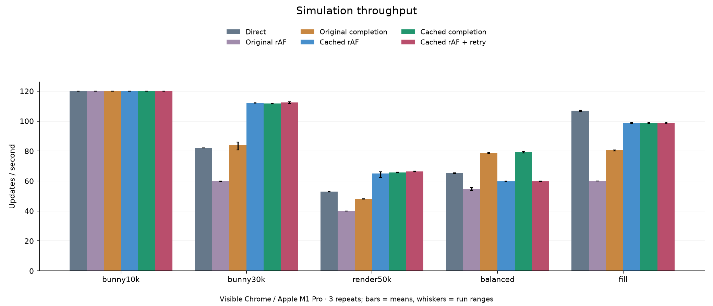
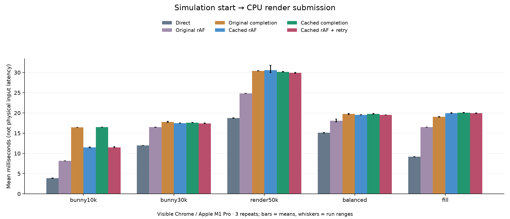
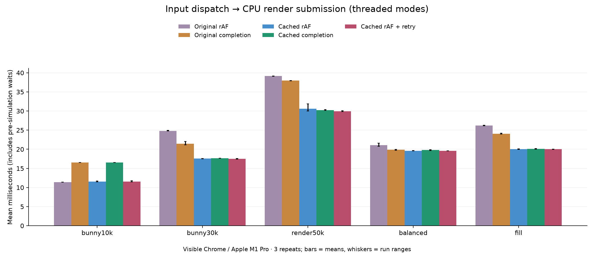
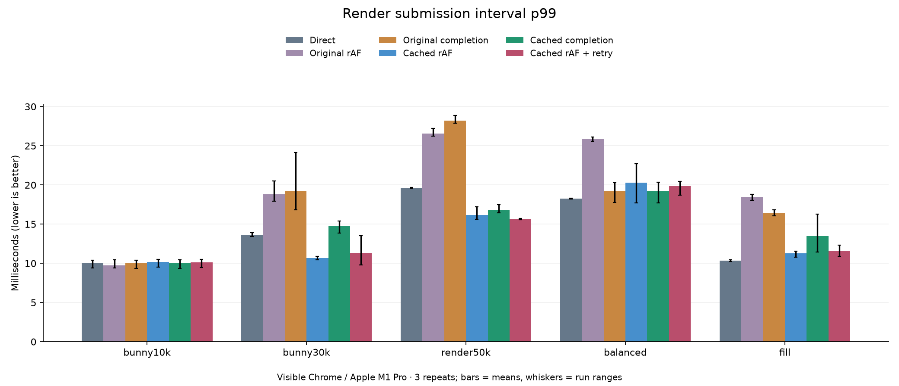
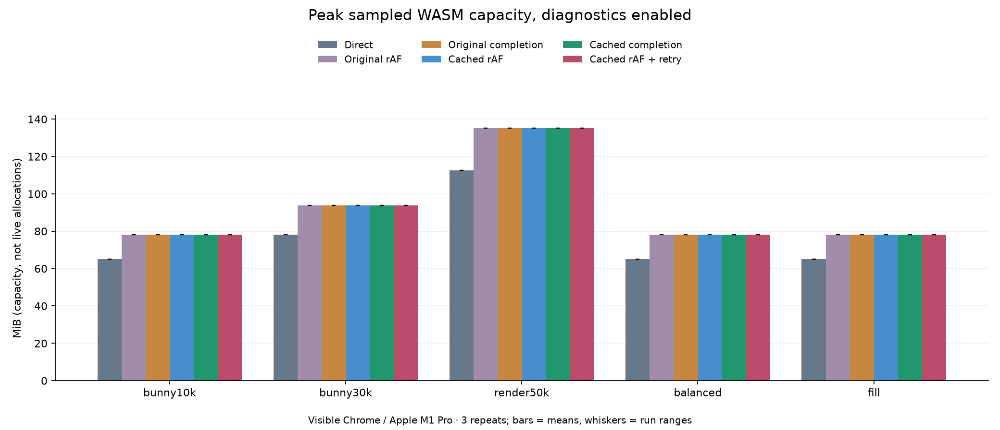
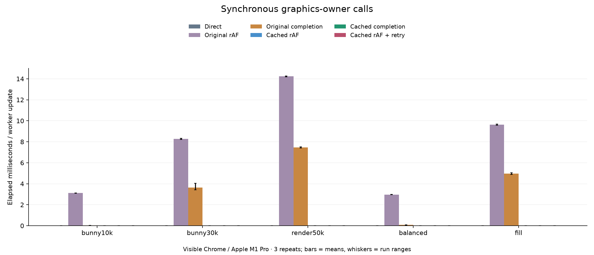
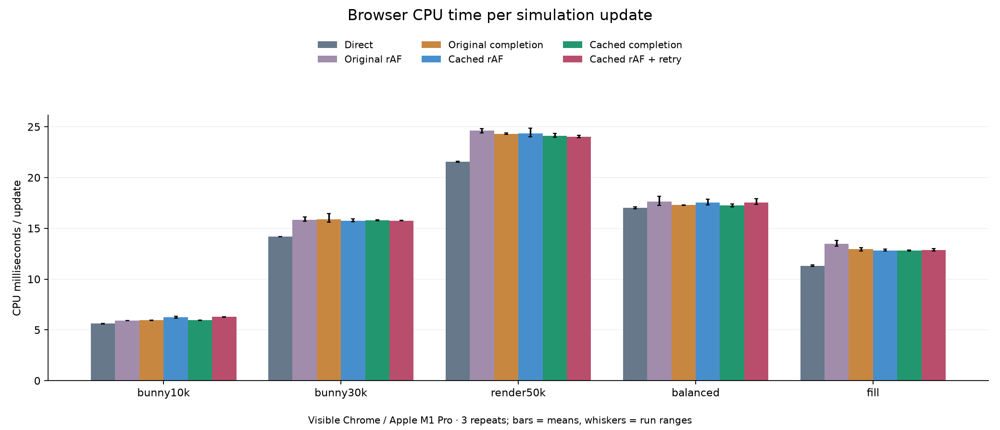
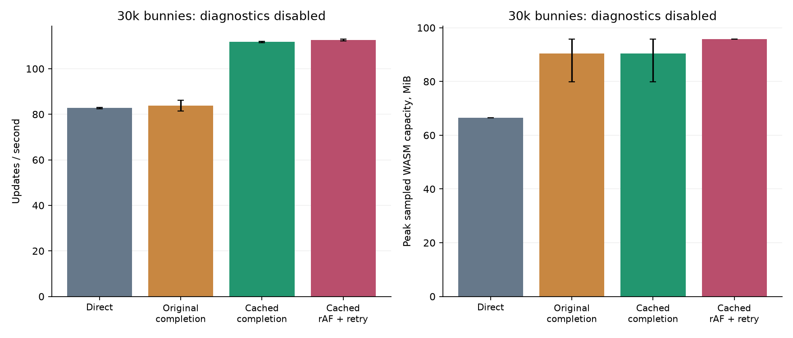

# Web component threading: window cache and dispatch retry

Measured 2026-10-03. 90 instrumented runs, same PoC Release binary and content in all modes. Direct uses its legacy path; it is not a separate vanilla-engine build. Another 12 diagnostics-off runs check normal memory/throughput at 30k.

## Assessment

**The window-state cache is a worthwhile improvement to this web PoC. The immediate post-render retry does not demonstrate an additional benefit worth choosing it for.** Keep threading and the experimental controls opt-in: the results now support a stronger throughput case for heavy sprites on this tested desktop, but they still expose memory and latency costs.

With the cache and completion dispatch, mean throughput versus the same engine's direct path changes by **+36.1% at 30k bunnies**, **+24.5% at 50k stationary sprites**, **+21.4% for balanced work**, and **−7.8% for fill-heavy rendering**. At 10k, every mode reaches the 120 Hz cap. The gains in the heavy sprite scenes occur in all three repeats, with clear separation from direct; these are run ranges, not statistical confidence intervals.

The cache removes one synchronous graphics-owner call per update in these preloaded scenes. With the original rAF scheduler, that call occupied 8.27 ms/update at 30k and 14.23 ms/update at 50k. It delayed simulation until main had finished rendering. Cached runs record zero such calls during measurement and can overlap the two stages. This is the main demonstrated improvement.

The retry policy recorded only **nine successful extra dispatches across its fifteen full runs**, including warm-up. Most runs recorded zero. Its small throughput differences should not be attributed to a successful new steady-state scheduling mechanism. The worker generally becomes idle after the immediate retry check has already executed.

For the measured workloads:

- **Heavy sprites:** cache + rAF is a useful starting point. At 30k it gives 112.07 updates/s versus 82.11 direct, and submission p99 improves from 13.63 to 10.70 ms. Cached completion has similar mean throughput but a worse 14.76 ms p99 in this case. At 50k, all cached schedules beat direct, with some variation between repeats.
- **Balanced simulation/rendering:** cache + completion gives 79.14 updates/s versus 65.21 direct. Cached rAF and retry give about 60. The submission p99 remains slightly worse than direct: 19.26 versus 18.27 ms.
- **Light or fill-heavy work:** direct remains preferable in this experiment. Light work gains no throughput from threading; fill-heavy work remains slower despite the cache.

Latency has improved relative to the old threaded path in the heavy sprite scenes, but it is still a tradeoff against direct. At 30k, dispatch-to-submit age falls from 24.84 ms with original rAF to 17.55 ms with cached rAF. At 10k, cached rAF/retry is about 11.55–11.57 ms versus 16.53 ms for completion dispatch. The older simulation-start metric excluded the window wait and therefore should not be used alone to compare these schedulers. These are CPU pipeline measurements, **not physical input-to-display latency**.

The changes do not reduce snapshot memory: instrumented 30k runs use 93.88 MiB of WASM capacity in every threaded mode versus 78.19 MiB direct. Without diagnostics, cached completion retains the gain (111.80 versus 82.79 updates/s), but its sampled WASM capacity is 79.81–95.81 MiB versus 66.50 MiB direct. Capacity grows in chunks and is not live allocation size. Browser CPU time per update also remains higher in the heavy sprite cases; the throughput improvement comes from overlap, not a demonstrated reduction in total work or energy.

The milestone therefore delivers the window-cache improvement and a measured negative result for the minimal retry experiment. It does **not** deliver one scheduler that combines completion's balanced-workload throughput with rAF's lower light-load age. The next scheduling experiment should admit completion-driven updates only when the current browser interval has an unused dispatch opportunity, then verify that it preserves the long-simulation gain without light-load run-ahead. Snapshot consumer/copy costs remain the next rendering optimization. A lower-powered device and a representative gameplay replay are still required before recommending this as a general web default.

## Implementation

- Window cache: browser main captures OPENED together with input/window state while the worker is idle, then publishes it with the next tick. The game thread reads that owned snapshot instead of making a synchronous main-thread call. Close events are still applied before simulation. Default remains off.
- Dispatch retry: browser main tries again after consuming a frame only if it did not dispatch at callback start. At most one update is admitted per callback. No extra frame slots, dropped updates, or adaptive prediction were introduced. Default remains the original rAF scheduler.
- Diagnostics now separately record synchronous graphics-owner calls. These spans include owner execution and waiting, and overlap the worker-total span. They are not additional CPU time to add to the other columns.

| Mode | Window cache | Schedule |
| --- | ---: | --- |
| Direct | — | Existing main-thread flow |
| Original rAF | 0 | 0: dispatch before consumption |
| Original completion | 0 | 1: also dispatch on worker completion |
| Cached rAF | 1 | 0 |
| Cached completion | 1 | 1 |
| Cached rAF + retry | 1 | 2: retry after consumption if not already dispatched |

Use `render.poc_pipeline=component`, `render.poc_threaded=1`, `render.poc_web_cache_window=1`, and the chosen `render.poc_web_schedule` value. Scheduling experiments require the overlapping sprite path (`poc_web_2d=0`).

## Throughput

| Workload | Direct | Original rAF | Original completion | Cached rAF | Cached completion | Cached rAF + retry |
| --- | ---: | ---: | ---: | ---: | ---: | ---: |
| bunny10k | 120.00 | 119.98 | 120.00 | 120.00 | 120.00 | 120.01 |
| bunny30k | 82.11 | 59.93 | 84.23 | 112.07 | 111.74 | 112.48 |
| render50k | 52.85 | 40.00 | 48.02 | 64.90 | 65.79 | 66.33 |
| balanced | 65.21 | 54.85 | 78.66 | 59.82 | 79.14 | 59.84 |
| fill | 106.94 | 59.99 | 80.51 | 98.68 | 98.57 | 98.79 |

### Updates per second

### Frame age

### Dispatch-to-submit age

### Tail intervals

### Memory capacity

### Owner roundtrips

### CPU cost

## Per-mode evidence

p99 is the interval at or below which 99% of observations fall; this table averages the per-run p99 values. Submission is a CPU event, not confirmed display presentation. Frame age begins at input/simulation processing, after the old window query. The additional dispatch-to-submit graph matches frames to worker updates and includes input preparation plus that pre-simulation wait. Use it to compare latency between schedulers fairly; neither metric is physical input-to-display latency. Direct has no worker dispatch and is omitted from that graph.

| Case | Mode | Updates/s | Submit/s | Submit p99 ms | Mean age ms | Queue wait ms | Sync ms/update | Sync calls/update | WASM MiB | CPU ms/update |
| --- | --- | ---: | ---: | ---: | ---: | ---: | ---: | ---: | ---: | ---: |
| bunny10k | Direct | 120.002 | 120.009 | 10.062 | 3.858 | 0.000 | 0.000 | 0.000 | 65.125 | 5.618 |
| bunny10k | Original rAF | 119.980 | 119.978 | 9.740 | 8.194 | 0.001 | 3.125 | 1.000 | 78.188 | 5.910 |
| bunny10k | Original completion | 120.000 | 120.005 | 10.030 | 16.452 | 6.986 | 0.037 | 1.000 | 78.188 | 5.952 |
| bunny10k | Cached rAF | 120.000 | 120.004 | 10.168 | 11.479 | 1.865 | 0.000 | 0.000 | 78.188 | 6.223 |
| bunny10k | Cached completion | 120.001 | 120.000 | 10.075 | 16.497 | 6.987 | 0.000 | 0.000 | 78.188 | 5.950 |
| bunny10k | Cached rAF + retry | 120.006 | 120.003 | 10.139 | 11.503 | 1.888 | 0.000 | 0.000 | 78.188 | 6.288 |
| bunny30k | Direct | 82.113 | 82.117 | 13.628 | 11.969 | 0.000 | 0.000 | 0.000 | 78.188 | 14.173 |
| bunny30k | Original rAF | 59.933 | 59.932 | 18.828 | 16.484 | 0.002 | 8.271 | 1.000 | 93.875 | 15.856 |
| bunny30k | Original completion | 84.230 | 84.273 | 19.277 | 17.762 | 2.713 | 3.641 | 1.000 | 93.875 | 15.896 |
| bunny30k | Cached rAF | 112.074 | 112.074 | 10.696 | 17.490 | 3.088 | 0.000 | 0.000 | 93.875 | 15.751 |
| bunny30k | Cached completion | 111.740 | 111.738 | 14.756 | 17.616 | 3.160 | 0.000 | 0.000 | 93.875 | 15.773 |
| bunny30k | Cached rAF + retry | 112.483 | 112.482 | 11.317 | 17.434 | 3.038 | 0.000 | 0.000 | 93.875 | 15.764 |
| render50k | Direct | 52.853 | 52.851 | 19.662 | 18.750 | 0.000 | 0.000 | 0.000 | 112.688 | 21.563 |
| render50k | Original rAF | 40.002 | 40.002 | 26.577 | 24.831 | 0.002 | 14.230 | 1.000 | 135.250 | 24.610 |
| render50k | Original completion | 48.018 | 48.049 | 28.216 | 30.429 | 6.130 | 7.470 | 1.000 | 135.250 | 24.307 |
| render50k | Cached rAF | 64.904 | 64.897 | 16.184 | 30.578 | 8.069 | 0.000 | 0.000 | 135.250 | 24.324 |
| render50k | Cached completion | 65.794 | 65.767 | 16.796 | 30.175 | 7.821 | 0.000 | 0.000 | 135.250 | 24.107 |
| render50k | Cached rAF + retry | 66.335 | 66.307 | 15.626 | 29.908 | 7.713 | 0.000 | 0.000 | 135.250 | 24.021 |
| balanced | Direct | 65.209 | 65.207 | 18.272 | 15.135 | 0.000 | 0.000 | 0.000 | 65.125 | 16.999 |
| balanced | Original rAF | 54.848 | 54.852 | 25.859 | 18.078 | 0.002 | 2.965 | 1.000 | 78.188 | 17.636 |
| balanced | Original completion | 78.662 | 78.644 | 19.261 | 19.751 | 0.010 | 0.078 | 1.000 | 78.188 | 17.283 |
| balanced | Cached rAF | 59.817 | 59.797 | 20.323 | 19.549 | 0.002 | 0.000 | 0.000 | 78.188 | 17.519 |
| balanced | Cached completion | 79.139 | 79.148 | 19.262 | 19.770 | 0.010 | 0.000 | 0.000 | 78.188 | 17.271 |
| balanced | Cached rAF + retry | 59.838 | 59.830 | 19.846 | 19.535 | 0.002 | 0.000 | 0.000 | 78.188 | 17.537 |
| fill | Direct | 106.940 | 106.941 | 10.346 | 9.168 | 0.000 | 0.000 | 0.000 | 65.125 | 11.295 |
| fill | Original rAF | 59.992 | 59.991 | 18.484 | 16.511 | 0.002 | 9.619 | 1.000 | 78.188 | 13.468 |
| fill | Original completion | 80.511 | 80.530 | 16.441 | 19.055 | 6.313 | 4.958 | 1.000 | 78.188 | 12.937 |
| fill | Cached rAF | 98.685 | 98.649 | 11.293 | 19.974 | 8.720 | 0.000 | 0.000 | 78.188 | 12.827 |
| fill | Cached completion | 98.573 | 98.524 | 13.497 | 20.082 | 8.800 | 0.000 | 0.000 | 78.188 | 12.815 |
| fill | Cached rAF + retry | 98.786 | 98.764 | 11.545 | 19.964 | 8.675 | 0.000 | 0.000 | 78.188 | 12.864 |

### Dispatch-to-submit detail (threaded modes)

| Case | Mode | Mean ms | p99 ms | Successful retries per entire run |
| --- | --- | ---: | ---: | ---: |
| bunny10k | Original rAF | 11.377 | 12.759 | 0.000 |
| bunny10k | Original completion | 16.530 | 18.147 | 0.000 |
| bunny10k | Cached rAF | 11.549 | 13.365 | 0.000 |
| bunny10k | Cached completion | 16.533 | 18.173 | 0.000 |
| bunny10k | Cached rAF + retry | 11.572 | 13.375 | 0.000 |
| bunny30k | Original rAF | 24.837 | 26.813 | 0.000 |
| bunny30k | Original completion | 21.452 | 27.963 | 0.000 |
| bunny30k | Cached rAF | 17.545 | 19.547 | 0.000 |
| bunny30k | Cached completion | 17.664 | 24.243 | 0.000 |
| bunny30k | Cached rAF + retry | 17.490 | 19.811 | 0.333 |
| render50k | Original rAF | 39.135 | 40.721 | 0.000 |
| render50k | Original completion | 37.942 | 42.887 | 0.000 |
| render50k | Cached rAF | 30.634 | 31.584 | 0.000 |
| render50k | Cached completion | 30.232 | 33.182 | 0.000 |
| render50k | Cached rAF + retry | 29.965 | 30.745 | 0.333 |
| balanced | Original rAF | 21.107 | 28.782 | 0.000 |
| balanced | Original completion | 19.868 | 25.889 | 0.000 |
| balanced | Cached rAF | 19.618 | 23.209 | 0.000 |
| balanced | Cached completion | 19.805 | 25.945 | 0.000 |
| balanced | Cached rAF + retry | 19.608 | 22.734 | 0.333 |
| fill | Original rAF | 26.199 | 28.049 | 0.000 |
| fill | Original completion | 24.054 | 26.386 | 0.000 |
| fill | Cached rAF | 20.028 | 21.148 | 0.000 |
| fill | Cached completion | 20.132 | 25.569 | 0.000 |
| fill | Cached rAF + retry | 20.016 | 21.552 | 2.000 |

### Isolated changes

These comparisons use this collection only. Cache effect keeps the rAF scheduler fixed; retry effect keeps the cache fixed. Small differences relative to run ranges are inconclusive.

| Case | Cache vs original rAF UPS | Retry vs cached rAF UPS | Cached completion vs direct UPS |
| --- | ---: | ---: | ---: |
| bunny10k | +0.0% | +0.0% | -0.0% |
| bunny30k | +87.0% | +0.4% | +36.1% |
| render50k | +62.3% | +2.2% | +24.5% |
| balanced | +9.1% | +0.0% | +21.4% |
| fill | +64.5% | +0.1% | -7.8% |

## Workloads and method

- bunny10k and bunny30k: fixed populations of animated bouncing sprites, using Bunnymark assets in the shared benchmark harness.
- balanced: 10,000 sprites, scripted movement of every sprite, and 100,000 arithmetic iterations per update.
- render50k: 50,000 small stationary sprites, one pass, no added scripted simulation.
- fill: 10,000 sprites scaled to 64 pixels, four passes; GPU time is not independently measured.
- 5 seconds warm-up, 15 seconds measurement, 3 repeats per workload/mode. Mode order rotates by repeat. Fresh visible Chrome, DevTools closed, AC power and focus/visibility checked; no headless performance claims.
- Hardware/browser: ANGLE (Apple, ANGLE Metal Renderer: Apple M1 Pro, Version 26.5.2 (Build 25F84)); Chrome 154.0.8037.95.
- All cases use the shared 60,000-sprite/object capacity. Drawing buffers: 720×720 for bunnies, 1280×720 for synthetic scenes; identical dimensions checked across modes. These are not the original standalone Bunnymark bundle settings.
- WASM figures are maximum sampled buffer capacity per run, averaged across repeats. Growth is chunked; this is not live allocated memory. Diagnostics add fixed buffers. Browser RSS and CPU figures are retained in runs.csv; process CPU time is not a power/energy measurement.
- The timing trace uses bounded buffers and rejects overflow. Synchronous-call records are filtered separately from worker updates. No successful runs are discarded. Failed setup/correctness pilots are retained outside the performance collection.
- Browser scheduling remains display-paced. Only Chrome on this Apple M1 Pro is measured. Broader 2D compatibility is serialized and excluded; lower-powered/mobile targets, a representative game replay, physical latency, and energy remain untested.

## Collection interruptions and validation

- 2 invalid attempts are retained under `failed/` in the raw archive. The runner stopped at failed focus checks, then resumed without replacing any successful run.
- Low Power Mode was already off. Display sleep was configured after 10 minutes, and no display-sleep assertion was active initially. After the interruptions, `caffeinate -diu` held display/system sleep off for the remaining collection; macOS confirmed both assertions. Display sleep is a plausible cause of focus loss, not independently proved by the samples.
- Playwright focus emulation is disabled after navigation for this collection. Its default emulation affected the prior report’s visibility checks. Sampling focus still does not independently detect every kind of OS window occlusion.
- Native graphics: 65 tests / 17,324 assertions passed, including a new test that checks cached open state, snapshot immutability, refresh to closed, and the uncached fallback. Native engine admission: 1 test / 16 assertions passed; the native test engine and web Release engine rebuilt.
- Browser correctness: all seven configurations matched simulation checksum 82980080 and PNG SHA-256 `26f4afe9718d074214a91e407447f339c873989cc8e695ca012b2463115b9d45`. Input, render/update pause/resume and context-loss shutdown passed.
- Injected hidden-state tests passed for all cached schedules; with animation callbacks paused, the hidden service completed context-loss shutdown. Real tab visibility was not validated: automation continued to expose `document.hidden=false` during attempted tab/window backgrounding. This limitation is recorded rather than treating injection as a real hide/show test.
- See [validation.json](validation.json) for correctness evidence. The raw archive includes engine artifact hashes and the engine/graphics working-tree patch against the recorded revision.

## Diagnostics-off memory/throughput check

| Mode | Updates/s mean | Run range | Peak WASM capacity range MiB |
| --- | ---: | --- | --- |
| Direct | 82.79 | 82.42–83.01 | 66.50–66.50 |
| Original completion | 83.87 | 81.51–86.22 | 79.81–95.81 |
| Cached completion | 111.80 | 111.45–112.07 | 79.81–95.81 |
| Cached rAF + retry | 112.67 | 112.31–113.05 | 95.81–95.81 |

Bars show means and whiskers show run ranges; memory uses each run’s maximum sampled capacity. This later collection checks the same 30k scene without trace buffers. Capacity grows in chunks and can differ across runs. Differences from the earlier instrumented collection mix diagnostic overhead with temporal variation; they do not isolate instrumentation cost.

## Reproduction and evidence

See `scripts/web/benchmark/README.md`. Use `MODES=direct,threaded,scheduled,cached_raf,cached_completion,cached_retry` and `CASES=bunny10k,bunny30k,balanced,render50k,fill` with the collector, then run `improvements_report.py RAW_DIRECTORY REPORT_DIRECTORY`. Optional `--control` adds a diagnostics-off collection. Raw JSON/CSV, configuration banners and per-run samples are preserved in [raw-results.tar.gz](raw-results.tar.gz); calculated metrics are in [runs.csv](runs.csv).
