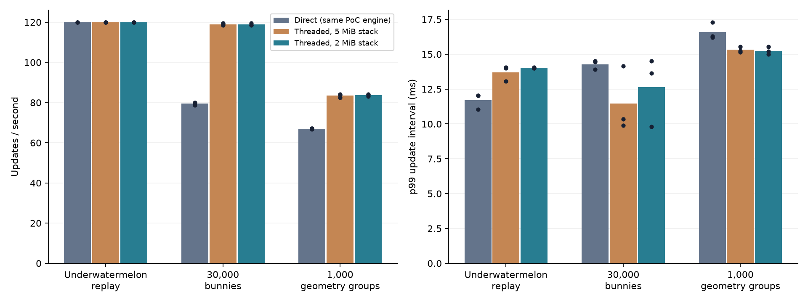
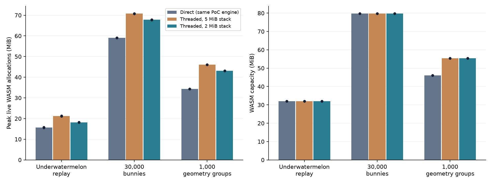
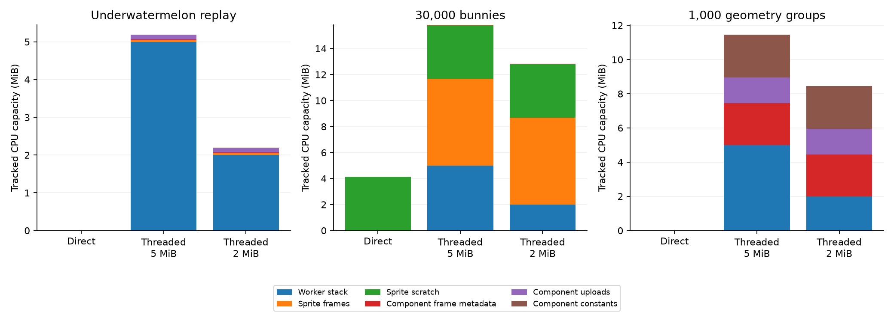
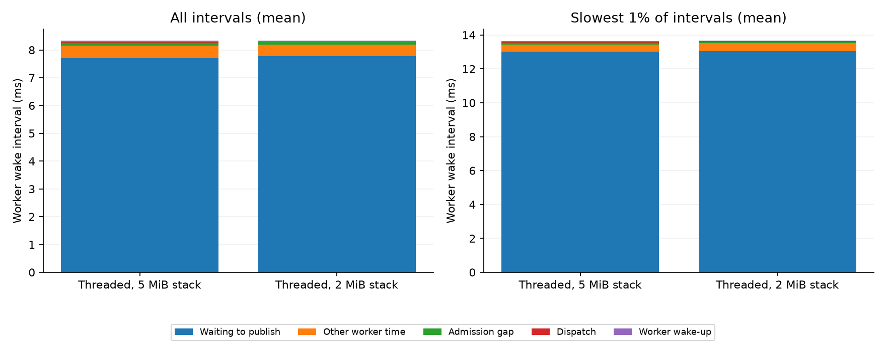

# Web worker diagnostics and stack-memory comparison

Measured on Apple M1 Pro, macOS, Chrome 154.0.8037.95 with ANGLE Metal. The executable is `dmengine_release` (`is_debug=false`), built using CMake `RelWithDebInfo` and Emscripten 4.0.6. All compared modes use identical engine binaries; runtime assertions and default stack cookies are enabled for the PoC.

Direct uses the same modified Release PoC engine with threading disabled. Threaded modes use component snapshots, overlapping preparation, sprite geometry on browser main, and completion scheduling (`render.poc_web_schedule=1`). Only worker stack reservation differs between the two threaded modes. All switches remain opt-in; the default stack remains 5 MiB.

Performance runs use foreground Chrome, AC power, hardware graphics, no focus emulation, no CPU/update tracing and no stack painting. Bars show means of three runs; dots show individual runs. Underwatermelon measures 14,400 updates after 600 warm-up updates (about 120 seconds). The replay forces a 1/60-second simulation step in every mode; simulated time advances faster than wall time at 120 updates/s. Synthetic runs measure 30 seconds after 10 seconds of warm-up. These short synthetic runs are regression checks, not production acceptance.

Workloads: Underwatermelon retains fruit physics, merging, scoring, GUI and sound in the approved offline copy. Bunnymark moves 30,000 sprites. The geometry case renders 1,000 groups containing 2,000 meshes and 5,000 models, including CPU/GPU skinning and instancing; its small triangles emphasize component and draw overhead.

| Workload | Mode | Updates/s | p99 ms | Peak live MiB | WASM capacity MiB |
|---|---|---:|---:|---:|---:|
| Underwatermelon replay | Direct (same PoC engine) | 120.00 | 11.72 | 15.69 | 32.00 |
| Underwatermelon replay | Threaded, 5 MiB stack | 119.97 | 13.70 | 21.22 | 32.00 |
| Underwatermelon replay | Threaded, 2 MiB stack | 120.00 | 14.02 | 18.17 | 32.00 |
| 30,000 bunnies | Direct (same PoC engine) | 79.57 | 14.28 | 59.02 | 79.81 |
| 30,000 bunnies | Threaded, 5 MiB stack | 118.97 | 11.47 | 70.81 | 79.81 |
| 30,000 bunnies | Threaded, 2 MiB stack | 118.87 | 12.65 | 67.81 | 79.81 |
| 1,000 geometry groups | Direct (same PoC engine) | 67.03 | 16.60 | 34.37 | 46.12 |
| 1,000 geometry groups | Threaded, 5 MiB stack | 83.45 | 15.32 | 46.13 | 55.38 |
| 1,000 geometry groups | Threaded, 2 MiB stack | 83.69 | 15.25 | 43.13 | 55.38 |

p99 is the interval below which 99% of recorded update intervals fall. The Lua histogram reports its upper bin bound. Higher updates/s is better; lower p99 is better. Neither metric measures photon latency or energy.

Live allocation comes from the WASM allocator. WASM capacity is its backing memory, including free space, and can stay unchanged when live allocation falls. A smaller stack primarily frees allocator reservation; its untouched pages may never have been resident. This does not imply an equal drop in operating-system RSS. Browser process RSS and physical GPU memory are different quantities.

| Workload | 2 MiB versus 5 MiB: throughput | p99 | Live allocation | WASM capacity |
|---|---:|---:|---:|---:|
| Underwatermelon replay | +0.02% | +0.32 ms | -3.05 MiB | +0.00 MiB |
| 30,000 bunnies | -0.09% | +1.18 ms | -3.00 MiB | +0.00 MiB |
| 1,000 geometry groups | +0.30% | -0.07 ms | -3.00 MiB | +0.00 MiB |

The capacity graph shows per-run median tracked allocations, averaged across runs. It is a partial breakdown, not total live memory: Lua, resources, other component scratch, allocator overhead and engine bookkeeping remain outside it. Sprite counters include every registered collection world. Deferred render scratch is sampled from retired slots and can lag up to two frames. Component upload/constants are disjoint subsets of component-frame capacity; sprite constants are already included in scratch. GPU logical sprite buffers are separate in `memory-breakdown.csv` and are not stacked here.

## Separate timing diagnostics

These instrumented runs are excluded from the performance figures. Sequential IDs and timestamps partition each wake interval into the preceding worker update, admission gap, main dispatch and next worker wake-up. Graphics-owner calls and publication waits are subsets of worker time. Render consumption overlaps it and must not be added to the critical-path total. Other JavaScript/extension rendezvous are not individually attributed.

| Mode | Worker mean / tail ms | Admission gap mean / tail ms | Wake mean / tail ms | Graphics queue+execute+return mean ms | Publication wait mean / tail ms | Stack touched KiB |
|---|---:|---:|---:|---:|---:|---:|
| Threaded, 5 MiB stack | 8.164 / 13.434 | 0.103 / 0.118 | 0.047 / 0.054 | 0.000 | 7.707 / 13.001 | 17.72 |
| Threaded, 2 MiB stack | 8.197 / 13.505 | 0.090 / 0.104 | 0.028 / 0.028 | 0.000 | 7.772 / 13.058 | 17.72 |

The traced gameplay is dominated by publication backpressure: the worker waits for the previous frame to retire before publishing its prepared frame. The long ready-to-consume waits and short consumption spans are consistent with waiting on the browser render cadence in this light workload, not evidence that simulation consumes an entire core. The measured worker wake-up and graphics-owner paths do not explain the long intervals. The next targeted experiment is render admission/consumption timing within the existing bounded pipeline; adding queue depth could increase latency and requires separate justification.

Tail columns average the same slowest 1% of wake intervals; they are not sums of independent percentiles. Absolute clock doubles can differ by one ULP across owners; validation permits at most one microsecond of rounding and preserves the raw timestamps. Stack painting observes deepest writes in these runs, not the maximum possible stack requirement of arbitrary extensions or deeper gameplay call paths.

## Evidence and limits

Every accepted replay completed the same fixed event stream and cleanup contract. All per-case signatures matched. The 2 MiB worker stack also passed the broad fixture covering sprites, GUI, labels, tilemaps, particles, physics, sound, cameras, proxies/factories, CPU/GPU-skinned models, mesh updates, instancing, pause/resume and context-loss shutdown.

This collection does not establish clean-vanilla performance, slower-device behavior, other browsers, physical input latency, GPU completion timing or energy consumption. The two larger supplied games are tracked in [the compatibility notes](ADVANCED_PROJECTS.md); their smoke checks are excluded from these performance results.

Raw JSON/CSV, manifests, runner snapshots and build hashes: [raw-results.tar.gz](raw-results.tar.gz). Calculations: [runs.csv](runs.csv), [memory-breakdown.csv](memory-breakdown.csv), [diagnostics.csv](diagnostics.csv). Per-update attribution CSVs retain the update IDs for investigation.

Additional evidence: [build provenance](provenance.json), [validation logs](validation/), [preserved diagnostic pilots](DIAGNOSTIC_PILOTS.md), and [analysis sources](analysis-sources/).
